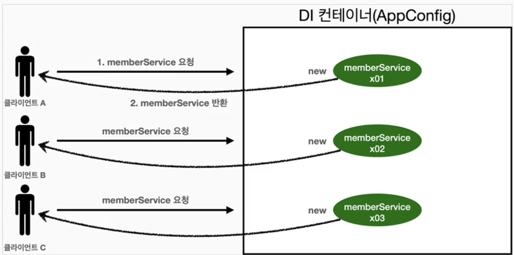
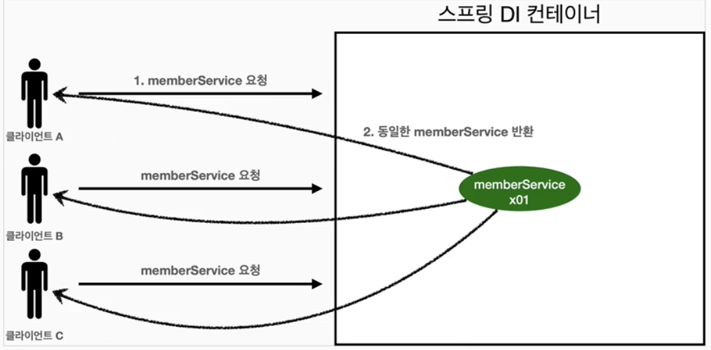
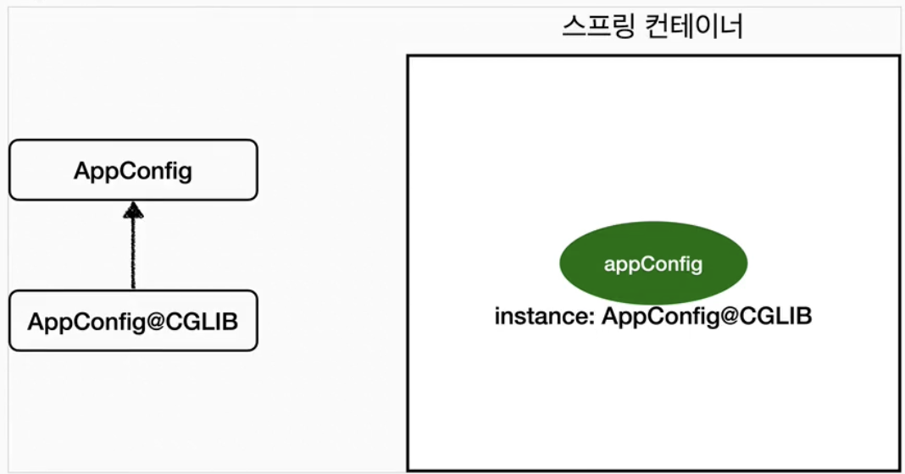
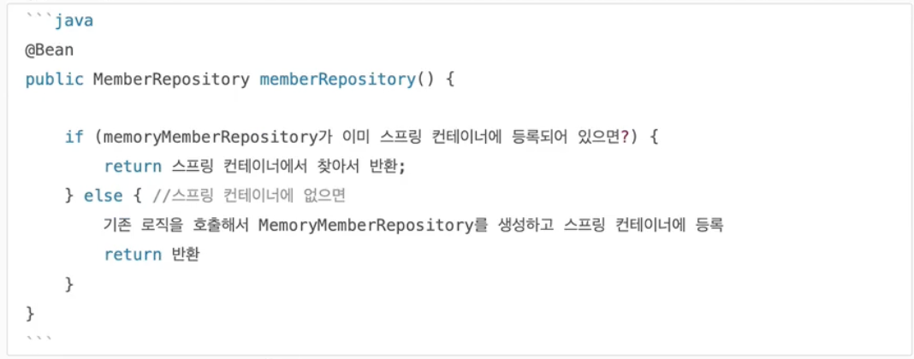

# 싱글톤 컨테이너
## 웹 애플리케이션과 싱글톤
- 스프링은 태생이 기업용 온라인 서비스 기술을 지원하기 위해 탄생함
- 대부분의 스프링 애플리케이션은 웹 애플리케이션 (물론 웹 아닌 애플리케이션도 얼마든지 개발 가능)
- 보통 여러 고객이 동시에 요청함

```java
@Test  
@DisplayName("스프링 없는 순수한 DI 컨테이너")  
void pureContainer() {  
    AppConfig appConfig = new AppConfig();  
    // 1. 조회: 호출할 때 마다 객체 생성  
    MemberService memberService1 = appConfig.memberService();  
  
    // 2. 조회: 호출할 떄 마다 객체 생성  
    MemberService memberService2 = appConfig.memberService();  
  
    // 참조값이 다른 것을 확인  
    System.out.println("memberService1 = " + memberService1);  
    System.out.println("memberService2 = " + memberService2);  
  
    // memberService1 != memberService2  
    Assertions.assertNotSame(memberService1, memberService2);  
}
```
- 스프링 없는 순수한 DI 컨테이너인 AppConfig는 요청을 할 때마다 객체를 새로 생성
- 고객 트래픽이 초당 100이 나오면 초당 100개 객체가 생성되고 소멸됨 -> 메모리 낭비 심함
- 해결방안: 해당 객체가 딱 1개만 생성되고 공유하도록 설계하면 된다 -> 싱글톤 패턴
## 싱글톤 패턴
- 클래스의 인스턴스가 딱 1개만 생성되는 것을 보장하는 디자인 패턴
- 객체 인스턴스를 2개 이상 생성하지 못하도록 막아야 함
	- private 생성자를 사용해서 외부에서 임의로 new 키워드를 사용하지 못하게
```java
public class SingletonService {  
  
    private static final SingletonService instance = new SingletonService();  
  
    public static SingletonService getInstance() {  
        return instance;  
    }  
  
    private SingletonService() {}  
  
    public void logic() {  
        System.out.println("싱글톤 객체 로직 호출");  
    }  
}
```
1. static 영역에 객체 instance를 미리 하나 생성해서 올려둔다
2. 이 객체 인스턴스가 필요하면 오직 `getInstance()` 메서드를 통해서만 조회 가능
	- 이 인스턴스 호출 시 항상 같은 인스턴스 반환
3. 딱 1개의 객체 인스턴스만 존재해야 하므로, 생성자를 private으로 막아서 혹시라도 외부에서 new 키워드로 객체 인스턴스가 생성되는 것을 막는다.
### 테스트
```java
@Test  
@DisplayName("싱글톤 패턴을 적용한 객체 사용")  
void singletonServiceTest() {  
    SingletonService singletonService1 = SingletonService.getInstance();  
    SingletonService singletonService2 = SingletonService.getInstance();  
  
    System.out.println("singletonService1 = " + singletonService1);  
    System.out.println("singletonService2 = " + singletonService2);  
  
    Assertions.assertSame(singletonService2, singletonService1);  
}
```
- private으로 new 키워드 막음
- 호출할 때마다 같은 객체 인스턴스를 반환하는 것을 확인 가능
### 문제점
- 구현하는 코드 자체가 많이 들어감
- 의존관계상 클라이언트가 구체 클래스에 의존 -> DIP 위반
- 클라이언트가 구체 클래스에 의존해서 OCP 원칙을 위반할 가능성이 높음
- 테스트 어려움
- 내부 속성 변경하거나 초기화 하기 어려움
- private 생성자로 자식 클래스 만들기 어려움
- 결론적으로 유연성 떨어짐
- 안티패턴으로 불리기도 함
## 싱글톤 컨테이너 (스프링 컨테이너)
- 싱글톤 패턴의 문제점을 해결하면서, 객체 인스턴스를 싱글톤으로 관리
	- 스프링 빈이 싱글톤으로 관리되는 빈
### 싱글톤 컨테이너
- 스프링 컨테이너는 싱글톤 패턴을 적용하지 않아도, 객체 인스턴스를 싱글톤으로 관리
	- 컨테이너는 객체를 하나만 생성해서 관리
- 스프링 컨테이너는 싱글톤 컨테이너 역할을 함.
	- 이렇게 싱글톤 객체를 생성, 관리하는 기능을 **싱글톤 레지스트리**
- 스프링 컨테이너의 이런 기능 덕분에 싱글톤 패턴의 모든 단점을 해결하면서 객체를 싱글톤으로 유지 가능
	- 싱글톤 패턴을 위한 지저분한 코드가 들어가지 않아도 됨
	- DIP, OCP, 테스트, private 생성자로부터 자유롭게 싱글톤 사용
```java
@Test  
@DisplayName("스프링 컨테이너와 싱글톤")  
void springContainer() {  
	ApplicationContext ac = new AnnotationConfigApplicationContext(AppConfig.class);  
	MemberService memberService1 = ac.getBean("memberService", MemberService.class);  
	MemberService memberService2 = ac.getBean("memberService", MemberService.class);  
	  
	// 참조값이 다른 것을 확인  
	System.out.println("memberService1 = " + memberService1);  
	System.out.println("memberService2 = " + memberService2);  

	// memberService1 != memberService2  
	Assertions.assertSame(memberService1, memberService2);  
}
```

- 스프링 컨테이너 덕분에 고객의 요청이 올 때 마다 객체 생성이 아니라, 이미 만들어진 객체를 공유해서 효율적으로 재사용 가능
- 참고: 기본 빈 등록 방식은 싱글톤이지만, 이 방식만 지원하는 것은 아님
## 싱글톤 방식의 주의점
- 여러 클라이언트가 하나의 같은 객체 인스턴스를 공유하기 때문에 싱글톤 객체는 상태를 유지(stateful)하게 설계하면 안된다.
- 무상태(stateless)로 설계해야 함
	- 특정 클라이언트에 의존적인 필드가 있으면 안됨
	- 특정 클라이언트가 값을 변경할 수 있는 필드가 있으면 안됨
	- 가급적 읽기만 가능해야 함
	- 필드 대신에 자바에서 공유되지 않는 지역변수, 파라미터, ThreadLocal 등을 사용해야 함
- 스프링 빈의 필드에 공유 값을 설정하면 정말 큰 장애가 발생할 수 있음
### Test
```java
public class StatefulService {  
  
    private int price;  
  
    public void order(String name, int price) {  
        System.out.println("name = " + name + " price = " + price);  
        this.price = price; // 여기가 문제  
    }  
  
    public int getPrice() {  
        return price;  
    }  
}
```
- test
```java
  
class StatefulServiceTest {  
  
    @Test  
    void statefulServiceSingleton() {  
        ApplicationContext ac = new AnnotationConfigApplicationContext(TestConfig.class);  
  
        StatefulService statefulService1 = ac.getBean(StatefulService.class);  
        StatefulService statefulService2 = ac.getBean(StatefulService.class);  
  
        statefulService1.order("userA", 10000);  
        statefulService2.order("userB", 20000);  
  
        int price = statefulService1.getPrice();  
  
        System.out.println("price = " + price);  
  
        Assertions.assertEquals(20000, statefulService1.getPrice());  
    }  
  
    static class TestConfig {  
  
        @Bean  
        public StatefulService statefulService() {  
            return new StatefulService();  
        }  
    }  
}
```
## @Configuration과 싱글톤
```java
@Configuration  
public class AppConfig {  
  
    @Bean  
    public MemberService memberService() {  
        System.out.println("call AppConfig.memberService");  
        return new MemberServiceImpl(memberRepository());  
    }  
  
    @Bean  
    public MemberRepository memberRepository() {  
        System.out.println("call AppConfig.memberRepository");  
        return new MemoryMemberRepository();  
    }  
  
    @Bean  
    public OrderService orderService() {  
        System.out.println("call AppConfig.orderService");  
        return new OrderServiceImpl(memberRepository(), discountPolicy());  
    }  
  
    @Bean  
    public DiscountPolicy discountPolicy() {  
//        return new FixDiscountPolicy();  
        return new RateDiscountPolicy();  
    }  
  
}
```
- 분명 `new MemoryMemberRepository()` 가 두 번 호출됨
```java
@Test  
void configurationTest() {  
    ApplicationContext ac = new AnnotationConfigApplicationContext(AppConfig.class);  
  
    MemberServiceImpl memberService = ac.getBean("memberService", MemberServiceImpl.class);  
    OrderServiceImpl orderService = ac.getBean("orderService", OrderServiceImpl.class);  
    MemberRepository memberRepository = ac.getBean("memberRepository", MemberRepository.class);  
  
    MemberRepository memberRepository1 = memberService.getMemberRepository();  
    MemberRepository memberRepository2 = orderService.getMemberRepository();  
  
    System.out.println("memberRepository1 = " + memberRepository1);  
    System.out.println("memberRepository2 = " + memberRepository2);  
    System.out.println("memberRepository = " + memberRepository);  
  
    Assertions.assertSame(memberRepository, memberService.getMemberRepository());  
    Assertions.assertSame(memberRepository, orderService.getMemberRepository());  
}
```
- 하지만 해당 테스트의 모든 `memberRepository`는 같다
- 직관적으로는 `memberRepository`의 호출이 3번이어야 할 것 같음
- 하지만 실제 출력 코드는 1번씩만 호출됨
```
call AppConfig.memberService
call AppConfig.memberRepository
call AppConfig.orderService
```
## @Configuration과 바이트코드 조작의 마법
- 스프링 컨테이너는 싱글톤 레지스트리다. 따라서 스프링 빈이 싱글톤이 되도록 보장해주어야 함. 그런데 스프링이 자바 코드까지 어떻게 하기는 어렵다. 자바 코드를 보면 분명 3번 호출되어야 하는 것이 맞음.
- 그래서 스프링은 **클래스의 바이트코드를 조작하는 라이브러리 사용**
```java
@Test  
void configurationDeep() {  
    ApplicationContext ac = new AnnotationConfigApplicationContext(AppConfig.class);  
    AppConfig bean = ac.getBean(AppConfig.class);  
  
    System.out.println("bean = " + bean);  
}
```
- AppConfig도 스프링 빈
```
bean = hello.core.AppConfig$$SpringCGLIB$$0@77d18d0b
```
- `AnnotationConfigApplicationContext`에 파라미터로 넘긴 값도 스프링 빈으로 등록됨
	- `AppConfig`도 스프링 빈이 됨
- 순수한 클래스와 다르게 나옴
	- 순수한 클래스라면 `class hello.core.AppConfig`로 나와야 함
- **내가 만든 클래스가 아니라 스프링이 CGLIB라는 라이브러리를 이용해서 AppConfig 클래스를 상속받은 임의의 다른 클래스를 만들고 다른 클래스를 스프링 빈으로 등록한 것!**

- 그 임의의 다른 클래스가 바로 싱글톤이 보장되도록 해줌
### AppConfig@CGLIB 예상 코드

- 이미 존재하면 존재하는 빈 반환, 없으면 생성해서 반환
- 덕분에 싱글톤 보장