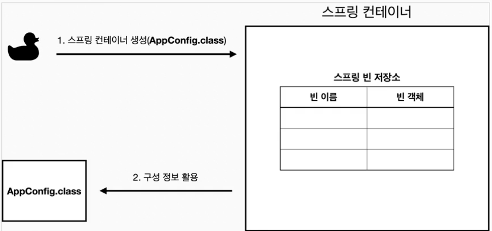
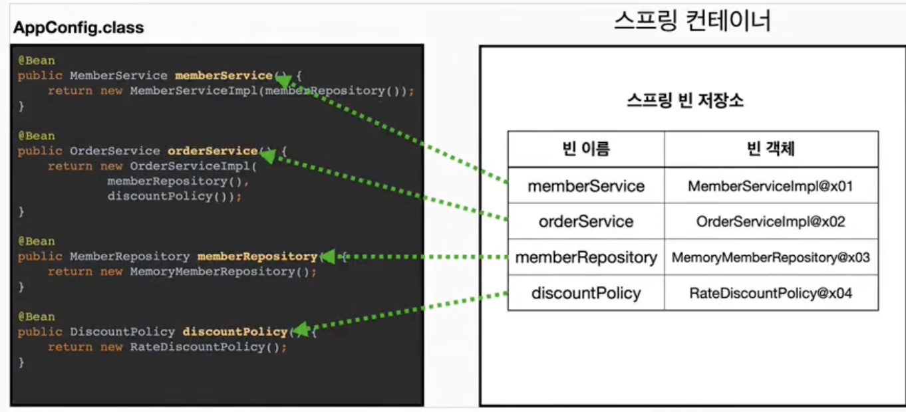
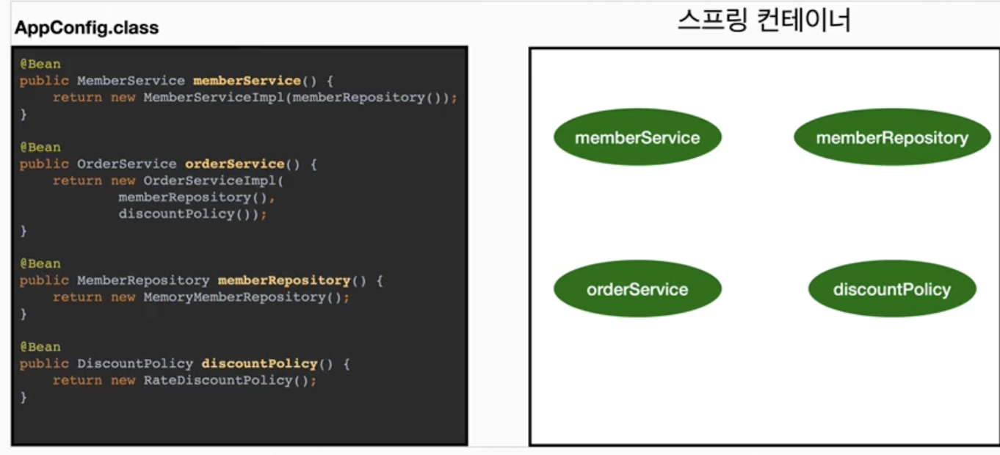
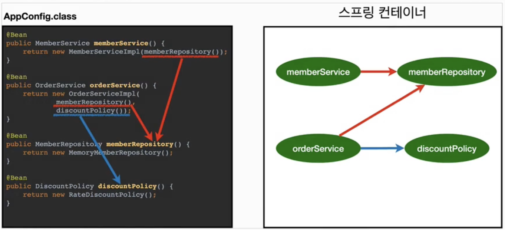

# 스프링 컨테이너
## 스프링 컨테이너란?
- `ApplicationContext`를 스프링 컨테이너라 함
- DI를 위해 사용
- `@Configuration`이 붙은 `AppConfig`를 설정(구성) 정보로 사용
- 여기서 `@Bean`이라 적힌 메서드를 모두 호출해서 반환된 객체를 스프링 컨테이너에 등록
	- **스프링 빈**: 스프링 컨테이너에 등록된 객체
## 스프링 컨테이너 생성
```java
ApplicationContext applicationContext = new AnnotationConfigApplicationContext(AppConfig.class);
```
- `ApplicationContext`는 인터페이스
- XML 기반으로 만들 수 있고 애노테이션 기반의 자바 설정 클래스로 만들 수 있다.
### 생성 과정
#### 1. 스프링 컨테이너 생성

#### 2. 스프링 빈 등록

- 주의: *빈 이름은 항상 다른 이름을 부여해야 함*
#### 3. 스프링 빈 의존관계 설정 - 준비

#### 4. 스프링 빈 의존관계 설정 - 완료

- 설정 정보 참고해서 의존관계 주입(DI)
#### 참고
- 스프링은 빈을 생성하고 의존관계 주입하는 단계가 나누어져 있음
- 그런데 이렇게 자바 코드로 스프링 빈을 등록하면 생성자를 호출하면서 의존관계 주입도 한번에 처리됨
## 컨테이너에 등록된 모든 빈 조회
### 모든 빈 출력하기
- 스프링에 등록된 모든 빈 출력 가능
```java
@Test  
@DisplayName("모든 빈 출력하기")  
void findAllBean() {  
    String[] beanDefinitionNames = ac.getBeanDefinitionNames();  // 모든 빈 이름 출력
    for (String beanDefinitionName: beanDefinitionNames) {  
        Object bean = ac.getBean(beanDefinitionName);  // 빈 이름으로 빈 객체 조회
        System.out.println("name = " + beanDefinitionName + " object = " + bean);  
    }  
}  
```
### 애플리케이션 빈 출력하기
- 내가 등록한 빈만 출력
- `getRole()`로 구분 가능
	- `ROLE_APPLICATION`: 일반적으로 사용자가 정의한 빈
	- `ROLE_INFRASTRUCTION`: 스프링이 내부에서 사용하는 빈
```java
@Test  
@DisplayName("애플리케이션 빈 출력하기")  
void findApplicationBean() {  
    String[] beanDefinitionNames = ac.getBeanDefinitionNames();  
    for (String beanDefinitionName: beanDefinitionNames) {  
        BeanDefinition beanDefinition = ac.getBeanDefinition(beanDefinitionName);  
  
        if (beanDefinition.getRole() == BeanDefinition.ROLE_APPLICATION) {  
            Object bean = ac.getBean(beanDefinitionName);  
            System.out.println("name = " + beanDefinitionName + " object = " + bean);  
        }  
    }  
}
```
## 스프링 빈 조회-기본
- 가장 기본적인 조회 방법
- `ac.getBean(빈이름, 타입)`
- `ac.getBean(타입)`
- 조회 대상 스프링 빈이 없으면 예외 발생
```java
@Test  
@DisplayName("빈 이름으로 조회")  
void findBeanByName() {  
    MemberService memberService = ac.getBean("memberService", MemberService.class);  
    Assertions.assertInstanceOf(MemberServiceImpl.class, memberService);  
}  
  
@Test  
@DisplayName("이름 없이 타입으로만 조회")  
void findBeanByType() {  
    MemberService memberService = ac.getBean(MemberService.class);  
    Assertions.assertInstanceOf(MemberServiceImpl.class, memberService);  
}  
  
@Test  
@DisplayName("구체 타입으로 조회")  
void findBeanByName2() {  
    MemberServiceImpl memberService = ac.getBean("memberService", MemberServiceImpl.class);  
    Assertions.assertInstanceOf(MemberServiceImpl.class, memberService);  
}  
  
@Test  
@DisplayName("빈 이름으로 조회 X")  
void findBeanByNameX() {  
    Assertions.assertThrows(NoSuchBeanDefinitionException.class, () -> ac.getBean("xxxx", MemberService.class));  
}
```
## 동일한 타입이 둘 이상
```java
@Test  
@DisplayName("타입으로 조회시 같은 타입이 둘 이상 있으면, 중복 오류가 발생한다")  
void findBeanByTypeDuplicate() {  
    assertThrows(NoUniqueBeanDefinitionException.class,  
            () -> ac.getBean(MemberRepository.class));  
}  
  
@Test  
@DisplayName("타입으로 조회시 같은 타입이 둘 이상 있으면, 빈 이름을 지정하면 된다")  
void findBeanByName() {  
    MemberRepository memberRepository = ac.getBean("memberRepository1", MemberRepository.class);  
    assertInstanceOf(MemberRepository.class, memberRepository);  
}  
  
@Test  
@DisplayName("특정 타입 모두 조회하기")  
void findAllBeanByType() {  
    Map<String, MemberRepository> beansOfType = ac.getBeansOfType(MemberRepository.class);  
    for (String key: beansOfType.keySet()) {  
        System.out.println("key = " + key + " value = " + beansOfType.get(key));  
    }  
}  
  
@Configuration  
static class SameBeanConfig {  
    @Bean  
    public MemberRepository memberRepository1() {  
        return new MemoryMemberRepository();  
    }  
  
    @Bean  
    public MemberRepository memberRepository2() {  
        return new MemoryMemberRepository();  
    }  
}
```
## 스프링 빈 조회 - 상속관계
```java
@Test  
@DisplayName("부모 타입으로 조회시, 자식이 둘 이상 있으면, 중복 오류 발생")  
void findBeanByParentTypeDuplicate() {  
    assertThrows(NoUniqueBeanDefinitionException.class,  
            ()->ac.getBean(DiscountPolicy.class));  
}  
  
@Test  
@DisplayName("부모 타입으로 조회시, 자식이 둘 이상 있으면, 빈 이름을 지정하면 된다")  
void findBeanByParentTypeBeanName() {  
    DiscountPolicy rateDiscountPolicy = ac.getBean("rateDiscountPolicy", DiscountPolicy.class);  
    assertInstanceOf(RateDiscountPolicy.class, rateDiscountPolicy);  
}  
  
@Test  
@DisplayName("특정 하위 타입으로 조회")  
void findBeanBySubType() {  
    RateDiscountPolicy bean = ac.getBean(RateDiscountPolicy.class);  
    assertInstanceOf(RateDiscountPolicy.class, bean);  
}  
  
@Test  
@DisplayName("부모 타입으로 모두 조회하기")  
void findBeanByParentType() {  
    Map<String, DiscountPolicy> beansOfType = ac.getBeansOfType(DiscountPolicy.class);  
    assertEquals(2, beansOfType.size());  
    for (String key: beansOfType.keySet()) {  
        System.out.println("key = " + key + " value = " + beansOfType.get(key));  
    }  
}  
  
@Test  
@DisplayName("부모 타입으로 모두 조회하기 - Object")  
void findAllBeanByParentType() {  
    Map<String, Object> beansOfType = ac.getBeansOfType(Object.class);  
    for (String key: beansOfType.keySet()) {  
        System.out.println("key = " + key + " value = " + beansOfType.get(key));  
    }  
}  
  
@Configuration  
static class TestConfig {  
    @Bean  
    public DiscountPolicy rateDiscountPolicy() {  
        return new RateDiscountPolicy();  
    }  
  
    @Bean  
    public DiscountPolicy fixDiscountPolicy() {  
        return new FixDiscountPolicy();  
    }  
}
```
