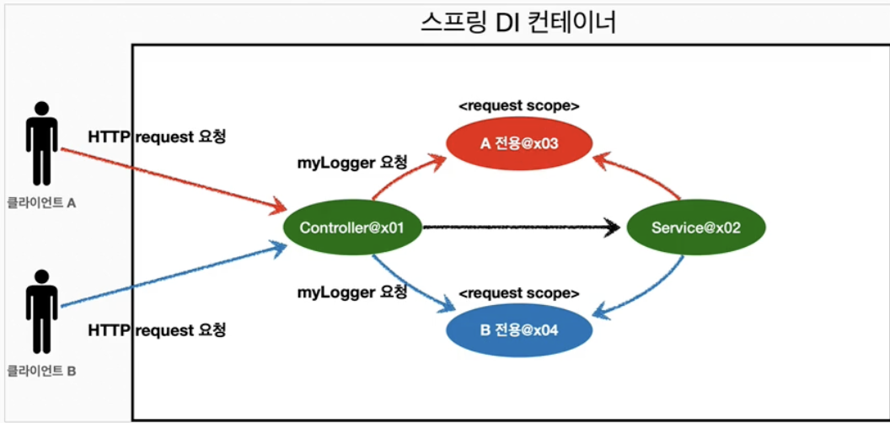
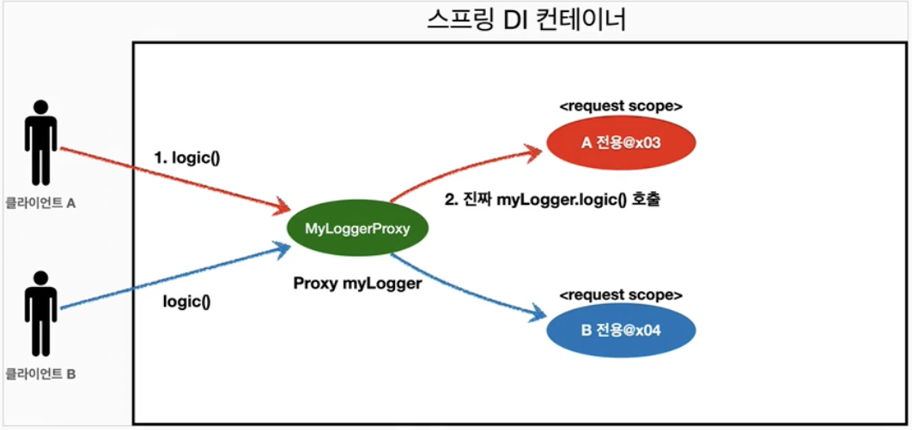

# 웹 스코프
### 웹 스코프의 특징
- 웹 환경에서만 동작
- 프로토타입과 다르게 스프링이 해당 스코프의 종료시점까지 관리. 따라서 종료 메서드가 호출됨
### 종류
- request: HTTP 요청 하나가 들어오고 나갈 때까지 유지되는 스코프, 각각의 HTTP 요청마다 별도의 빈 인스턴스가 생성되고 관리됨
- session: HTTP Session과 동일한 생명주기를 가지는 스코프
- application: 서블릿 컨텍스트(`ServletContext`)와 동일한 생명주기를 가지는 스코프
- websocket: 웹 소켓과 동일한 생명주기를 가지는 스코프
#### HTTP request 요청 당 각각 할당되는 request 스코프

## request 스코프 예제
### 웹 환경 추가
- 웹 환경이 동작하도록 라이브러리 추가
	- build.gradle에 추가
```
implementation 'org.springframework.boot:spring-boot-starter-web'
```
- CoreApplication의 main메서드 실행하면 웹 애플리케이션 실행됨
### 예제 개발
- 동시에 여러 HTTP 요청이 오면 정확히 어떤 요청이 남긴 로그인지 구분하기 어려움
- 이럴때 사용하기 좋은 것이 바로 request 스코프
```java
@Component  
@Scope(value = "request")  
public class MyLogger {  
  
    private String uuid;  
    private String requestURL;  
  
    public void setRequestURL(String requestURL) {  
        this.requestURL = requestURL;  
    }  
  
    public void log(String message) {  
        System.out.println("[" + uuid + "] [" + requestURL + "]" + message);  
    }  
  
    @PostConstruct  
    public void init() {  
        String uuid = UUID.randomUUID().toString();  
        System.out.println("[" + uuid + "] request scope bean create: " + this);  
    }  
  
    @PreDestroy  
    public void close() {  
        System.out.println("[" + uuid + "] request scope bean close: " + this);  
    }  
}
```
- 로그를 출력하기 위한 `MyLogger` 클래스
- @Scope(value ="request") 를 사용해서 request 스코프로 지정했다. 이게 이 빈은 HTTP 요청 당 하나씩 생성되고, HTTP 요청이 끝나는 시점에 소멸된다.
- 이 빈이 생성되는 시점에 자동으로 aPostConstruct 초기화 메서드를 사용해서 uuid를 생성해서 저장해둔다. 이 빈은 HTTP 요청 당 하나씩 생성되므로, uuid를 저장해두면 다른 HTTP 요청과 구분할 수 있다.
- 이 빈이 소멸되는 시점에 'aPreDestroy를 사용해서 종료 메시지를 남긴다.
- requestURL 은 이 빈이 생성되는 시점에는 알 수 없으므로, 외부에서 setter로 입력 받는다.
- *LogDemoController*
```java
package hello.core.web;  
  
import hello.core.common.MyLogger;  
import jakarta.servlet.http.HttpServletRequest;  
import lombok.RequiredArgsConstructor;  
import org.springframework.stereotype.Controller;  
import org.springframework.web.bind.annotation.RequestMapping;  
import org.springframework.web.bind.annotation.ResponseBody;  
  
@Controller  
@RequiredArgsConstructor  
public class LogDemoController {  
  
    private final LogDemoService logDemoService;  
    private final MyLogger myLogger;  
  
    @RequestMapping("log-demo")  
    @ResponseBody  
    public String logDemo(HttpServletRequest request) {  
        String requestURL = request.getRequestURL().toString();  
        myLogger.setRequestURL(requestURL);  
  
        myLogger.log("controller test");  
        logDemoService.logic("testid");  
  
        return "OK";  
    }  
}
```
- *MyLogger*
```java
package hello.core.common;  
  
import jakarta.annotation.PostConstruct;  
import jakarta.annotation.PreDestroy;  
import org.springframework.context.annotation.Scope;  
import org.springframework.stereotype.Component;  
  
import java.util.UUID;  
  
@Component  
@Scope(value = "request")  
public class MyLogger {  
  
    private String uuid;  
    private String requestURL;  
  
    public void setRequestURL(String requestURL) {  
        this.requestURL = requestURL;  
    }  
  
    public void log(String message) {  
        System.out.println("[" + uuid + "] [" + requestURL + "]" + message);  
    }  
  
    @PostConstruct  
    public void init() {  
        uuid = UUID.randomUUID().toString();  
        System.out.println("[" + uuid + "] request scope bean create: " + this);  
    }  
  
    @PreDestroy  
    public void close() {  
        System.out.println("[" + uuid + "] request scope bean close: " + this);  
    }  
}
```
- 로거가 잘 작동하는지 확인하는 테스트용 컨트롤러
- 여기서 HttpServiceRequest를 통해 요청 URL을 받았다
	- requestURL 값:` http://localhost:8080/log-demo`
- 이렇게 받은 URL 값을 myLogger에 저장. myLogger는 HTTP 요청 당 각각 구분되므로 다른 요청 때문에 값이 섞이는 걱정은 하지 않아도 됨
- 컨트롤러에서 controller test라는 로그 남김
- *LogDemoService 추가*
```java
package hello.core.web;  
  
import hello.core.common.MyLogger;  
import lombok.RequiredArgsConstructor;  
import org.springframework.stereotype.Service;  
  
@Service  
@RequiredArgsConstructor  
class LogDemoService {  
  
    private final MyLogger myLogger;  
  
    public void logic(String id) {  
        myLogger.log("service id = " + id);  
    }  
}
```
- 비즈니스 로직이 있는 서비스 계층에서도 초그를 출력해보자.
- 여기서 중요한 점이 있다. request scope를 사용하지 않고 파라미터로 이 모든 정보를 서비스 계층에 넘긴다면, 파라미터가 많아서 지저분해짐. 더 문제는 requestURL같은 웹과 관련된 정보가 웹과 관련없는 서비스 ㄱ계층까지 넘어가게 됨. **웹과 관련된 부분은 컨트롤러까지만 사용해야 함.** 서비스 계층은 웹 기술에 종속되지 않고, 가급적 순수하게 유지하는 것이 유지보수 관점에서 좋다.
- request scope의 MyLogger 덕분에 이런 부분을 파라미터로 넘기지 않고, MyLogger의 멤버변수에 저장해서 코드와 계층을 깔끔하게 유지 가능
#### 오류
- 하지만 예상한 실행 결과와 다르게 에러 발생
```
Unsatisfied dependency expressed through constructor parameter 0: Error creating bean with name 'myLogger': Scope 'request' is not active for the current thread; consider defining a scoped proxy for this bean if you intend to refer to it from a singleton
```
## 스코프와 Provider
```java
@Controller  
@RequiredArgsConstructor  
public class LogDemoController {  
  
    private final LogDemoService logDemoService;  
    private final ObjectProvider<MyLogger> myLoggerProvider;  
  
    @RequestMapping("log-demo")  
    @ResponseBody  
    public String logDemo(HttpServletRequest request) {  
        MyLogger myLogger = myLoggerProvider.getObject();  
        String requestURL = request.getRequestURL().toString();  
        myLogger.setRequestURL(requestURL);  
  
        myLogger.log("controller test");  
        logDemoService.logic("testid");  
  
        return "OK";  
    }  
}
```
```java
@Service  
@RequiredArgsConstructor  
class LogDemoService {  
  
    private final ObjectProvider<MyLogger> myLoggerProvider;  
  
    public void logic(String id) {  
        MyLogger myLogger = myLoggerProvider.getObject();  
        myLogger.log("service id = " + id);  
    }  
}
```
- ObjectProvider 사용으로 코드 수정
```
[dedc4c08-8206-4a2c-bfd8-24b487e387cb] request scope bean create: hello.core.common.MyLogger@90a1c9d
[dedc4c08-8206-4a2c-bfd8-24b487e387cb] [http://localhost:8080/log-demo]controller test
[dedc4c08-8206-4a2c-bfd8-24b487e387cb] [http://localhost:8080/log-demo]service id = testid
[dedc4c08-8206-4a2c-bfd8-24b487e387cb] request scope bean close: hello.core.common.MyLogger@90a1c9d
```
- 잘 동작한다.
- `ObjectProvider` 덕분에 `ObjectProvider.getObject()` 호출 시점까지 request scope **빈의 생성을 지연 할 수 있다.**
- `ObjectProvider.getObject()`를 호출하는 시점에는 HTTP 요청이 진행중이므로 request scope 빈의 생성이 정상처리됨
- `ObjectProvider.getObject()`를 `LogDemoController`, `LogDemoService`에서 각각 한번씩 따로 호출해도 같은 HTTP 요청이면 같은 스프링 빈이 반환됨
	- 직접 구현하려면 매우 힘듦...
## 스코프와 프록시
```java
@Component  
@Scope(value = "request", proxyMode = ScopedProxyMode.TARGET_CLASS)  
public class MyLogger { /* ... */ }
```
- `proxyMode = ScopedProxyMode.TARGET_CLASS` 추가
	- 적용 대상이 인터페이스가 아닌 클래스면 `TARGET_CLASS 선택
	- 인터페이스면: `INTERFACES` 선택
- 이렇게 하면 MyLogger의 가짜 프록시 클래스를 만들어두고 HTTP request와 상관 없이 가짜 프록시 클래스를 다른 빈에 미리 주입 가능
### 동작 원리
> CGLIB라는 라이브러리로 내 클래스를 상속 받은 가짜 프록시 객체를 만들어서 주입한다
- @Scope 의 `proxyMode = ScopedProxyMode.TARGET_CLASS)` 를 설정하면 스프링 컨테이너는 CGLIB라는 바이트 코드를 조작하는 라이브러리를 사용해서, MyLogger를 상속받은 가짜 프록시 객체를 생성한다.
- 결과를 확인해보면 우리가 등록한 순수한 MyLogger 클래스가 아니라 MyLoggers$EnhancerBySpringCGLIB 이라는 클 래스로 만들어진 객체가 대신 등록된 것을 확인할 수 있다.
- 그리고 스프링 컨테이너에 "myLogger"라는 이름으로 진짜 대신에 이 가짜 프록시 객체를 등록한다
- 'ac.getBean("myLogger", MyLogger.class)로 조회해도 프록시 객체가 조회되는 것을 확인할 수 있다. 그래서 의존관계 주입도 이 가짜 프록시 객체가 주입된다.

*가짜 프록시 객체는 요청이 오면 그때 내부에서 진짜 빈을 요청하는 위임 로직이 들어있다.* 
- 가짜 프록시 객체는 내부에 진짜 myLogger를 찾는 방법을 알고 있다.
- 클라이언트가 `myLogger.logic()` 을 호출하면 사실은 가짜 프록시 객체의 메서드를 호출한 것이다.
- 가짜 프록시 객체는 request 스코프의 진짜 `myLogger.logic()`를 호출한다.
- 가짜 프록시 객체는 원본 클래스를 상속 받아서 만들어졌기 때문에 이 객체를 사용하는 클라이언트 입장에서는 사실 원본인지 아닌지도 모르게, 동일하게 사용할 수 있다(다형성)

*동작 정리*
- CGLIB라는 라이브러리로 내 클래스를 상속 받은 가짜 프록시 객체를 만들어서 주입한다.
- 이 가짜 프록시 객체는 실제 요청이 오면 그때 내부에서 실제 빈을 요청하는 위임 로직이 들어있다.
- 가짜 프록시 객체는 실제 request scope와는 관계가 없다. 그냥 가짜이고, 내부에 단순한 위임 로직만 있고, 싱글톤 처럼 동작한다.

*특징 정리*
- 프록시 객체 덕분에 클라이언트는 마치 싱글톤 빈을 사용하듯이 편리하게 request scope를 사용할 수 있다.
- 사실 Provider를 사용하든, 프록시를 사용하든 핵심 아이디어는 진짜 객체 조회를 꼭 필요한 시점까지 지연처리 한다는 점이다.
- 단지 애노테이션 설정 변경만으로 원본 객체를 프록시 객체로 대체할 수 있다. 이것이 바로 다형성과 DI 컨테이너가 가진 큰 강점 이다.
- 꼭 웹 스코프가 아니어도 프록시는 사용할 수 있다.

*주의점*
- 마치 싱글톤을 사용하는 것 같지만 다르게 동작하기 때문에 결국 주의해서 사용해야 한다.
- 이런 특별한 scope는 꼭 필요한 곳에만 최소화해서 사용하자, 무분별하게 사용하면 유지보수하기 어려워진다.