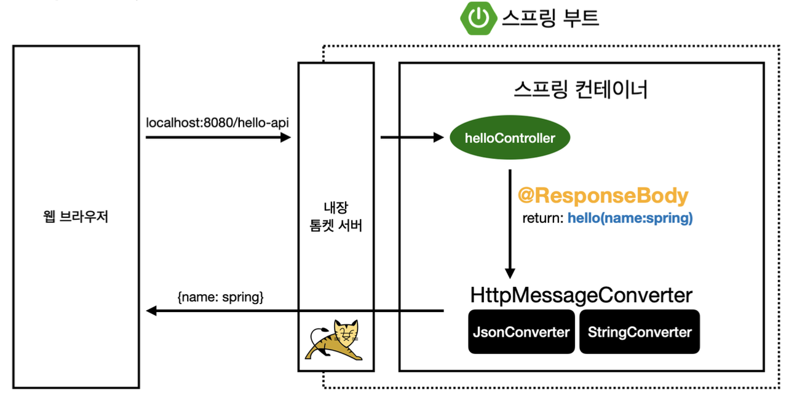
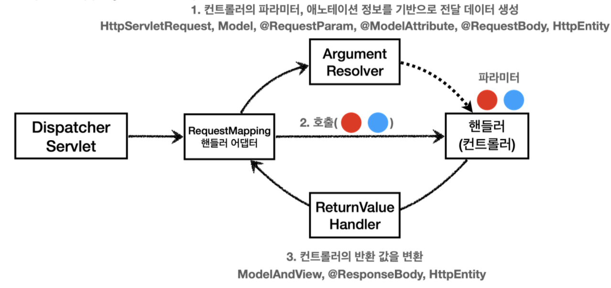
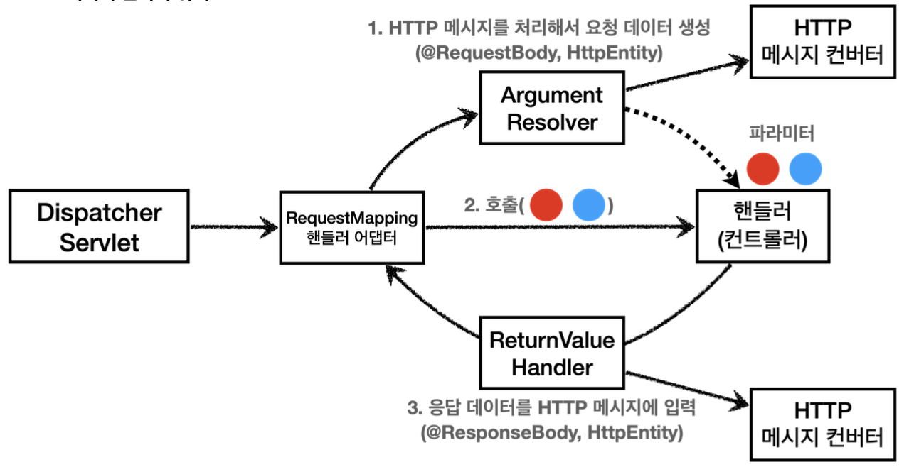

# 스프링 MVC - 기본 기능
## 로깅 간단히 알아보기
### 로깅 라이브러리
- 스프링 부트 라이브러리를 사용하면 스프링 부트 로깅 라이브러리(`spring-boot-starter-logging`)가 함께 포함됨
#### 로그 선언
- `private Logger log = LoggerFactory.getLogger(getClass());`
- `private static final Logger log = LoggerFactory.getLogger(Xxx.class);  `
- `@Slf4j`: 롬복 사용 가능
#### 로그 호출
- `log.info("hello")`
- `System.out.println("hello");`
- 시스템 콘솔로 직접 출력하는 것보다 로그를 사용하면 다음과 같은 장점이 있다. 실무에서는 항상 로그를 사용해야 함
### LogTestController
```java
package hello.springmvc.basic;  
  
import org.slf4j.Logger;  
import org.slf4j.LoggerFactory;  
import org.springframework.web.bind.annotation.RequestMapping;  
import org.springframework.web.bind.annotation.RestController;  
  
@RestController  
public class LogTestController {  
  
    private final Logger log = LoggerFactory.getLogger(getClass());  
  
    @RequestMapping("/log-test")  
    public String logTest() {  
        String name = "Spring";  
  
        System.out.println("name = " + name);  
  
        log.trace("trace log={}", name);  
        log.debug("debug log={}", name);  
        log.info(" info log={}", name);  
        log.warn(" warn log={}", name);  
        log.error("error log={}", name);  
  
        return "ok";  
    }  
}
```
#### 매핑 정보
- `@RestController`
	- `@Controller`는 반환 값이 String이면 뷰 이름으로 인식됨. 그래서 *뷰를 찾고 뷰가 렌더링*된다.
	- `@RestController`는 반환 값으로 뷰를 찾는 것이 아니라, *HTTP 메시지 바디에 바로 입력*한다. 따라서 실행 결과로 ok 메시지를 받을 수 있다. `@ResponseBody`와 관련 있음
	- 
#### 테스트
- 로그가 출력되는 포맷 확인
	- 시간, 로그 레벨, 프로세스 ID, 쓰레드 명, 클래스명, 로그 메시지
- 로그 레벨 설정을 변경해서 출력 결과를 보자
	- LEVEL: `TRACE > DEBUG > INFO > WARN > ERROR`
	- 개발 서버는 debug 출력
	- 운영 서버는 info 출력
- `@Slf4j`로 변경
#### 로그 레벨 설정
```
# 전체 로그 레벨 설정(기본 info)
logging.level.hello.root=info  
  
# hello.springmvc 패키지와 그 하위 로그 레벨 설정  
logging.level.hello.springmvc=debug
```
#### 올바른 로그 사용법
- `log.debug("data="+data)`
	- 로그 출력 레벨을 info로 설정해도 해당 코드에 있는 "data="+data가 실제 실행이 되어 버린다. 결과적으로 문자 더하기 연산이 발생한다
- `log.debug("data={}", data)`
	- 로그 출력 레벨을 info로 설정하면 아무일도 발생하지 않는다. 따라서 앞과 같은 의미없는 연산이 발생하지 않음
#### 로그 사용시 장점
- 쓰레드 정보, 클래스 이름 같은 부가 정보를 함께 볼 수 있고, 출력 모양을 조정 가능
- 로그 레벨에 따라 개발 서버에서는 모든 로그를 출력하고, 운영서버에서는 출력하지 않는 등 로그를 상황에 맞게 조절할 수 있다.
- 시스템 아웃 콘솔에만 출력하는 것이 아니라, 파일이나 네트워크 등, 로그를 별도의 위치에 남길 수 있다. 특히 파일로 남길 때는 일별, 특정 용량에 따라 로그를 분할하는 것도 가능
- 성능도 일반 System.out보다 좋음. (내부 버퍼링, 멀티쓰레드 등등) 그래서 실무에서는 꼭 로그를 사용해야 함
## 요청 매핑
### MappingController
```java
package hello.springmvc.basic.requestmapping;  
  
import org.slf4j.Logger;  
import org.slf4j.LoggerFactory;  
import org.springframework.web.bind.annotation.RequestMapping;  
import org.springframework.web.bind.annotation.RestController;  
  
@RestController  
public class MappingController {  
  
    private Logger log = LoggerFactory.getLogger(getClass());  
  
    @RequestMapping("/hello-basic")  
    public String helloBasic() {  
        log.info("helloBasic");  
        return "ok";  
    }  
}
```
- `@RequestMapping("/hello-basic")`
	- `/hello-basic` URL 호출이 오면 이 메서드가 실행되도록 매핑
	- 대부분의 속성을 배열로 제공하므로 다중 설정 가능 `{"/hello-basic", "/hello-go"}`
#### HTTP 메서드
- `method` 속성으로 HTTP 메서드를 지정하지 않으면 메서드와 무관하게 호출됨 (모두 허용)
#### HTTP 메서드 매핑
```java
	@RequestMapping(value = "/mapping-get-v1", method = RequestMethod.GET)  
    public String mappingGetV1() {  
        log.info("mappingGetV1");  
        return "ok";  
    }  
```
#### HTTP 메서드 매핑 축약
```java
    @GetMapping(value = "/mapping-get-v2")  
    public String mappingGetV2() {  
        log.info("mapping-get-v2");  
        return "ok";  
    }  
```
#### PathVariable(경로 변수) 사용
```java
@GetMapping("/mapping/{userId}")  
public String mappingPath(@PathVariable("userId") String data) {  
    log.info("mappingPath userId={}", data);  
    return "ok";  
}
```
- `@PathVariable`의 이름과 파라미터 이름이 같으면 생략 가능
```java
@GetMapping("/mapping/{userId}")  
public String mappingPath(@PathVariable String userId) {  
    log.info("mappingPath userId={}", userId);  
    return "ok";  
}
```
#### PathVariable 사용 - 다중
```java
@GetMapping("/mapping/users/{userId}/orders/{orderId}")  
public String mappingPath(@PathVariable String userId, @PathVariable Long orderId) {  
    log.info("mappingPath userId={}, orderId={}", userId, orderId);  
    return "ok";  
}
```
#### 특정 파라미터 조건 매핑
```java
@GetMapping(value = "/mapping-param", params = "mode=debug")  
public String mappingParam() {  
    log.info("mappingParam");  
    return "ok";  
}
```
- 특정 파라미터가 있거나 없는 조건을 추가 가능. 잘 사용하지는 않음
#### 특정 헤더 조건 매핑
```java
@GetMapping(value = "/mapping-header", headers = "mode=debug")  
public String mappingHeader() {  
    log.info("mappingHeader");  
    return "ok";  
}
```
- 파라미터 매핑과 비슷하지만 HTTP 헤더 사용
#### 미디어 타입 조건 매핑 - HTTP 요청 Content-Type, consume
```java
@PostMapping(value = "/mapping-consume", consumes = "application/json")  
public String mappingConsumes() {  
    log.info("mappingConsumes");  
    return "ok";  
}
```
- HTTP 요청의 Content-Type 헤더를 기반으로 미디어 타입으로 매핑
- 만약 맞지 않으면 415 상태코드(Unsupported Media Type) 반환
#### 미디어 타입 조건 매핑 - HTTP 요청 Accept, produce
```java
@PostMapping(value = "/mapping-produce", produces = "text/html")  
public String mappingProduces() {  
    log.info("mappingProduces");  
    return "ok";  
}
```
- HTTP 요청의 Accept 헤더를 기반으로 미디어 타입으로 매핑
- 만약 맞지 않으면 HTTP 406 상태코드(Not Acceptable)을 반환
## 요청 매핑 - API 예시
### 회원 관리 API
- 회원 목록 조회: GET `/users`
- 회원 등록: POST `/users`
- 회원 조회: GET `/users/{userId}`
- 회원 수정: PATCH `/users/{userId}`
- 회원 삭제: DELETE `/users/{userId}`
### MappingClassController
```java
package hello.springmvc.basic.requestmapping;  
  
import org.springframework.web.bind.annotation.*;  
  
@RestController  
@RequestMapping("/mapping/users")  
public class MappingClassController {  
  
  
    @GetMapping  
    public String user() {  
        return "get users";  
    }  
  
    @PostMapping  
    public String addUser() {  
        return "post user";  
    }  
  
    @GetMapping("/{userId}")  
    public String findUser(@PathVariable String userId) {  
        return "get userId=" + userId;  
    }  
  
    @PatchMapping("/{userId}")  
    public String updateUser(@PathVariable String userId) {  
        return "update userId=" + userId;  
    }  
  
    @DeleteMapping("/{userId}")  
    public String deleteUser(@PathVariable String userId) {  
        return "delete userId=" + userId;  
    }  
}
```
## HTTP 요청 - 기본, 헤더 조회
- HTTP 헤더 정보를 조회하는 방법
### RequestHeaderController
```java
package hello.springmvc.basic.request;  
  
import jakarta.servlet.http.HttpServletRequest;  
import jakarta.servlet.http.HttpServletResponse;  
import lombok.extern.slf4j.Slf4j;  
import org.springframework.http.HttpMethod;  
import org.springframework.util.MultiValueMap;  
import org.springframework.web.bind.annotation.CookieValue;  
import org.springframework.web.bind.annotation.RequestHeader;  
import org.springframework.web.bind.annotation.RequestMapping;  
import org.springframework.web.bind.annotation.RestController;  
  
import java.util.Locale;  
  
@Slf4j  
@RestController  
public class RequestHeaderController {  
  
    @RequestMapping("/headers")  
    public String headers(  
            HttpServletRequest request,  
            HttpServletResponse response,  
            HttpMethod httpMethod,  
            Locale locale,  
            @RequestHeader MultiValueMap<String, String> headerMap,  
            @RequestHeader("host") String host,  
            @CookieValue(value = "myCookie", required = false) String cookie  
            ) {  
  
        log.info("request={}", request);  
        log.info("response={}", response);  
        log.info("httpMethod={}", httpMethod);  
        log.info("locale={}", locale);  
        log.info("headerMap={}", headerMap);  
        log.info("header host={}", host);  
        log.info("myCookie={}", cookie);  
        return "ok";  
    }  
}
```
- `HttpServletRequest`
- `HttpServletResponse`
- `HttpMethod`: HTTP 메서드 조회
- `Locale`: Locale 정보 조회
- `@RequestHeader MultiValueMap<String, String> headerMap`
	- 모든 HTTP 헤더를 MultiValueMap 형식으로 조회
- `@RequestHeader("host") String host`
	- 특정 HTTP 헤더 조회
	- 속성
		- 필수 값 여부: `required`
		- 기본 값 속성: `defaultValue`
- `@CookieValue(value = "myCookie", required = false) String cookie`
	- 특정 쿠키 조회
	- 속성
		- 필수 값 여부: `required`
		- 기본 값: `defaultValue`
#### `MultiValueMap`
- MAP과 유사한데, 하나의 키에 여러 값을 받을 수 있다.
- HTTP header, HTTP 쿼리 파라미터와 같이 하나의 키에 여러 값을 받을 때 사용
	- **keyA=value1&keyA=value2**
## HTTP 요청 파라미터 - 쿼리 파라미터, HTML Form
### HTTP 요청 데이터 조회 - 개요
- 클라이언트에서 서버로 요청 데이터를 전달할 때는 주로 다음 3가지 방법을 사용함
- **GET - 쿼리 파라미터**
- **POST - HTML Form**
- **HTTP message body**에 데이터를 직접 담아서 요청
### 요청 파라미터 - 쿼리 파라미터, HTML Form
`HttpServletRequest`의 `request.getParameter()`를 사용하면 다음 두가지 요청 파라미터를 조회할 수 있다.
#### GET, 쿼리 파라미터 전송
`http://localhost:8080/request-param?username=hello&age=20`
#### POST, HTML Form 전송
```
POST /request-param ...
content-type: application/x-www-form-urlencoded

username=hello&age=20
```
- 요청 파라미터 조회
### RequestParamController
```java
package hello.springmvc.basic.request;  
  
import jakarta.servlet.http.HttpServletRequest;  
import jakarta.servlet.http.HttpServletResponse;  
import lombok.extern.slf4j.Slf4j;  
import org.springframework.stereotype.Controller;  
import org.springframework.web.bind.annotation.RequestMapping;  
  
import java.io.IOException;  
  
@Slf4j  
@Controller  
public class RequestParamController {  
  
    @RequestMapping("/request-param-v1")  
    public void requestParamV1(HttpServletRequest request, HttpServletResponse response) throws IOException {  
        String username = request.getParameter("username");  
        int age = Integer.parseInt(request.getParameter("age"));  
        log.info("username={}, age={}", username, age);  
  
        response.getWriter().write("ok");  
    }  
}
```
#### request.getParameter()
- GET 실행
- POST Form 페이지 생성
```html
<!DOCTYPE html>  
<html>  
<head>  
    <meta charset="UTF-8">  
    <title>Title</title>  
</head>  
<body>  
<form action="/request-param-v1" method="post">  
    username: <input type="text" name="username" />  
    age: <input type="text" name="age" />  
    <button type="submit">전송</button>  
</form>  
</body>  
</html>
```
> 참고
> `Jar`를 사용하면 `webapp` 경로를 사용할 수 없다. 이제부터 정적 리소스도 클래스 경로에 함께 포함해야 함
## HTTP 요청 파라미터 - @RequestParam
- 스프링이 제공하는 `@RequestParam`을 사용하면 요청 파라미터를 매우 편리하게 사용 가능
### requestParamV2
```java
@ResponseBody  
@RequestMapping("/request-param-v2")  
public String requestParamV2(  
        @RequestParam("username") String memberName,  
        @RequestParam("age") int memberAge  
) {  
  
    log.info("username={}, age={}", memberName, memberAge);  
    return "ok";  
}
```
- `@RequestParam`: 파라미터 이름으로 바인딩
- `@ResponseBody`: View 조회를 무시하고, HTTP message body에 직접 해당 내용 입력
`@RequestParma`의 `name(value)` 속성이 파라미터 이름으로 사용
- @RequestParam("**username**") String **memberName**
- → request.getParameter("**username**")
### requestParamV3
```java
@ResponseBody  
@RequestMapping("/request-param-v3")  
public String requestParamV3(  
        @RequestParam String userName,  
        @RequestParam int age  
) {  
  
    log.info("username={}, age={}", userName, age);  
    return "ok";  
}
```
- HTTP 파라미터 이름이 변수 이름과 같으면 `@RequestParam(name="xx")` 생략 가능
### requestParamV4
```java
@ResponseBody  
@RequestMapping("/request-param-v4")  
public String requestParamV4(String userName, int age) {  
    log.info("username={}, age={}", userName, age);  
    return "ok";  
}
```
- `String`, `int`, `Integer`등의 단순 타입이면 `@RequestParam`도 생략 가능
> **주의**
> `@RequestParam` 애노테이션을 생략하면 스프링 MVC는 내부에서 `required=false`를 적용
> `required` 옵션은 바로 다음에 설명한다.

>****참고****
이렇게 애노테이션을 완전히 생략해도 되는데, 너무 없는 것도 약간 과하다는 주관적 생각이 있다.
`@RequestParam` 이 있으면 명확하게 요청 파리미터에서 데이터를 읽는 다는 것을 알 수 있다.
### 주의! 스프링 부트 3.2 파라미터 이름 인식 문제
#### 파라미터 필수 여부 - requestParamRequired
```java
@ResponseBody  
@RequestMapping("/request-param-required")  
public String requestParamRequired(  
        @RequestParam(required = true) String username,  
        @RequestParam(required = false) Integer age  
) {  
    log.info("username={}, age={}", username, age);  
    return "ok";  
}
```
- `@RequestParam.required
	- 파라미터 필수 여부
	- 기본값이 true
- `/request-param-required` 요청
	- `username`이 없으므로 400 예외 발생
##### 주의! 파라미터 이름만 사용
- `/request-param-required?username=`
- 파라미터 이름만 있고 값이 없는 경우 빈문자로 통과
##### 주의! - 기본형(primitive)에 null 입력
- `/request-param` 요청
- `@RequestParam(required = false) int age`
- `null`을 `int`에 입력하는 것은 불가능(500 예외 발생)
- 따라서 `null`을 받을 수 있는 `Integer`로 변경하거나 또는 다음에 나오는 `defaultValue` 사용
#### 기본 값 적용 - requestParamDefault
```java
@ResponseBody  
@RequestMapping("/request-param-default")  
public String requestParamDefault(  
        @RequestParam(required = true, defaultValue = "guestInteger") String username,  
        @RequestParam(required = false, defaultValue = "-1") int age  
) {  
    log.info("username={}, age={}", username, age);  
    return "ok";  
}
```
- 파라미터에 값이 없는 경우 `defaultValue`를 사용하면 기본 값 적용 가능
- 이미 기본 값이 있기 때문에 `required`는 의미가 없다
- `defaultValue`는 빈 문자의 경우에도 설정한 기본 값이 적용됨
#### 파라미터를 Map으로 조회하기 - requestParamMap
```java
@ResponseBody  
@RequestMapping("/request-param-map")  
public String requestParamMap(@RequestParam Map<String, Object> paramMap) {  
    log.info("username={}, age={}", paramMap.get("username"), paramMap.get("age"));  
    return "ok";  
}
```
- 파라미터를 Map, MultiValueMap으로 조회 가능
- `@RequestParam Map`
	- `Map(key=value)`
- `@RequestParam MultiValueMap`
	- `MultiValueMap(key=[value1, value2, ...] ex) (key=userIds, value=[id1,id2])`
- 파라미터의 값이 1개가 확실하다면 `Map`을 사용해도 되지만, 그렇지 않다면 `MultiValueMap`을 사용하자
## HTTP 요청 파라미터 - @ModelAttribute
- 요청 파라미터를 바인딩 받을 객체 생성
### HelloData
```java
package hello.springmvc.basic;  
  
import lombok.Data;  
  
@Data  
public class HelloData {  
    private String username;  
    private int age;  
}
```
- 롬복 `@Data`
	- `@Getter`, `@Setter`, `@ToString`, `@EqualsAndHashCode`, `@RequiredArgsConstructor`를 자동으로 적용
### `@ModelAttribute` 적용 - modelAttributeV1
```java
@ResponseBody  
@RequestMapping("/model-attribute-v1")  
public String modelAttributeV1(@ModelAttribute HelloData helloData) {  
  
    log.info("username={}, age={}", helloData.getUsername(), helloData.getAge());  
  
    return "ok";  
}
```
- `HelloData` 객체가 생성되고 요청 파라미터의 값도 모두 들어가 있음
#### 스프링 MVC가 `@ModelAttribute`가 있으면 실행하는 것
- `HelloData` 객체 생성
- 요청 파라미터의 이름으로 `HelloData` 객체의 프로퍼티를 찾음. 그리고 해당 프로퍼티의 setter를 호출해서 파라미터의 값을 입력(바인딩)한다.
- 예) 파라미터 이름이 `username` 이면 `setUsername()` 메서드를 찾아서 호출하면서 값을 입력한다.
##### 프로퍼티
- 객체에 `getUsername()`,  `setUsername()` 메서드가 있으면, 이 객체는 `username`이라는 프로퍼티를 가지고 있다.
- `username` 프로퍼티의 값을 변경하면 `setUsername()` 이 호출되고, 조회하면 `getUsername()` 이 호출된다.
##### 바인딩 오류
- `age=abc` 처럼 숫자가 들어가야 할 곳에 문자를 넣으면 `BindException` 이 발생한다. 이런 바인딩 오류를 처리하는 방법은 검증 부분에서 다룬다.
### `@ModelAttribute` 생략 - modelAttributeV2
```java
@ResponseBody  
@RequestMapping("/model-attribute-v2")  
public String modelAttributeV2(HelloData helloData) {  
  
    log.info("username={}, age={}", helloData.getUsername(), helloData.getAge());  
  
    return "ok";  
}
```
- `@ModelAttribute` 생략 가능
	- 그런데 `@RequestParam`도 생략할 수 있으니 혼란이 발생할 수 있다.
- 스프링은 해당 생략시 다음과 같은 규칙을 적용한다.
	- `String` , `int` , `Integer` 같은 단순 타입 = `@RequestParam`
	- 나머지 = `@ModelAttribute` (argument resolver 로 지정해둔 타입 외)
## HTTP 요청 메시지 - 단순 텍스트
- 요청 파라미터와 다르게 HTTP 메시지 바디를 통해 데이터가 직접 넘어오는 경우는 `@RequestParam`, `@ModelAttribute`를 사용할 수 없다. (물론 HTML Form 형식으로 전달되는 경우는 요청 파라미터로 인정됨)
- HTTP 메시지 바디의 데이터를 `InputStream`을 사용해서 직접 읽을 수 있다.
### RequestBodyStringController
```java
package hello.springmvc.basic.request;  
  
import jakarta.servlet.ServletInputStream;  
import jakarta.servlet.http.HttpServletRequest;  
import jakarta.servlet.http.HttpServletResponse;  
import lombok.extern.slf4j.Slf4j;  
import org.springframework.http.HttpEntity;  
import org.springframework.stereotype.Controller;  
import org.springframework.util.StreamUtils;  
import org.springframework.web.bind.annotation.PostMapping;  
  
import java.io.IOException;  
import java.io.InputStream;  
import java.io.Writer;  
import java.nio.charset.StandardCharsets;  
  
@Slf4j  
@Controller  
public class RequestBodyStringController {  
  
    @PostMapping("/request-body-string-v1")  
    public void requestBodyString(HttpServletRequest request, HttpServletResponse response) throws IOException {  
        ServletInputStream inputStream = request.getInputStream();  
        String messageBody = StreamUtils.copyToString(inputStream, StandardCharsets.UTF_8);  
  
        log.info("messageBody={}", messageBody);  
  
        response.getWriter().write("ok");  
    }  
  
}
```
### Input, Output 스트림, Reader - requestBodyStringV2
```java
    @PostMapping("/request-body-string-v2")  
    public void requestBodyStringV2(InputStream inputStream, Writer responseWriter) throws IOException {  
        String messageBody = StreamUtils.copyToString(inputStream, StandardCharsets.UTF_8);  
  
        log.info("messageBody={}", messageBody);  
  
        responseWriter.write("ok");  
    } 
```
- 스프링 MVC는 다음 파라미터를 지원한다.
	- `InputStream(Reader)`: HTTP 요청 메시지 바디의 내용을 직접 조회
	- `OutputStream(Writer)`: HTTP 응답 메시지 바디에 직접 결과 출력
### HttpEntity - requestBodyStringV3
```java
    @PostMapping("/request-body-string-v3")  
    public HttpEntity<String> requestBodyStringV3(HttpEntity<String> httpEntity) throws IOException {  
  
        String messageBody = httpEntity.getBody();  
  
        log.info("messageBody={}", messageBody);  
  
        return new HttpEntity<>("ok");  
    }  
```
- 스프링 MVC는 다음 파라미터를 지원한다.
	- **HttpEntity**: HTTP header, body 정보를 편리하게 조회
		- 메시지 바디 정보를 직접 조회
		- 요청 파라미터를 조회하는 기능과 관계 없음 `@RequestParam` X, `@ModelAttribute` X
	- **HttpEntity는 응답에도 사용 가능**
		- 메시지 바디 정보 직접 반환
		- 헤더 정보 포함 기능
		- view 조회 X
- `HttpEntity`를 상속받은 다음 객체들도 같은 기능을 제공한다.
	- **RequestEntity**
		- HttpMethod, url 정보가 추가, 요청에서 사용
	- **ResponseEntity**
		- HTTP 상태 코드 설정 가능, 응답에서 사용
		- `return new ResponseEntity<String>("Hello World", responseHeaders, HttpStatus.CREATED)`
> **참고**
> 스프링MVC 내부에서 HTTP 메시지 바디를 읽어서 문자나 객체로 변환해서 전달해주는데, 이때 HTTP 메시지 컨버터(`HttpMessageConverter` )라는 기능을 사용한다. 이것은 조금 뒤에 HTTP 메시지 컨버터에서 자세히 설명한다.
### @RequestBody - requestBodyStringV4
```java
@ResponseBody  
@PostMapping("/request-body-string-v4")  
public String requestBodyStringV4(@RequestBody String messageBody) {  
  
    log.info("messageBody={}", messageBody);  
  
    return"ok";  
}
```
#### @RequestBody
- `@RequestBody`를 사용하면 HTTP 메시지 바디 정보를 편리하게 조회 가능. 참고로 헤더 정보가 필요하다면 `HttpEntity`를 사용하거나 `@RequestHeader`를 사용하면 된다.
#### 요청 파라미터 vs HTTP 메시지 바디
- 요청 파라미터를 조회하는 기능: `@RequestParam` , `@ModelAttribute`
- HTTP 메시지 바디를 직접 조회하는 기능: `@RequestBody`
#### @ResponseBody
- `@ResponseBody` 를 사용하면 응답 결과를 HTTP 메시지 바디에 직접 담아서 전달할 수 있다. 물론 이 경우에도 view를 사용하지 않는다.
## HTTP 요청 메시지 - JSON
```java
package hello.springmvc.basic.request;  
  
import hello.springmvc.basic.HelloData;  
import jakarta.servlet.ServletInputStream;  
import jakarta.servlet.http.HttpServletRequest;  
import jakarta.servlet.http.HttpServletResponse;  
import lombok.extern.slf4j.Slf4j;  
import org.springframework.stereotype.Controller;  
import org.springframework.util.StreamUtils;  
import org.springframework.web.bind.annotation.PostMapping;  
import org.springframework.web.bind.annotation.RequestBody;  
import org.springframework.web.bind.annotation.ResponseBody;  
import tools.jackson.databind.ObjectMapper;  
  
import java.io.IOException;  
import java.nio.charset.StandardCharsets;  
  
@Slf4j  
@Controller  
public class RequestBodyJsonController {  
  
    private ObjectMapper objectMapper = new ObjectMapper();  
  
    @PostMapping("/request-body-json-v1")  
    public void requestBodyJsonV1(HttpServletRequest request, HttpServletResponse response) throws IOException {  
        ServletInputStream inputStream = request.getInputStream();  
        String messageBody = StreamUtils.copyToString(inputStream, StandardCharsets.UTF_8);  
  
        log.info("messageBody={}", messageBody);  
  
        HelloData helloData = objectMapper.readValue(messageBody, HelloData.class);  
        log.info("username={}, age={}", helloData.getUsername(), helloData.getAge());  
  
        response.getWriter().write("ok");  
    }  
}
```
- HttpServletRequest를 사용해서 직접 HTTP 메시지 바디에서 데이터를 읽어와서, 문자로 변환
- 문자로 된 JSON 데이터를 Jackson 라이브러리인 `objectMapper`를 사용해서 자바 객체로 변환
### requestBodyJsonV2 - @RequestBody 문자 변환
```java
    @ResponseBody  
    @PostMapping("/request-body-json-v2")  
    public String requestBodyJsonV2(@RequestBody String messageBody) throws IOException {  
  
        log.info("messageBody={}", messageBody);  
  
        HelloData helloData = objectMapper.readValue(messageBody, HelloData.class);  
        log.info("username={}, age={}", helloData.getUsername(), helloData.getAge());  
  
        return "ok";  
    }  
```
- `@RequestBody`를 사용해서 HTTP 메시지에서 데이터를 꺼내고 messageBody에 저장
- 문자로 된 JSON 데이터인 `messageBody`를 `objectMapper`를 통해서 자바 객체로 변환
### requestBodyJsonV3 - @RequestBody 객체 변환
```java
    @ResponseBody  
    @PostMapping("/request-body-json-v3")  
    public String requestBodyJsonV3(@RequestBody HelloData helloData) {  
  
        log.info("username={}, age={}", helloData.getUsername(), helloData.getAge());  
  
        return "ok";  
    }  
```
#### @RequestBody 객체 파라미터
- `@RequestBody HelloData data`
- `@RequestBody`에 직접 만든 객체를 지정할 수 있다.

- `HttpEntity` , `@RequestBody` 를 사용하면 HTTP 메시지 컨버터가 HTTP 메시지 바디의 내용을 우리가 원하는 문자나 객체 등으로 변환해준다.
- HTTP 메시지 컨버터는 문자 뿐만 아니라 JSON도 객체로 변환해주는데, 우리가 방금 V2에서 했던 작업을 대신 처리해준다.
#### @RequestBody는 생략 불가능
스프링은 `@ModelAttribute` , `@RequestParam` 과 같은 해당 애노테이션을 생략시 다음과 같은 규칙을 적용한다.
- `String` , `int` , `Integer` 같은 단순 타입 = `@RequestParam`
- 나머지 = `@ModelAttribute` (argument resolver 로 지정해둔 타입 외)

따라서 이 경우 HelloData에 `@RequestBody` 를 생략하면 `@ModelAttribute` 가 적용되어버린다.
- `HelloData data` `@ModelAttribute HelloData data`
따라서 생략하면 HTTP 메시지 바디가 아니라 요청 파라미터를 처리하게 된다.
### requestBodyJsonV4 = HttpEntity
```java
@ResponseBody  
@PostMapping("/request-body-json-v4")  
public String requestBodyJsonV4(HttpEntity<HelloData> httpEntity) {  
  
    HelloData data = httpEntity.getBody();  
  
    log.info("username={}, age={}", data.getUsername(), data.getAge());  
  
    return "ok";  
}
```
### requestBodyJsonV5
```java
@ResponseBody  
@PostMapping("/request-body-json-v5")  
public HelloData requestBodyJsonV5(@RequestBody HelloData data) {  
  
    log.info("username={}, age={}", data.getUsername(), data.getAge());  
  
    return data;  
}
```
#### @ResponseBody
- 응답의 경우에도 `@ResponseBody` 를 사용하면 해당 객체를 HTTP 메시지 바디에 직접 넣어줄 수 있다.
- 물론 이 경우에도 `HttpEntity` 를 사용해도 된다.

- `@RequestBody` 요청
	- JSON 요청 HTTP 메시지 컨버터 객체
- `@ResponseBody` 응답
	- 객체 HTTP 메시지 컨버터 JSON 응답
## HTTP 응답 - 정적 리소스, 뷰 템플릿
- 스프링(서버)에서 응답 데이터를 만드는 방법은 크게 3가지
	- 정적 리소스
	- 뷰 템플릿 사용
	- HTTP 메시지 사용
### 정적 리소스
스프링 부트는 클래스패스의 다음 디렉토리에 있는 정적 리소스를 제공한다.
- `/static` , `/public` , `/resources` ,`/META-INF/resources`
#### 정적 리소스 경로
- `src/main/resources/static`
- 해당 파일을 변경 없이 그대로 서비스
### 뷰 템플릿
- 뷰 템플릿을 거쳐 HTML이 생성되고, 뷰가 응답을 만들어서 전달
#### 뷰 템플릿 경로
- `src/main/resources/templates`
#### ResponseViewController - 뷰 템플릿을 호출하는 컨트롤러
```java
package hello.springmvc.basic.response;  
  
import org.springframework.stereotype.Controller;  
import org.springframework.ui.Model;  
import org.springframework.web.bind.annotation.RequestMapping;  
import org.springframework.web.servlet.ModelAndView;  
  
@Controller  
public class ResponseViewController {  
  
    @RequestMapping("/response-view-v1")  
    public ModelAndView responseViewV1() {  
        ModelAndView mav = new ModelAndView("response/hello")  
                .addObject("data", "hello!");  
  
        return mav;  
    }  
  
    @RequestMapping("/response-view-v2")  
    public String responseViewV2(Model model) {  
        model.addAttribute("data", "hello!");  
        return "response/hello";  
    }  
  
    @RequestMapping("/response/hello")  
    public void responseViewV3(Model model) {  
        model.addAttribute("data", "hello!");  
    }  
}
```
##### String을 반환하는 경우 - View or HTTP 메시지
- `@ResponseBody` 가 없으면 `response/hello`로 뷰 리졸버가 실행되어서 뷰를 찾고, 렌더링 한다.
- `@ResponseBody` 가 있으면 뷰 리졸버를 실행하지 않고, HTTP 메시지 바디에 직접 `response/hello` 라는 문자가 입력된다.
##### void를 반환하는 경우
- `@Controller` 를 사용하고, `HttpServletResponse` , `OutputStream(Writer)` 같은 HTTP 메시지 바디를 처리하는 파라미터가 없으면 요청 URL을 참고해서 논리 뷰 이름으로 사용
	- 요청 URL:`/response/hello`
	- 실행: `templates/response/hello.html`
- **참고로 이 방식은 명시성이 너무 떨어지고 이렇게 딱 맞는 경우도 많이 없어서 권장 X**
##### HTTP 메시지
- `@ResponseBody` , `HttpEntity` 를 사용하면, 뷰 템플릿을 사용하는 것이 아니라, HTTP 메시지 바디에 직접 응답 데이터를 출력할 수 있다.
## HTTP 응답 - HTTP API, 메시지 바디에 직접 입력
- HTTP API를 제공하는 경우에는 데이터를 전달해야 하므로, HTTP 메시지 바디에 JSON 같은 형식으로 데이터를 실어 보낸다.
> 참고
> HTML이나 뷰 템플릿을 사용해도 HTTP 응답 메시지 바디에 HTML 데이터가 담겨서 전달된다. 여기서 설명하는 내용은 정적 리소스나 뷰 템플릿을 거치지 않고, 직접 HTTP 응답 메시지를 전달하는 경우를 말한다.
### ResponseBodyController
```java
package hello.springmvc.basic.response;  
  
import hello.springmvc.basic.HelloData;  
import jakarta.servlet.http.HttpServletResponse;  
import lombok.extern.slf4j.Slf4j;  
import org.springframework.http.HttpStatus;  
import org.springframework.http.ResponseEntity;  
import org.springframework.stereotype.Controller;  
import org.springframework.web.bind.annotation.GetMapping;  
import org.springframework.web.bind.annotation.ResponseBody;  
import org.springframework.web.bind.annotation.ResponseStatus;  
  
import java.io.IOException;  
  
@Slf4j  
@Controller  
public class ResponseBodyController {  
  
    @GetMapping("/response-body-string-v1")  
    public void responseBodyV1(HttpServletResponse response) throws IOException {  
        response.getWriter().write("ok");  
    }  
  
    @GetMapping("/response-body-string-v2")  
    public ResponseEntity<String> responseBodyV2() throws IOException {  
        return new ResponseEntity<>("ok", HttpStatus.OK);  
    }  
  
    @ResponseBody  
    @GetMapping("/response-body-string-v3")  
    public String responseBodyV3() {  
        return "ok";  
    }  
  
    @GetMapping("/response-body-json-v1")  
    public ResponseEntity<HelloData> responseBodyJsonV1() {  
        HelloData helloData = new HelloData();  
        helloData.setUsername("userA");  
        helloData.setAge(20);  
  
        return new ResponseEntity<>(helloData, HttpStatus.OK);  
    }  
  
    @ResponseStatus(HttpStatus.OK)  
    @ResponseBody  
    @GetMapping("/response-body-json-v2")  
    public HelloData responseBodyJsonV2() {  
        HelloData helloData = new HelloData();  
        helloData.setUsername("userA");  
        helloData.setAge(20);  
  
        return helloData;  
    }  
}
```
#### responseBodyV1
- 서블릿을 직접 다룰 때 처럼 HttpServletResponse 객체를 통해서 HTTP 메시지 바디에 직접 ok 응답 메시지를 전달
- `response.getWriter().write("ok")`
#### responseBodyV2
- `ResponseEntity` 엔티티는 `HttpEntity` 를 상속 받았는데, HttpEntity는 HTTP 메시지의 헤더, 바디 정보를 가지고 있다. `ResponseEntity` 는 여기에 더해서 HTTP 응답 코드를 설정할 수 있다.
- `HttpStatus.CREATED`로 변경하면 201 응답이 나가는 것을 확인할 수 있다.
#### responseBodyV3
- `@ResponseBody` 를 사용하면 view를 사용하지 않고, HTTP 메시지 컨버터를 통해서 HTTP 메시지를 직접 입력할수 있다. `ResponseEntity`도 동일한 방식으로 동작한다.
#### responseBodyJsonV1
- `ResponseEntity` 를 반환한다. HTTP 메시지 컨버터를 통해서 JSON 형식으로 변환되어서 반환된다.
#### responseBodyJsonV2
- `ResponseEntity` 는 HTTP 응답 코드를 설정할 수 있는데, `@ResponseBody` 를 사용하면 이런 것을 설정하기 까다롭다.
- `@ResponseStatus(HttpStatus.OK)` 애노테이션을 사용하면 응답 코드도 설정할 수 있다.
- 물론 애노테이션이기 때문에 응답 코드를 동적으로 변경할 수는 없다. 프로그램 조건에 따라서 동적으로 변경하려면 `ResponseEntity` 를 사용하면 된다.
### @RestController
- `@Controller` 대신에 `@RestController` 애노테이션을 사용하면, 해당 컨트롤러에 모두 `@ResponseBody` 가 적용되는 효과가 있다. 따라서 뷰 템플릿을 사용하는 것이 아니라, HTTP 메시지 바디에 직접 데이터를 입력한다. 이름 그대로 Rest API(HTTP API)를 만들 때 사용하는 컨트롤러이다.
## HTTP 메시지 컨버터
- HTTP API처럼 JSON 데이터를 HTTP 메시지 바디에서 직접 읽거나 쓰는 경우 HTTP 메시지 컨버터를 사용하면 편리하다
### @ResponseBody 사용 원리

- `@ResponseBody`를 사용
	- HTTP의 BODY에 문자 내용을 직접 반환
	- `viewResolver` 대신에 `HttpMessageConverter`가 동작
	- 기본 문자처리: `StringHttpMessageConverter`
	- 기본 객체처리: `MappingJackson2HttpMessageConverter`
	- byte 처리 등등 기타 여러 HttpMessageConverter가 기본으로 등록되어 있음
> 참고
> 응답의 경우 클라이언트의 HTTP Accept 헤더와 서버의 컨트롤러 반환 타입 정보 둘을 조합해서 `HttpMessageConverter`가 선택됨
### 스프링 MVC는 다음의 경우에 HTTP 메시지 컨버터를 적용
- HTTP 요청: `@RequestBody` , `HttpEntity(RequestEntity)` 
- HTTP 응답: `@ResponseBody` , `HttpEntity(ResponseEntity)` 
### HTTP 메시지 컨버터 인터페이스
```java
package org.springframework.http.converter;

public interface HttpMessageConverter<T> {
	boolean canRead(Class<?> clazz, @Nullable MediaType mediaType);
	boolean canWrite(Class<?> clazz, @Nullable MediaType mediaType);
	
	List<MediaType> getSupportedMediaTypes();
	
	T read(Class<? extends T> clazz, HttpInputMessage inputMessage)
	throws IOException, HttpMessageNotReadableException;
	
	void write(T t, @Nullable MediaType contentType, HttpOutputMessage outputMessage) throws IOException, HttpMessageNotWritableException;

}
```
- HTTP 메시지 컨버터는 HTTP 요청, 응답 둘 다 사용
	- `canRead()` , `canWrite()` : 메시지 컨버터가 해당 클래스, 미디어타입을 지원하는지 체크
	- `read()` , `write()` : 메시지 컨버터를 통해서 메시지를 읽고 쓰는 기능
#### 스프링 부트 기본 메시지 컨버터
(일부 생략)
```
0 = ByteArrayHttpMessageConverter
1 = StringHttpMessageConverter
2 = MappingJackson2HttpMessageConverter
```
- `ByteArrayHttpMessageConverter`: `byte[]` 데이터 처리
	- 클래스 타입: `byte[]`, 미디어 타입: `*/*`
	- 요청 예)  `@RequestBody byte[] data`
	- 응답 예) `@ResponseBody return byte[]` 쓰기 미디어타입 `application/octet-stream`
- `StringHttpMessageConverter` : `String` 문자로 데이터를 처리한다.
	- 클래스 타입: `String` , 미디어타입: `*/*`
	- 요청 예) `@RequestBody String data`
	- 응답 예) `@ResponseBody return "ok"` 쓰기 미디어타입 `text/plain`
- `MappingJackson2HttpMessageConverter` : application/json
	- 클래스 타입: 객체 또는 `HashMap` , 미디어타입 `application/json` 관련
	- 요청 예) `@RequestBody HelloData data`
	- 응답 예) `@ResponseBody return helloData` 쓰기 미디어타입 `application/json` 관련
### HTTP 요청 데이터 읽기
- HTTP 요청이 오고, 컨트롤러에서 `@RequestBody`, `HttpEntity` 파라미터를 사용
- 메시지 컨버터가 메시지를 읽을 수 있는지 확인하기 위해 `canRead()` 호출
	- 대상 클래스 타입을 지원하는가
	- HTTP 요청의 Content-Type 미디어 타입을 지원하는가
- `canRead()` 조건을 만족하면 `read()`를 호출해서 객체 생성하고 반환
### HTTP 응답 데이터 생성
- 컨트롤러에서 `@ResponseBody`, `HttpEntity`로 값이 반환됨
- 메시지 컨버터가 메시지를 쓸 수 있는지 확인하기 위해 `canWrite()` 호출
	- 대상 클래스 타입을 지원하는가.
	- HTTP 요청의 Accept 미디어 타입을 지원하는가.(더 정확히는 `@RequestMapping` 의 `produces` )
- `canWrite()` 조건을 만족하면 `write()` 를 호출해서 HTTP 응답 메시지 바디에 데이터를 생성한다.
## 요청 매핑 핸들러 어댑터 구조
- 애노테이션 기반의 컨트롤러, `@RequestMapping`을 처리하는 핸들러 어댑터인 `RequestMappingHandlerAdapter` (요청 매핑 핸들러 어댑터)에 있다.
### RequestMappingHandlerAdapter 동작 방식

#### ArgumentResolver
- 애노테이션 기반의 컨트롤러는 매우 다양한 파라미터를 사용할 수 있다.
- 파라미터를 유연하게 처리할 수 있는 이유가 `ArgumentResolver` 덕분

- 애노테이션 기반 컨트롤러를 처리하는 `RequestMappingHandlerAdapter` 는 바로 이 `ArgumentResolver` 를 호출해서 컨트롤러(핸들러)가 필요로 하는 다양한 파라미터의 값(객체)을 생성
- 그리고 이렇게 파리미터의 값이 모두 준비되면 컨트롤러를 호출하면서 값을 넘겨준다.
```java
public interface HandlerMethodArgumentResolver {
	
	boolean supportsParameter(MethodParameter parameter);
	
	@Nullable
	Object resolveArgument(MethodParameter parameter, @Nullable ModelAndViewContainer mavContainer, NativeWebRequest webRequest, @Nullable WebDataBinderFactory binderFactory) throws Exception;

}
```
#### 동작 방식
`ArgumentResolver`의 `supportsParameter()`를 호출해서 해당 파라미터를 지원하는지 체크하고 지원하면 `resolveArgument()`를 호출해서 실제 객체 생성

원한다면 이 인터페이스를 확장해서 원하는 `ArgumentResolver`를 만들 수도 있다.
#### ReturnValueHandler
- `HandlerMethodReturnValueHandler` 를 줄여서 `ReturnValueHandler` 라 부른다.
- `ArgumentResolver` 와 비슷한데, 이것은 응답 값을 변환하고 처리한다.

- 컨트롤러에서 String으로 뷰 이름을 반환해도 동작하는 이유가 바로 ReturnValueHandler 덕분
### HTTP 메시지 컨버터
#### HTTP 메시지 컨버터 위치

- HTTP 메시지 컨버터를 사용하는 `@RequestBody`도 컨트롤러가 필요로 하는 파라미터의 값에 사용됨
- `@ResponseBody`의 경우도 컨트롤러의 반환 값 이용

- **요청의 경우**
	- `@RequestBody` 를 처리하는 `ArgumentResolver` 가 있고, `HttpEntity` 를 처리하는`ArgumentResolver` 가 있다. 이 `ArgumentResolver` 들이 HTTP 메시지 컨버터를 사용해서 필요한 객체를 생성하는 것이다.
- **응답의 경우**
	- `@ResponseBody` 와 `HttpEntity` 를 처리하는 `ReturnValueHandler` 가 있다. 그리고 여기에서 HTTP 메시지 컨버터를 호출해서 응답 결과를 만든다.
- 스프링 MVC는 
	- `@RequestBody` `@ResponseBody`가 있으면 `RequestResponseBodyMethodProcessor(ArgumentResolver, ReturnValueHandler 둘다 구현)` 
	- `HttpEntity` 가 있으면 `HttpEntityMethodProcessor(ArgumentResolver, ReturnValueHandler 둘다 구현)` 를 사용한다.
### 확장
스프링은 다음을 모두 인터페이스로 제공한다. 따라서 필요하면 언제든지 기능 확장 가능
- `HandlerMethodArgumentResolver`
- `HandlerMethodReturnValueHandler`
- `HttpMessageConverter`
*실제 기능 확장 필요할 때 검색 : `WebMvcConfigurer`*