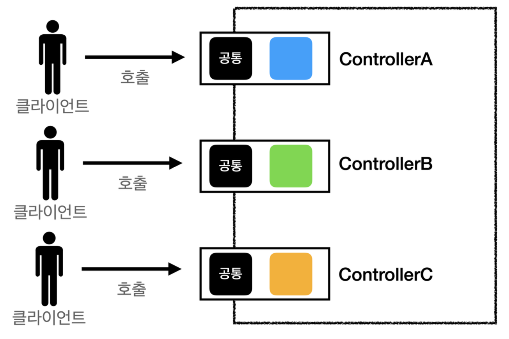
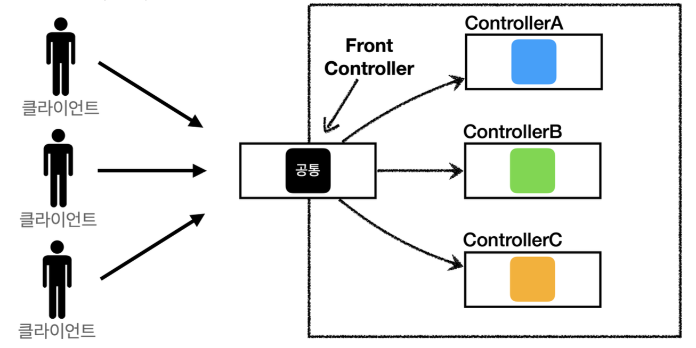
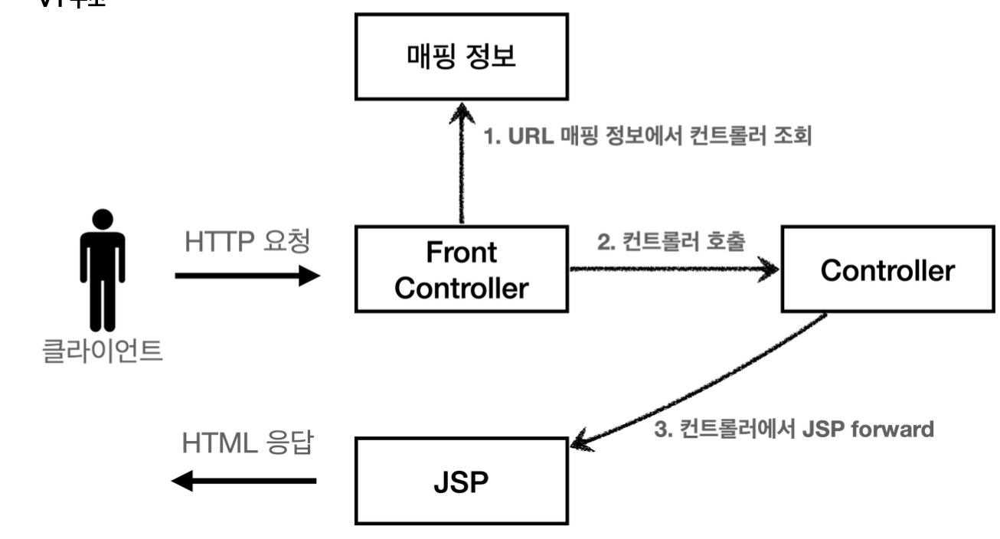
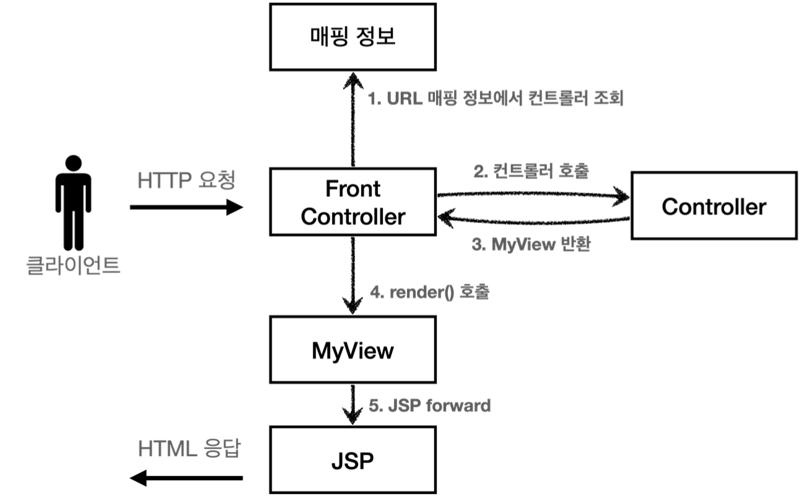
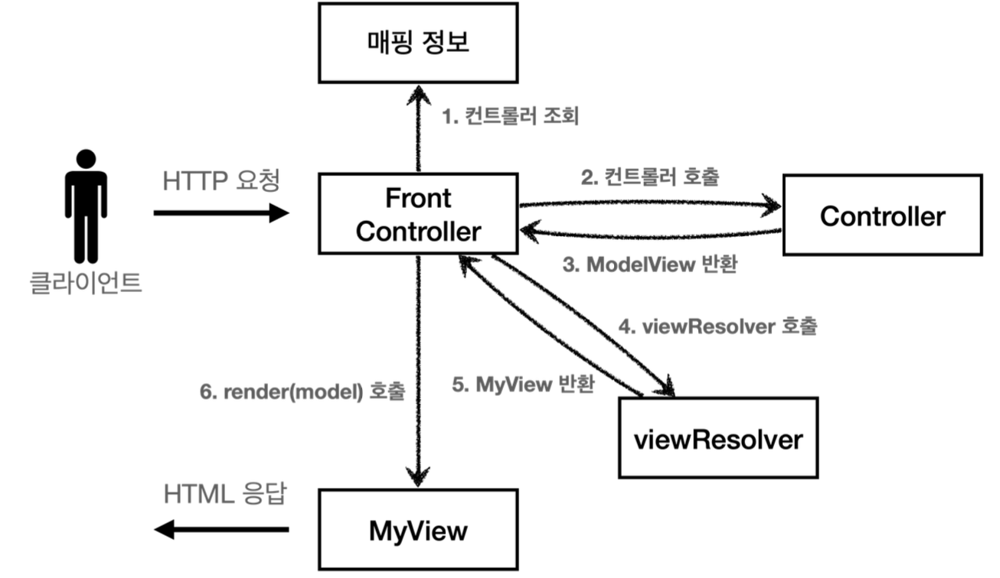

# MVC 프레임워크 만들기
## 프론트 컨트롤러 패턴 소개
- 프론트 컨트롤러 도입 전

- 프론트 컨트롤러 도입 후

### Front Controller 패턴 특징
- 프론트 컨트롤러 서블릿 하나로 클라이언트의 요청을 받음
- 프론트 컨트롤ㄹ러가 요청에 맞는 컨트롤러를 찾아서 호출
- 입구를 하나로
- 공통 처리 가능
- 프론트 컨트롤러를 제외한 나머지 컨트롤러는 서블릿을 사용하지 않아도 됨
### 스프링 웹 MVC와 프론트 컨트롤러
- 스프링 웹 MVC의 핵심도 바로 *FrontController*
- 스프링 웹 MVC의 *DispatcherServlet*이 FrontController 패턴으로 구현되어 있음
## 프론트 컨트롤러 도입 - v1
### V1 구조

### ControllerV1
```java
package hello.servlet.web.frontcontroller.v1;  
  
import jakarta.servlet.ServletException;  
import jakarta.servlet.http.HttpServletRequest;  
import jakarta.servlet.http.HttpServletResponse;  
  
import java.io.IOException;  
  
public interface ControllerV1 {  
  
    void process(HttpServletRequest request, HttpServletResponse response) throws ServletException, IOException;\  
  
}
```
- 서블릿과 비슷한 모양의 컨트롤러 인터페이스 도입
- 각 컨트롤러들은 이 인터페이스를 구현하면 됨
- 프론트 컨트롤러는 이 인터페이스를 호출해서 구현과 관계없이 로직의 일관성을 가져갈 수 있다
#### MemberFormControllerV1 - 회원 등록 컨트롤러
```java
package hello.servlet.web.frontcontroller.v1.controller;  
  
import hello.servlet.web.frontcontroller.v1.ControllerV1;  
import jakarta.servlet.RequestDispatcher;  
import jakarta.servlet.ServletException;  
import jakarta.servlet.http.HttpServletRequest;  
import jakarta.servlet.http.HttpServletResponse;  
  
import java.io.IOException;  
  
public class MemberFormControllerV1 implements ControllerV1 {  
    @Override  
    public void process(HttpServletRequest request, HttpServletResponse response) throws ServletException, IOException {  
        String viewPath = "/WEB-INF/views/new-form.jsp";  
        RequestDispatcher dispatcher = request.getRequestDispatcher(viewPath);  
        dispatcher.forward(request, response);  
    }  
}
```
#### MemberSaveControllerV1 - 회원 저장 컨트롤러
```java
package hello.servlet.web.frontcontroller.v1.controller;  
  
import hello.servlet.domain.member.Member;  
import hello.servlet.domain.member.MemberRepository;  
import hello.servlet.web.frontcontroller.v1.ControllerV1;  
import jakarta.servlet.RequestDispatcher;  
import jakarta.servlet.ServletException;  
import jakarta.servlet.http.HttpServletRequest;  
import jakarta.servlet.http.HttpServletResponse;  
  
import java.io.IOException;  
import java.util.List;  
  
public class MemberSaveControllerV1 implements ControllerV1 {  
  
    private MemberRepository memberRepository = MemberRepository.getInstance();  
  
    @Override  
    public void process(HttpServletRequest request, HttpServletResponse response) throws ServletException, IOException {  
        String username = request.getParameter("username");  
        int age = Integer.parseInt(request.getParameter("age"));  
  
        Member member = new Member(username, age);  
        memberRepository.save(member);  
  
        // Model에 데이터를 보관한다.  
        request.setAttribute("member", member);  
  
        String viewPath = "/WEB-INF/views/save-result.jsp";  
        RequestDispatcher dispatcher = request.getRequestDispatcher(viewPath);  
        dispatcher.forward(request, response);  
    }  
  
}
```
#### MemberListControllerV1 - 회원 목록 컨트롤러
```java
package hello.servlet.web.frontcontroller.v1.controller;  
  
import hello.servlet.domain.member.Member;  
import hello.servlet.domain.member.MemberRepository;  
import hello.servlet.web.frontcontroller.v1.ControllerV1;  
import jakarta.servlet.RequestDispatcher;  
import jakarta.servlet.ServletException;  
import jakarta.servlet.http.HttpServletRequest;  
import jakarta.servlet.http.HttpServletResponse;  
  
import java.io.IOException;  
import java.util.List;  
  
public class MemberListControllerV1 implements ControllerV1 {  
  
  
    private MemberRepository memberRepository = MemberRepository.getInstance();  
  
    @Override  
    public void process(HttpServletRequest request, HttpServletResponse response) throws ServletException, IOException {  
  
        List<Member> members = memberRepository.findAll();  
  
        request.setAttribute("members", members);  
  
        String viewPath = "/WEB-INF/views/members.jsp";  
        RequestDispatcher dispatcher = request.getRequestDispatcher(viewPath);  
        dispatcher.forward(request, response);  
  
    }  
}
```
### FrontControllerServletV1 - 프론트 컨트롤러
```java
package hello.servlet.web.frontcontroller.v1;  
  
import hello.servlet.web.frontcontroller.v1.controller.MemberFormControllerV1;  
import hello.servlet.web.frontcontroller.v1.controller.MemberListControllerV1;  
import hello.servlet.web.frontcontroller.v1.controller.MemberSaveControllerV1;  
import jakarta.servlet.ServletException;  
import jakarta.servlet.annotation.WebServlet;  
import jakarta.servlet.http.HttpServlet;  
import jakarta.servlet.http.HttpServletRequest;  
import jakarta.servlet.http.HttpServletResponse;  
  
import java.io.IOException;  
import java.util.HashMap;  
import java.util.Map;  
  
@WebServlet(name = "frontControllerServletV1", urlPatterns = "/front-controller/v1/*")  
public class FrontControllerServletV1 extends HttpServlet {  
  
    private Map<String, ControllerV1> controllerMap = new HashMap<>();  
  
    public FrontControllerServletV1() {  
        controllerMap.put("/front-controller/v1/members/new-form", new MemberFormControllerV1());  
        controllerMap.put("/front-controller/v1/members/save", new MemberSaveControllerV1());  
        controllerMap.put("/front-controller/v1/members", new MemberListControllerV1());  
    }  
  
    @Override  
    protected void service(HttpServletRequest request, HttpServletResponse response) throws ServletException, IOException {  
        System.out.println("FrontControllerServletV1.service");  
  
        String requestURI = request.getRequestURI();  
  
        ControllerV1 controller = controllerMap.get(requestURI);  
        if (controller == null) {  
            response.setStatus(HttpServletResponse.SC_NOT_FOUND);  
            return;  
        }  
  
        controller.process(request, response);  
    }  
}
```
### 프론트 컨트롤러 분석
#### urlPatters
- `urlPatterns = "/front-controller/v1/*"`: `/front-controller/v1`를 포함한 하위 모든 요청은 이 서블릿에서 받아들임
- 예) `/front-controller/v1` , `/front-controller/v1/a` , `/front-controller/v1/a/b`
#### controllerMap
- key: 매핑 URL
- value: 호출될 컨트롤러
#### service()
- 먼저 `requestURI`를 조회해서 실제 호출할 컨트롤러를 `controllerMap`에서 찾음. 만약 없다면 404(SC_NOT_FOUND) 상태 코드 반환
- 컨트롤러를 찾고 `controller.process(request, response)` 호출해서 해당 컨트롤러 실행
## View 분리 - v2
- 모든 컨트롤러에서 뷰로 이동하는 부분에 중복이 있고 깔끔하지 않음
```java
String viewPath = "/WEB-INF/views/new-form.jsp";
RequestDispatcher dispatcher = request.getRequestDispatcher(viewPath);
dispatcher.forward(request, response);
```
### V2 구조

### MyView
```java
package hello.servlet.web.frontcontroller;  
  
import jakarta.servlet.RequestDispatcher;  
import jakarta.servlet.ServletException;  
import jakarta.servlet.http.HttpServletRequest;  
import jakarta.servlet.http.HttpServletResponse;  
  
import java.io.IOException;  
  
public class MyView {  
      
    private String viewPath;  
  
    public MyView(String viewPath) {  
        this.viewPath = viewPath;  
    }  
  
    public void render(HttpServletRequest request, HttpServletResponse response) throws ServletException, IOException {  
        RequestDispatcher dispatcher = request.getRequestDispatcher(viewPath);  
        dispatcher.forward(request, response);  
    }  
}
```
### ControllerV2
```java
package hello.servlet.web.frontcontroller.v2;  
  
import hello.servlet.web.frontcontroller.MyView;  
import jakarta.servlet.ServletException;  
import jakarta.servlet.http.HttpServletRequest;  
import jakarta.servlet.http.HttpServletResponse;  
  
import java.io.IOException;  
  
public interface ControllerV2 {  
      
    MyView process(HttpServletRequest request, HttpServletResponse response) throws ServletException, IOException;  
  
}
```
#### MemberFormControllerV2 - 회원 등록 폼
```java
package hello.servlet.web.frontcontroller.v2.controller;  
  
import hello.servlet.web.frontcontroller.MyView;  
import hello.servlet.web.frontcontroller.v2.ControllerV2;  
import jakarta.servlet.ServletException;  
import jakarta.servlet.http.HttpServletRequest;  
import jakarta.servlet.http.HttpServletResponse;  
  
import java.io.IOException;  
  
public class MemberFormControllerV2 implements ControllerV2 {  
    @Override  
    public MyView process(HttpServletRequest request, HttpServletResponse response) throws ServletException, IOException {  
        return new MyView("/WEB-INF/views/new-form.jsp");  
    }  
}
```
- 이제 각 컨트롤러는 복잡한 `dispatcher.forward()`를 직접 생성해서 호출하지 않아도 됨. 단순히 MyView 객체를 생성하고 거기에 뷰 이름만 넣고 반환하면 된다.
- `ControllerV1`을 구현한 클래스와 `ControllerV2`를 구현한 클래스를 비교해보면, 이 부분의 중복이 확실하게 제거된 것 확인 가능
#### MemberSaveControllerV2 - 회원 저장
```java
package hello.servlet.web.frontcontroller.v2.controller;  
  
import hello.servlet.domain.member.Member;  
import hello.servlet.domain.member.MemberRepository;  
import hello.servlet.web.frontcontroller.MyView;  
import hello.servlet.web.frontcontroller.v2.ControllerV2;  
import jakarta.servlet.ServletException;  
import jakarta.servlet.http.HttpServletRequest;  
import jakarta.servlet.http.HttpServletResponse;  
  
import java.io.IOException;  
  
public class MemberSaveControllerV2 implements ControllerV2 {  
  
    private MemberRepository memberRepository = MemberRepository.getInstance();  
  
    @Override  
    public MyView process(HttpServletRequest request, HttpServletResponse response) throws ServletException, IOException {  
        String username = request.getParameter("username");  
        int age = Integer.parseInt(request.getParameter("age"));  
  
        Member member = new Member(username, age);  
        memberRepository.save(member);  
  
        // Model에 데이터를 보관한다.  
        request.setAttribute("member", member);  
  
        return new MyView("/WEB-INF/views/save-result.jsp");  
    }  
}
```
#### MemberListControllerV2 - 회원 목록
```java
package hello.servlet.web.frontcontroller.v2.controller;  
  
import hello.servlet.domain.member.Member;  
import hello.servlet.domain.member.MemberRepository;  
import hello.servlet.web.frontcontroller.MyView;  
import hello.servlet.web.frontcontroller.v2.ControllerV2;  
import jakarta.servlet.ServletException;  
import jakarta.servlet.http.HttpServletRequest;  
import jakarta.servlet.http.HttpServletResponse;  
  
import java.io.IOException;  
import java.util.List;  
  
public class MemberListControllerV2 implements ControllerV2 {  
  
    private MemberRepository memberRepository = MemberRepository.getInstance();  
  
    @Override  
    public MyView process(HttpServletRequest request, HttpServletResponse response) throws ServletException, IOException {  
        List<Member> members = memberRepository.findAll();  
  
        request.setAttribute("members", members);  
  
        return new MyView("/WEB-INF/views/members.jsp");  
    }  
}
```
### 프론트 컨트롤러 - V2
```java
package hello.servlet.web.frontcontroller.v2;  
  
import hello.servlet.web.frontcontroller.MyView;  
import hello.servlet.web.frontcontroller.v2.controller.MemberFormControllerV2;  
import hello.servlet.web.frontcontroller.v2.controller.MemberListControllerV2;  
import hello.servlet.web.frontcontroller.v2.controller.MemberSaveControllerV2;  
import jakarta.servlet.ServletException;  
import jakarta.servlet.annotation.WebServlet;  
import jakarta.servlet.http.HttpServlet;  
import jakarta.servlet.http.HttpServletRequest;  
import jakarta.servlet.http.HttpServletResponse;  
  
import java.io.IOException;  
import java.util.HashMap;  
import java.util.Map;  
  
@WebServlet(name = "frontControllerServletV2", urlPatterns = "/front-controller/v2/*")  
public class FrontControllerServletV2 extends HttpServlet {  
  
    private Map<String, ControllerV2> controllerMap = new HashMap<>();  
  
    public FrontControllerServletV2() {  
        controllerMap.put("/front-controller/v2/members/new-form", new MemberFormControllerV2());  
        controllerMap.put("/front-controller/v2/members/save", new MemberSaveControllerV2());  
        controllerMap.put("/front-controller/v2/members", new MemberListControllerV2());  
    }  
  
    @Override  
    protected void service(HttpServletRequest request, HttpServletResponse response) throws ServletException, IOException {  
        System.out.println("FrontControllerServletV2.service");  
  
        String requestURI = request.getRequestURI();  
  
        ControllerV2 controller = controllerMap.get(requestURI);  
        if (controller == null) {  
            response.setStatus(HttpServletResponse.SC_NOT_FOUND);  
            return;  
        }  
  
        MyView view = controller.process(request, response);  
        view.render(request, response);  
    }  
}
```
- `ControllerV2`의 반환 타입이 `MyView`이므로 프론트 컨트롤러는 컨트롤러의 호출 결과로 `MyView`를 반환 받음
- 그리고 `view.render()`를 호출하면 `forward` 로직을 수행해서 JSP 실행
- 프론트 컨트롤러의 도입으로 `MyView` 객체의 `render()`를 호출하는 부분을 모두 일관되게 처리 가능. 각각의 컨트롤러는 `MyView` 객체를 생성만 해서 반환하면 된다.
## Model 추가 - V3
### 서블릿 종속성 제거
- 컨트롤러 입장에서 HttpServletRequest, HttpServletResponse이 꼭 필요할까?
- 요청 파라미터 정보는 자바의 Map으로 대신 넘기도록 하면 지금 구조에서는 컨트롤러가 서블릿 기술을 몰라도 동작할 수 있다.
- 그리고 request 객체를 Model로 사용하는 대신에 별도의 Model 객체를 만들어서 반환하면 된다.
### 뷰 이름 중복 제거
- 컨트롤러에서 지정하는 뷰 이름에 중복이 있는 것을 확인할 수 있다.
- 컨트롤러는 *뷰의 논리 이름*을 반환하고, 실제 물리 위치의 이름은 프론트 컨트롤러에서 처리하도록 단순화 하자.
- 이렇게 해두면 향후 뷰의 폴더 위치가 함께 이동해도 프론트 컨트롤러만 고치면 된다.
### V3 구조

### ModelView
- 지금까지 컨트롤러에서 서블릿에 종속적인 HttpServletRequest를 사용했다. 그리고 Model도 `request.setAttribute()`를 통해 데이터를 저장하고 뷰에 전달했다.
- 서블릿의 종속성을 제거하기 위해 Model을 직접 만들고, 추가로 View 이름까지 전달하는 객체를 만들어보자. 
	- 이번 버전에서는 컨트롤러에서 HttpServletRequest를 사용할 수 없다. 따라서 직접 `request.setAttribute()`를 호출할 수도 없음. 따라서 Model이 별도로 필요함
### ModelView
```java
package hello.servlet.web.frontcontroller;  
  
import java.util.HashMap;  
import java.util.Map;  
  
public class ModelView {  
    private String viewName;  
    private Map<String, Object> model = new HashMap<>();  
  
    public ModelView(String viewName) {  
        this.viewName = viewName;  
    }  
  
    public String getViewName() {  
        return viewName;  
    }  
  
    public void setViewName(String viewName) {  
        this.viewName = viewName;  
    }  
  
    public Map<String, Object> getModel() {  
        return model;  
    }  
  
    public void setModel(Map<String, Object> model) {  
        this.model = model;  
    }  
}
```
- 뷰의 이름과 뷰를 렌더링할 때 필요한 model 객체를 가지고 있다. model은 단순히 map으로 되어 있으므로 컨트롤러에서 뷰에 필요한 데이터를 key, value로 넣어주면 됨
### ControllerV3
```java
package hello.servlet.web.frontcontroller.v3;  
  
import hello.servlet.web.frontcontroller.ModelView;  
  
import java.util.Map;  
  
public interface ControllerV3 {  
    ModelView process(Map<String, String> paramMap);  
}
```
- 이 컨트롤러는 서블릿 기술을 전혀 사용하지 않는다. 따라서 구현이 매우 단순해지고, 테스트 코드 작성시 테스트하기 쉽다.
- HttpServletRequest가 제공하는 파라미터는 프론트 컨트롤러가 paramMap에 담아서 호출해주면 된다.
- 응답 결과로 뷰 이름과 뷰에 전달할 Model 데이터를 포함하는 ModelView 객체를 반환하면 됨
#### MemberFormControllerV3 - 회원 등록 폼
```java
package hello.servlet.web.frontcontroller.v3.controller;  
  
import hello.servlet.web.frontcontroller.ModelView;  
import hello.servlet.web.frontcontroller.v3.ControllerV3;  
  
import java.util.Map;  
  
public class MemberFormControllerV3 implements ControllerV3 {  
    @Override  
    public ModelView process(Map<String, String> paramMap) {  
        return new ModelView("new-form");  
    }  
}
```
- `ModelView`를 생성할 때  `new-form`이라는 view의 논리적인 이름을 지정한다. 실제 물리적인 이름은 프론트 컨트롤러에서 처리
#### MemberSaveControllerV3 - 회원 저장
```java
package hello.servlet.web.frontcontroller.v3.controller;  
  
import hello.servlet.domain.member.Member;  
import hello.servlet.domain.member.MemberRepository;  
import hello.servlet.web.frontcontroller.ModelView;  
import hello.servlet.web.frontcontroller.v3.ControllerV3;  
  
import java.util.Map;  
  
public class MemberSaveControllerV3 implements ControllerV3 {  
  
    private MemberRepository memberRepository = MemberRepository.getInstance();  
  
    @Override  
    public ModelView process(Map<String, String> paramMap) {  
        String username = paramMap.get("username");  
        int age = Integer.parseInt(paramMap.get("age"));  
  
        Member member = new Member(username, age);  
        memberRepository.save(member);  
  
        ModelView mv = new ModelView("save-result");  
        mv.getModel().put("member", member);  
        return mv;  
    }  
}
```
- `paramMap.get("username");`
	- 파라미터 정보는 map에 담겨있다. map에서 필요한 요청 파라미터를 조회하면 된다.
- `mv.getModel().put("member", member);`
	- 모델은 단순한 map이므로 모델에 뷰에서 필요한 `member` 객체를 담고 반환한다.
#### MemberListControllerV3 - 회원 목록
```java
package hello.servlet.web.frontcontroller.v3.controller;  
  
import hello.servlet.domain.member.Member;  
import hello.servlet.domain.member.MemberRepository;  
import hello.servlet.web.frontcontroller.ModelView;  
import hello.servlet.web.frontcontroller.v3.ControllerV3;  
  
import java.util.List;  
import java.util.Map;  
  
public class MemberListControllerV3 implements ControllerV3 {  
  
    private MemberRepository memberRepository = MemberRepository.getInstance();  
  
    @Override  
    public ModelView process(Map<String, String> paramMap) {  
        List<Member> members = memberRepository.findAll();  
        ModelView mv = new ModelView("members");  
        mv.getModel().put("members", members);  
  
        return mv;  
    }  
}
```
### FrontControllerServletV3
```java
package hello.servlet.web.frontcontroller.v3;  
  
import hello.servlet.web.frontcontroller.ModelView;  
import hello.servlet.web.frontcontroller.MyView;  
import hello.servlet.web.frontcontroller.v3.controller.MemberFormControllerV3;  
import hello.servlet.web.frontcontroller.v3.controller.MemberListControllerV3;  
import hello.servlet.web.frontcontroller.v3.controller.MemberSaveControllerV3;  
import jakarta.servlet.ServletException;  
import jakarta.servlet.annotation.WebServlet;  
import jakarta.servlet.http.HttpServlet;  
import jakarta.servlet.http.HttpServletRequest;  
import jakarta.servlet.http.HttpServletResponse;  
  
import java.io.IOException;  
import java.util.HashMap;  
import java.util.Map;  
  
@WebServlet(name = "frontControllerServletV2", urlPatterns = "/front-controller/v3/*")  
public class FrontControllerServletV3 extends HttpServlet {  
  
    private Map<String, ControllerV3> controllerMap = new HashMap<>();  
  
    public FrontControllerServletV3() {  
        controllerMap.put("/front-controller/v3/members/new-form", new MemberFormControllerV3());  
        controllerMap.put("/front-controller/v3/members/save", new MemberSaveControllerV3());  
        controllerMap.put("/front-controller/v3/members", new MemberListControllerV3());  
    }  
  
    @Override  
    protected void service(HttpServletRequest request, HttpServletResponse response) throws ServletException, IOException {  
        System.out.println("FrontControllerServletV3.service");  
  
        String requestURI = request.getRequestURI();  
  
        ControllerV3 controller = controllerMap.get(requestURI);  
        if (controller == null) {  
            response.setStatus(HttpServletResponse.SC_NOT_FOUND);  
            return;  
        }  
  
        // paramMap  
        Map<String, String> paramMap = createParamMap(request);  
        ModelView mv = controller.process(paramMap);  
  
        String viewName = mv.getViewName();  
        MyView view = viewResolver(viewName);  
  
        view.render(mv.getModel(), request, response);  
    }  
  
    private MyView viewResolver(String viewName) {  
        return new MyView("/WEB-INF/views/" + viewName + ".jsp");  
    }  
  
    private Map<String, String> createParamMap(HttpServletRequest request) {  
        Map<String, String > paramMap = new HashMap<>();  
        request.getParameterNames().asIterator()  
                .forEachRemaining(paramName -> paramMap.put(paramName, request.getParameter(paramName)));  
        return paramMap;  
    }  
}
```
- `createParamMap()`
	- HttpServletRequest에서 파라미터 정보를 꺼내서 Map으로 변환한다. 그리고 해당 Map(`paramMap` )을 컨트롤러에 전달하면서 호출한다.
#### 뷰 리졸버
- `MyView view = viewResolver(viewName)`
- 컨트롤러가 반환한 논리 뷰 이름을 실제 물리 뷰 경로로 변경하고 실제 물리 경로가 있는 MyView 객체 반환
	- 논리 뷰 이름: `members`
	- 물리 뷰 경로: `/WEB-INF/views/members.jsp`
- `view.render(mv.getModel(), request, response)`
	- 뷰 객체를 통해서 HTML 화면 렌더링
	- 뷰 객체의 `render()`는 모델 정보도 함께 받음
	- JSP는 `request.getAttribute()`로 데이터를 조회하기 때문에, 모델의 데이터를 꺼내서 `request.setAttribute()`로 담아둠
	- JSP로 포워드해서 JSP 렌더링
### MyView
```java
package hello.servlet.web.frontcontroller;  
  
import jakarta.servlet.RequestDispatcher;  
import jakarta.servlet.ServletException;  
import jakarta.servlet.http.HttpServletRequest;  
import jakarta.servlet.http.HttpServletResponse;  
  
import java.io.IOException;  
import java.util.Map;  
  
public class MyView {  
  
    private String viewPath;  
  
    public MyView(String viewPath) {  
        this.viewPath = viewPath;  
    }  
  
    public void render(HttpServletRequest request, HttpServletResponse response) throws ServletException, IOException {  
        RequestDispatcher dispatcher = request.getRequestDispatcher(viewPath);  
        dispatcher.forward(request, response);  
    }  
  
    public void render(Map<String, Object> model, HttpServletRequest request, HttpServletResponse response) throws ServletException, IOException {  
        modelToRequestAttribute(model, request);  
        RequestDispatcher dispatcher = request.getRequestDispatcher(viewPath);  
        dispatcher.forward(request, response);  
    }  
  
    private void modelToRequestAttribute(Map<String, Object> model, HttpServletRequest request) {  
        model.forEach((key, value) -> request.setAttribute(key, value));  
    }  
}
```
