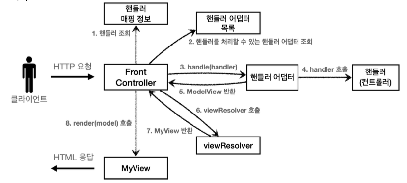
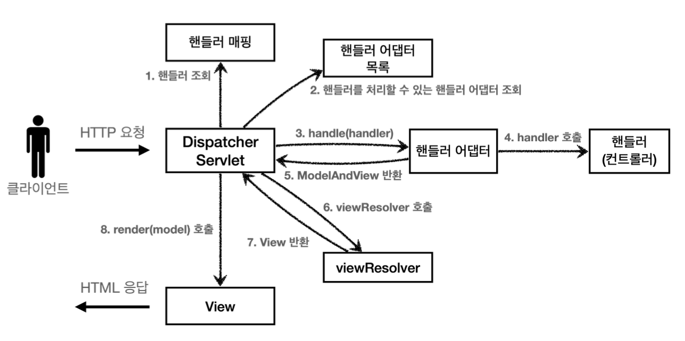

# 스프링 MVC - 구조 이해
## 스프링 MVC 전체 구조
### 직접 만든 MVC 프레임워크 구조

### SpringMVC 구조

#### 직접 만든 프레임워크 → 스프링 MVC 비교
- FrontController → DispatcherServlet
- handlerMappingMap → HandlerMapping
- MyHandlerAdapter → HandlerAdapter
- ModelView → ModelAndView
- viewResolver → ViewResolver
- MyView → View
### DispatcherServlet 구조 살펴보기
`org.springframework.web.servlet.DispatcherServlet`
- 스프링 MVC도 프론트 컨트롤러 패턴으로 구현되어 있다
- 스프링 MVC의 프론트 컨트롤러가 바로 *디스패처 서블릿*
- 이게 바로 스프링 MVC의 핵심
#### DispatcherServlet 서블릿 등록
- `DispatcherServlet`도 부모 클래스에서 `HttpServlet`을 상속 받아서 사용하고, 서블릿으로 동작
	- DispatcherServlet -> FrameworkServlet -> HttpServletBean -> HttpServlet
- 스프링 부트는 `DispatcherServlet`을 서블릿으로 자동으로 등록하면서 *모든 경로(`urlPatterns="/"`)* 에 대해서 매핑
	- 참고: 더 자세한 경로가 우선순위가 높다. 그래서 기존에 등록한 서블릿도 함께 동작함
#### 요청 흐름
- 서블릿이 호출되면 `HttpServlet`이 제공하는 `service()`가 호출됨
- 스프링 MVC는 `DispatcherServlet`의 부모인 `FrameworkServlet`에서 `service()`를 오버라이드 해두었다.
- `FrameworkServlet.service()`를 시작으로 여러 메서드가 호출되면서 `DispatcherServlet.doDispatch()`가 호출됨
### `doDispatch()` 분석
- `DispatcherServlet.doDispatch()`
```java
protected void doDispatch(HttpServletRequest request, HttpServletResponse
response) throws Exception {

	HttpServletRequest processedRequest = request;
	HandlerExecutionChain mappedHandler = null;
	ModelAndView mv = null;
	
	// 1. 핸들러 조회
	mappedHandler = getHandler(processedRequest);
	if (mappedHandler == null) {
		noHandlerFound(processedRequest, response);
		return;
	}
	
	// 2. 핸들러 어댑터 조회 - 핸들러를 처리할 수 있는 어댑터
	HandlerAdapter ha = getHandlerAdapter(mappedHandler.getHandler());
	
	// 3. 핸들러 어댑터 실행 -> 4. 핸들러 어댑터를 통해 핸들러 실행 -> 5. ModelAndView 반환
	mv = ha.handle(processedRequest, response, mappedHandler.getHandler());
	processDispatchResult(processedRequest, response, mappedHandler, mv,
	dispatchException);
	
}

private void processDispatchResult(HttpServletRequest request, HttpServletResponse response, HandlerExecutionChain mappedHandler, ModelAndView mv, Exception exception) throws Exception {

	// 뷰 렌더링 호출
	render(mv, request, response);
	
}

protected void render(ModelAndView mv, HttpServletRequest request,
HttpServletResponse response) throws Exception {

	View view;
	String viewName = mv.getViewName();
	
	// 6. 뷰 리졸버를 통해서 뷰 찾기, 7. View 반환
	view = resolveViewName(viewName, mv.getModelInternal(), locale, request);
	
	// 8. 뷰 렌더링
	view.render(mv.getModelInternal(), request, response);

}
```
#### 동작 순서
1. **핸들러 조회**: 핸들러 매핑을 통해 요청 URL에 매핑된 핸들러(컨트롤러)를 조회
2. **핸들러 어댑터 조회**: 핸들러를 실행할 수 있는 핸들러 어댑터를 조회
3. **핸들러 어댑터 실행**: 핸들러 어댑터를 실행
4. **핸들러 실행**: 핸들러 어댑터가 실제 핸들러를 실행
5. **ModelAndView 반환**: 핸들러 어댑터는 핸들러가 반환하는 정보를 ModelAndView로 변환해서 반환
6. **viewResolver 호출**: 뷰 리졸버를 찾고 실행
	- JSP의 경우 `InternalResourceViewResolver`가 자동 등록되고 사용됨
7. **View 반환**: 뷰 리졸버는 뷰의 논리 이름을 물리 이름으로 바꾸고, 렌더링 역할을 담당하는 뷰 객체 반환
	- JSP의 경우 `InternalResourceView(JstlView)`를 반환하는데, 내부에 `forward()` 로직이 있음
8. **뷰 렌더링**: 뷰를 통해서 뷰를 렌더링한다.
#### 인터페이스 살펴보기
- 스프링 MVC의 큰 강점은 *`DispatcherServlet` 코드의 변경 없이, 원하는 기능을 변경하거나 확장 가능하다는 점.* 지금까지 설명한 대부분을 확장 가능할 수 있게 인터페이스로 제공
- 이 인터페이스들만 구현해서 `DispatcherServlet`에 등록하면 자신만의 컨트롤러를 만들 수 있음
#### 주요 인터페이스 목록
- 핸들러 매핑: `org.springframework.web.servlet.HandlerMapping`
- 핸들러 어댑터: `org.springframework.web.servlet.HandlerAdapter`
- 뷰 리졸버: `org.springframework.web.servlet.ViewResolver`
- 뷰: `org.springframework.web.servlet.View`
## 핸들러 매핑과 핸들러 어댑터
- 지금은 전혀 사용하지 않지만, 과거에 주로 사용했던 스프링이 제공하는 간단한 컨트롤러로 핸들러 매핑과 어댑터를 이해해보자
### Controller 인터페이스
#### 과거 버전 스프링 컨트롤러
```java
@FunctionalInterface  
public interface Controller {  
    @Nullable ModelAndView handleRequest(HttpServletRequest request, HttpServletResponse response) throws Exception;  
}
```
> 참고
> `Controller` 인터페이스는 `@Controller` 애노테이션과는 전혀 다르다.
#### OldController
```java
package hello.servlet.web.springmvc.old;  
  
import jakarta.servlet.http.HttpServletRequest;  
import jakarta.servlet.http.HttpServletResponse;  
import org.jspecify.annotations.Nullable;  
import org.springframework.stereotype.Component;  
  
import org.springframework.web.servlet.ModelAndView;  
import org.springframework.web.servlet.mvc.Controller;  
  
@Component("/springmvc/old-controller")  
public class OldController implements Controller {  
      
    @Override  
    public @Nullable ModelAndView handleRequest(HttpServletRequest request, HttpServletResponse response) throws Exception {  
        System.out.println("OldController.handleRequest");  
        return null;  
    }  
}
```
- `@Component`: 이 컨트롤러는 `/springmvc/old-controller`라는 이름의 스프링 빈으로 등록되었다.
- **빈의 이름으로 URL을 매핑**할 것이다.
#### 이 컨트롤러는 어떻게 호출될 수 있을까?
- 2가지가 필요함
1. **HandlerMapping(핸들러 매핑)**
	- 핸들러 매핑에서 이 컨트롤러를 찾을 수 있어야 함
	- 예) 스프링 빈의 이름으로 핸들러를 찾을 수 있는 핸들러 매핑이 필요
2. **HandlerAdapter(핸들러 어댑터)**
	- 핸들러 매핑을 통해서 찾은 핸들러를 실행할 수 있는 핸들러 어댑터가 필요
	- 예) `Controller` 인터페이스를 실행할 수 있는 핸들러 어댑터를 찾고 실행
#### 스프링 부트가 자동 등록하는 핸들러 매핑과 핸들러 어댑터
##### HandlerMapping
```
0 = RequestMappingHandlerMapping : 애노테이션 기반의 컨트롤러인 @RequestMapping에서 사용
1 = BeanNameUrlHandlerMapping : 스프링 빈의 이름으로 핸들러를 찾는다.
```
##### HandlerAdapter
```
0 = RequestMappingHandlerAdapter : 애노테이션 기반의 컨트롤러인 @RequestMapping에서 사용
1 = HttpRequestHandlerAdapter : HttpRequestHandler 처리
2 = SimpleControllerHandlerAdapter : Controller 인터페이스(애노테이션X, 과거에 사용) 처리
```
- 핸들러 매핑도, 핸들러 어댑터도 모두 순서대로 찾고 만약 없으면 다음 순서로 넘어간다.
#### 1. 핸들러 매핑으로 핸들러 조회
1. `HandlerMapping` 을 순서대로 실행해서, 핸들러를 찾는다.
2. 이 경우 빈 이름으로 핸들러를 찾아야 하기 때문에 이름 그대로 빈 이름으로 핸들러를 찾아주는 `BeanNameUrlHandlerMapping` 가 실행에 성공하고 핸들러인 `OldController` 를 반환한다.
#### 2. 핸들러 어댑터 조회
1. `HandlerAdapter` 의 `supports()` 를 순서대로 호출한다.
2. `SimpleControllerHandlerAdapter` 가 `Controller` 인터페이스를 지원하므로 대상이 된다.
#### 3. 핸들러 어댑터 실행
1. 디스패처 서블릿이 조회한 `SimpleControllerHandlerAdapter` 를 실행하면서 핸들러 정보도 함께 넘겨준다.
2. `SimpleControllerHandlerAdapter` 는 핸들러인 `OldController` 를 내부에서 실행하고, 그 결과를 반환한다.
#### 정리 - OldController 핸들러매핑, 어댑터
`OldController` 를 실행하면서 사용된 객체는 다음과 같다.
- `HandlerMapping = BeanNameUrlHandlerMapping`
- `HandlerAdapter = SimpleControllerHandlerAdapter`
### HttpRequestHandler
- *서블릿과 가장 유사한 형태*의 핸들러
#### HttpRequestHandler
```java
public interface HttpRequestHandler {
	void handleRequest(HttpServletRequest request, HttpServletResponse response) throws ServletException, IOException;
}
```
#### MyHttpRequestHandler
```java
package hello.servlet.web.springmvc.old;  
  
import jakarta.servlet.ServletException;  
import jakarta.servlet.http.HttpServletRequest;  
import jakarta.servlet.http.HttpServletResponse;  
import org.springframework.stereotype.Component;  
import org.springframework.web.HttpRequestHandler;  
  
import java.io.IOException;  
  
@Component("/sprintmvc/request-handler")  
public class MyHttpRequestHandler implements HttpRequestHandler {  
    @Override  
    public void handleRequest(HttpServletRequest request, HttpServletResponse response) throws ServletException, IOException {  
        System.out.println("MyHttpRequestHandler.handleRequest");  
    }  
}
```
**1. 핸들러** **매핑으로** **핸들러** **조회**
1. `HandlerMapping` 을 순서대로 실행해서, 핸들러를 찾는다.
2. 이 경우 빈 이름으로 핸들러를 찾아야 하기 때문에 이름 그대로 빈 이름으로 핸들러를 찾아주는 `BeanNameUrlHandlerMapping` 가 실행에 성공하고 핸들러인 `MyHttpRequestHandler` 를 반환한다.
**2. 핸들러** **어댑터** **조회***
3. `HandlerAdapter` 의 `supports()` 를 순서대로 호출한다.
4. `HttpRequestHandlerAdapter` 가 `HttpRequestHandler` 인터페이스를 지원하므로 대상이 된다.
**3. 핸들러** **어댑터** **실행**
5. 디스패처 서블릿이 조회한 `HttpRequestHandlerAdapter` 를 실행하면서 핸들러 정보도 함께 넘겨준다.
6. `HttpRequestHandlerAdapter` 는 핸들러인 `MyHttpRequestHandler` 를 내부에서 실행하고, 그 결과를 반환한다.
#### 정리 - MyHttpRequestHandler 핸들러매핑, 어댑터
`MyHttpRequestHandler` 를 실행하면서 사용된 객체는 다음과 같다.
- `HandlerMapping = BeanNameUrlHandlerMapping`
- `HandlerAdapter = HttpRequestHandlerAdapter`
#### @RequestMapping
- 조금 뒤에서 설명하겠지만, 가장 우선순위가 높은 핸들러 매핑과 핸들러 어댑터는 `RequestMappingHandlerMapping` , `RequestMappingHandlerAdapter` 이다.
- `@RequestMapping` 의 앞글자를 따서 만든 이름인데, 이것이 바로 지금 스프링에서 주로 사용하는 애노테이션 기반의 컨트롤러를 지원하는 매핑과 어댑터이다. 실무에서는 99.9% 이 방식의 컨트롤러를 사용한다.
## 뷰 리졸버
#### OldController - View 조회할 수 있도록 변경
```java
package hello.servlet.web.springmvc.old;  
  
import jakarta.servlet.http.HttpServletRequest;  
import jakarta.servlet.http.HttpServletResponse;  
import org.jspecify.annotations.Nullable;  
import org.springframework.stereotype.Component;  
  
import org.springframework.web.servlet.ModelAndView;  
import org.springframework.web.servlet.mvc.Controller;  
  
@Component("/springmvc/old-controller")  
public class OldController implements Controller {  
  
    @Override  
    public @Nullable ModelAndView handleRequest(HttpServletRequest request, HttpServletResponse response) throws Exception {  
        System.out.println("OldController.handleRequest");  
        return new ModelAndView("new-form");  
    }  
}
```
- 실행해보면 컨트롤러는 정상 호출되지만, Whitelabel Error Page 호출됨
- **`application.properties`에 코드 추가**
```
spring.mvc.view.prefix=/WEB-INF/views/  
spring.mvc.view.suffix=.jsp
```
#### 뷰 리졸버 - InternalResourceViewResolver
- 스프링 부트는 `InternalResourceViewResolver`라는 뷰 리졸버를 자동으로 등록하는데, 이 때 `application.properties`에 등록한 `spring.mvc.view.prefix`, `spring.mvc.view.suffix` 설정 정보를 사용해서 등록
### 뷰 리졸버 동작 방식
#### 스프링 부트가 자동 등록하는 뷰 리졸버
```
1 = BeanNameViewResolver : 빈 이름으로 뷰를 찾아서 반환한다. (예: 엑셀 파일 생성 기능에 사용)
2 = InternalResourceViewResolver : JSP를 처리할 수 있는 뷰를 반환한다.
```
#### 1. 핸들러 어댑터 호출
- 핸들러 어댑터를 통해 `new-form`이라는 논리 뷰 이름 획득
#### 2. ViewResolver 호출
- 논리 뷰 이름으로 viewResolver를 순서대로 호출
- `BeanNameViewResolver`는 `new-form`이라는 이름의 스프링 빈으로 등록된 뷰를 찾아야 하는데 없다.
- `InternalResourceViewResolver`가 호출됨
#### 3. InternalResourceViewResolver
- 이 뷰 리졸버는 `InternalResourceView`를 반환
#### 4. 뷰 - InternalResourceView
- `InternalResourceView`는 JSP처럼 포워드 `forward()`를 호출해서 처리할 수 있는 경우에 사용됨
#### 5. view.render()
- `view.render()`가 호출되고 `InternalResourceView`는 `forward()`를 사용해서 JSP를 실행
>***참고***
`InternalResourceViewResolver` 는 만약 JSTL 라이브러리가 있으면 `InternalResourceView` 를 상속받은 `JstlView` 를 반환한다. `JstlView` 는 JSTL 태그 사용시 약간의 부가 기능이 추가된다.

>***참고***
다른 뷰는 실제 뷰를 렌더링하지만, JSP의 경우 `forward()` 통해서 해당 JSP로 이동(실행)해야 렌더링이 된다.
JSP를 제외한 나머지 뷰 템플릿들은 `forward()` 과정 없이 바로 렌더링 된다.

>**참고***
Thymeleaf 뷰 템플릿을 사용하면 `ThymeleafViewResolver` 를 등록해야 한다. 최근에는 라이브러리만 추가하면 스프링 부트가 이런 작업도 모두 자동화해준다.
## 스프링 MVC - 시작하기
- 스프링이 제공하는 컨트롤러는 애노테이션 기반으로 동작해서 매우 유연하고 실용적
#### @RequestMapping
- 스프링은 애노테이션을 활용한 매우 유연하고 실용적인 컨트롤러를 만들었는데 이것이 바로 `@RequestMapping` 애노테이션을 사용하는 컨트롤러
- `@RequestMapping`
	- `RequestMappingHandlerMapping`
	- `RequestMappingHandlerAdapter`
### SpringMemberFormControllerV1 - 회원 등록 폼
```java
package hello.servlet.web.springmvc.v1;  
  
import org.springframework.stereotype.Controller;  
import org.springframework.web.bind.annotation.RequestMapping;  
import org.springframework.web.servlet.ModelAndView;  
  
@Controller  
public class SpringMemberFormControllerV1 {  
  
    @RequestMapping("/springmvc/v1/members/new-form")  
    public ModelAndView process() {  
        System.out.println("SpringMemberFormControllerV1.process");  
        return new ModelAndView("new-form");  
    }  
}
```
- `@Controller`
	- 스프링이 자동으로 스프링 빈으로 등록 (내부에 `@Component` 애노테이션이 있어서 컴포넌트 스캔의 대상이 됨)
	- 스프링 MVC에서 애노테이션 기반 컨트롤러로 인식
- `@RequestMapping`: 요청 정보를 매핑한다. 해당 URL이 호출되면 이 메서드가 호출됨. 애노테이션을 기반으로 동작하기 때문에 메서드의 이름은 임의로 지으면 된다.
- `ModelAndView`: 모델과 뷰 정보를 담아서 반환하면 된다.
### SpringMemberSaveControllerV1 - 회원 저장
```java
package hello.servlet.web.springmvc.v1;  
  
import hello.servlet.domain.member.Member;  
import hello.servlet.domain.member.MemberRepository;  
  
import jakarta.servlet.http.HttpServletRequest;  
import jakarta.servlet.http.HttpServletResponse;  
import org.springframework.stereotype.Controller;  
import org.springframework.web.bind.annotation.RequestMapping;  
import org.springframework.web.servlet.ModelAndView;  
  
@Controller  
public class SpringMemberSaveControllerV1 {  
    private MemberRepository memberRepository = MemberRepository.getInstance();  
    @RequestMapping("/springmvc/v1/members/save")  
    public ModelAndView process(HttpServletRequest request, HttpServletResponse  
            response) {  
        String username = request.getParameter("username");  
        int age = Integer.parseInt(request.getParameter("age"));  
        Member member = new Member(username, age);  
        System.out.println("member = " + member);  
        memberRepository.save(member);  
        ModelAndView mv = new ModelAndView("save-result");  
        mv.addObject("member", member);  
        return mv;  
    }  
}
```
- `mv.addObject("member", member)`
	- 스프링이 제공하는 `ModelAndView`를 통해 Model 데이터를 추가할 때는 `addObject()`를 사용하면 된다. 이 데이터는 이후 뷰를 렌더링할 때 사용됨
### SpringMemberListControllerV1 - 회원 목록
```java
package hello.servlet.web.springmvc.v1;  
  
import hello.servlet.domain.member.Member;  
import hello.servlet.domain.member.MemberRepository;  
  
import org.springframework.stereotype.Controller;  
import org.springframework.web.bind.annotation.RequestMapping;  
import org.springframework.web.servlet.ModelAndView;  
import java.util.List;  
  
@Controller  
public class SpringMemberListControllerV1 {  
    private MemberRepository memberRepository = MemberRepository.getInstance();  
    @RequestMapping("/springmvc/v1/members")  
    public ModelAndView process() {  
        List<Member> members = memberRepository.findAll();  
        ModelAndView mv = new ModelAndView("members");  
        mv.addObject("members", members);  
        return mv;  
    }  
}
```
## 스프링 MVC - 컨트롤러 통합
- `@RequestMapping`을 잘 보면 클래스 단위가 아니라 메서드 단위에 적용된 것을 확인 가능. 따라서 컨트롤러 클래스를 유연하게 하나로 통합할 수 있다.
### SpringMemberControllerV2
```java
package hello.servlet.web.springmvc.v2;  
  
import hello.servlet.domain.member.Member;  
import hello.servlet.domain.member.MemberRepository;  
import jakarta.servlet.http.HttpServletRequest;  
import jakarta.servlet.http.HttpServletResponse;  
import org.springframework.stereotype.Controller;  
import org.springframework.web.bind.annotation.RequestMapping;  
import org.springframework.web.servlet.ModelAndView;  
  
import java.util.List;  
  
@Controller  
@RequestMapping("/springmvc/v2/members")  
public class SpringMemberControllerV2 {  
  
    private MemberRepository memberRepository = MemberRepository.getInstance();  
  
    @RequestMapping("/new-form")  
    public ModelAndView newForm() {  
        return new ModelAndView("new-form");  
    }  
  
    @RequestMapping("/save")  
    public ModelAndView save(HttpServletRequest request, HttpServletResponse  
            response) {  
        String username = request.getParameter("username");  
        int age = Integer.parseInt(request.getParameter("age"));  
        Member member = new Member(username, age);  
        System.out.println("member = " + member);  
        memberRepository.save(member);  
        ModelAndView mv = new ModelAndView("save-result");  
        mv.addObject("member", member);  
        return mv;  
    }  
  
    @RequestMapping
    public ModelAndView members() {  
        List<Member> members = memberRepository.findAll();  
        ModelAndView mv = new ModelAndView("members");  
        mv.addObject("members", members);  
        return mv;  
    }  
  
}
```
### 조합
- 컨트롤러 클래스를 통합하는 것을 넘어서 조합 가능
- 클래스 레벨에 다음과 같이 `@RequestMapping`을 두면 메서드 레벨과 조합 가능
```java
@Controller
@RequestMapping("/springmvc/v2/members")
public class SpringMemberControllerV2 {

	@RequestMapping("/save")  // /springmvc/v2/members/save
	public ModelAndView save() {
	}
}
```
## 스프링 MVC - 실용적인 방식
- 스프링 MVC는 개발자가 편리하게 개발할 수 있도록 많은 편의 기능 제공
- **실무에서는 지금부터 설명하는 방식을 주로 사용**
### SpringMemberControllerV3
```java
package hello.servlet.web.springmvc.v3;  
  
import hello.servlet.domain.member.Member;  
import hello.servlet.domain.member.MemberRepository;  
import org.springframework.stereotype.Controller;  
import org.springframework.ui.Model;  
import org.springframework.web.bind.annotation.*;  
  
import java.util.List;  
  
@Controller  
@RequestMapping("/springmvc/v3/members")  
public class SpringMemberControllerV3 {  
  
    private MemberRepository memberRepository = MemberRepository.getInstance();  
  
    @GetMapping("/new-form")  
    public String newForm() {  
        return "new-form";  
    }  
  
    @PostMapping("/save")  
    public String save(  
            @RequestParam("username") String username,  
            @RequestParam("age") int age,  
            Model model  
    ) {  
  
        Member member = new Member(username, age);  
        memberRepository.save(member);  
  
        model.addAttribute("member", member);  
        return "save-result";  
    }  
  
    @GetMapping  
    public String members(Model model) {  
  
        List<Member> members = memberRepository.findAll();  
        model.addAttribute("members", members);  
  
        return "members";  
    }  
  
}
```
#### Model 파라미터
- `save()`, `members()`를 보면 Model을 파라미터로 받는 것을 확인할 수 있다. 스프링 MVC도 이런 편의 기능 제공
#### ViewName 직접 반환
- 뷰의 논리 이름 직접 반환 가능
#### @RequestParam 사용
- 스프링은 HTTP 요청 파라미터를 `@RequestParam`으로 받을 수 있다.
- `RequestParam("username")`은 `request.getParameter("username")`과 거의 같은 코드라 생각하면 됨
- 물론 GET 쿼리 파라미터, POST Form 방식 모두 지원
#### @RequestMapping → @GetMapping, @PostMapping
- `@RequestMapping` 은 URL만 매칭하는 것이 아니라, HTTP Method도 함께 구분할 수 있다.
- 예를 들어서 URL이 `/new-form` 이고, HTTP Method가 GET인 경우를 모두 만족하는 매핑을 하려면 다음과 같이 처리하면 된다.
```java
@RequestMapping(value = "/new-form", method = RequestMethod.GET)
```
- 이것을 `@GetMapping` , `@PostMapping`으로 더 편리하게 사용할 수 있다.
- 참고로 Get, Post, Put, Delete, Patch 모두 애노테이션이 준비되어 있다.