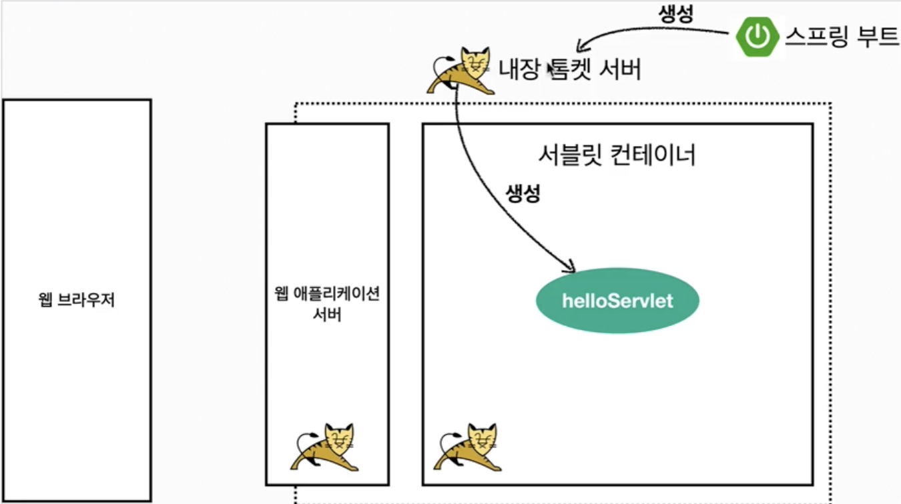
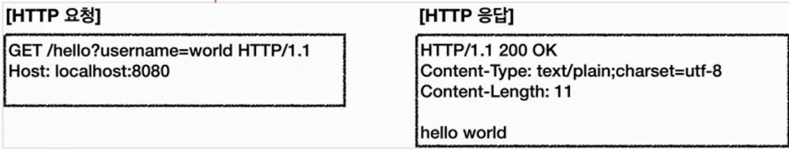
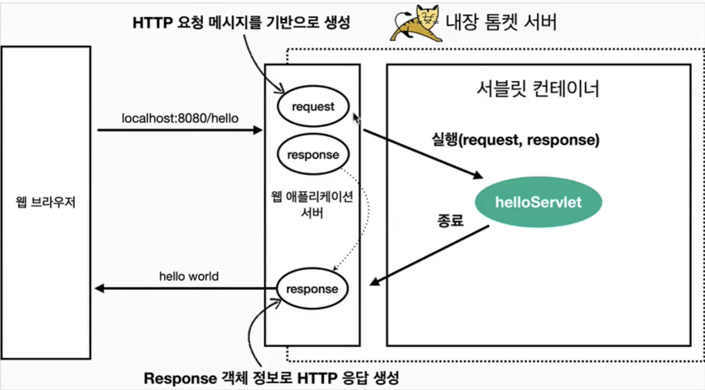

# 서블릿
## Hello 서블릿
> 서블릿은 톰캣 같은 웹 애플리케이션 서버를 직접 설치하고 그 위에 서블릿 코드를 클래스 파일로 빌드해서 올린 다음, 톰캣 서버를 실행하면 됨. 하지만 과정이 매우 번거로움
> 스프링 부트는 톰캣 서버를 내장하고 있으므로, 톰캣 서버 설치 없이 편리하게 서블릿 코드를 실행할 수 있다.
### 스프링 부트 서블릿 환경 구성
- `@ServletComponentScan`
- 스프링 부트는 서블릿을 직접 등록해서 사용할 수 있도록 애노테이션 지원
```java
@ServletComponentScan  
@SpringBootApplication  
public class ServletApplication {  
  
    public static void main(String[] args) {  
       SpringApplication.run(ServletApplication.class, args);  
    }  
  
}
```
- `@WebServlet` 서블릿 애노테이션
	- name: 서블릿 이름
	- urlPatterns: URL 매핑
- HTTP 요청을 통해 매핑된 URL이 호출되면 서블릿 컨테이너는 다음 메서드를 실행함
- `protected void service(HttpServletRequest request, HttpServletResponse response)`
```java
@WebServlet(name = "helloServlet", urlPatterns = "/hello")  
public class HelloServlet extends HttpServlet {  
    @Override  
    protected void service(HttpServletRequest request, HttpServletResponse response) throws ServletException, IOException {  
//        super.service(req, resp);  
        System.out.println("HelloServlet.service");  
        System.out.println("request = " + request);  
        System.out.println("response = " + response);  
  
        String username = request.getParameter("username");  
        System.out.println("username = " + username);  
  
        response.setContentType("text/plain");  
        response.setCharacterEncoding("utf-8");  
        response.getWriter().write("hello " + username);  
    }  
}
```
### HTTP 요청 메시지 로그로 확인하기
- `application.properties`
```properties
logging.level.org.apache.coyote.http11=trace
```
- 서버가 받은 HTTP 요청 메시지 출력
> 참고: 운영서버에 이렇게 모든 요청 정보를 다 남기면 성능저하가 발생 가능. 개발 단계에만 적용
### 서블릿 컨테이너 동작 방식 설명
- 내장 톰캣 서버 생성

- HTTP 요청, HTTP 응답 메시지

- 웹 애플리케이션 서버의 요청 응답 구조

>참고: HTTP 응답에서 Content-Length는 웹 애플리케이션 서버가 자동으로 생성해줌
### welcome 페이지 추가
- webapp경로에 index.html 추가
## HttpServletRequest - 개요
- **역할**
	- HTTP 요청 메시지를 개발자가 직접 파싱해서 사용해도 되지만, 매우 불편함
	- 서블릿은 개발자가 HTTP 요청 메시지를 편리하게 사용할 수 있도록 대신에 HTTP 요청 메시지를 파싱
	- 그리고 그 결과를 `HttpServletRequest` 객체에 담아서 제공함
- HttpServletRequest를 사용하면 다음과 같은 HTTP 요청 메시지를 편리하게 조회할 수 있다.
- **HTTP 요청 메시지**
```
POST /save HTTP/1.1

Host: localhost:8080

Content-Type: application/x-www-form-urlencoded

username=kim&age=20
```
- START LINE
	- HTTP 메소드
	- URL쿼리 스트링
	- 스키마, 프로토콜
- 헤더
	- 헤더 조회
- 바디
	- form 파라미터 형식 조회
	- message body 데이터 직접 조회
- HttpServletRequest 객체는 추가로 여러가지 부가기능도 함께 제공
- **임시 저장소 기능**
- 해당 HTTP 요청이 시작부터 끝날 때까지 유지되는 임시 저장소 기능
	- 저장: `request.setAttribute(name, value)`
	- 조회: `request.getAttribute(name)`
- 세션 관리 기능: `request.getSession(create: true)`
## HttpServletReqeust - 기본 사용법
### start-line 정보
```java
@Override  
    protected void service(HttpServletRequest request, HttpServletResponse response) throws ServletException, IOException {  
  
        printStartLine(request);  
        printHeaders(request);  
        printHeaderUtils(request);  
        printEtc(request);  
  
    }  
  
    private static void printStartLine(HttpServletRequest request) {  
        System.out.println("--- REQUEST-LINE - start ---");  
        System.out.println("request.getMethod() = " + request.getMethod()); //GET  
        System.out.println("request.getProtocol() = " + request.getProtocol()); // HTTP/1.1  
        System.out.println("request.getScheme() = " + request.getScheme()); //http  
        // http://localhost:8080/request-header        System.out.println("request.getRequestURL() = " + request.getRequestURL());  
        // /request-header  
        System.out.println("request.getRequestURI() = " + request.getRequestURI());  
        //username=hi  
        System.out.println("request.getQueryString() = " + request.getQueryString());  
        System.out.println("request.isSecure() = " + request.isSecure()); //https 사용  유무  
        System.out.println("--- REQUEST-LINE - end ---");  
        System.out.println();  
    }  
  
```
### 헤더 정보
```java

    private void printHeaders(HttpServletRequest request) {  
        System.out.println("--- Headers - start ---");  
  
//        Enumeration<String> headerNames = request.getHeaderNames();  
//        while (headerNames.hasMoreElements()) {  
//            String headerName = headerNames.nextElement();  
//            System.out.println("headerName: " + headerName);  
//        }  
  
        request.getHeaderNames().asIterator()  
                        .forEachRemaining(headerName -> System.out.println("headerName: " + headerName));  
  
        System.out.println("--- Headers - end ---");  
        System.out.println();  
    }  
 
```
### Header 편리한 조회
```java
 
    private void printHeaderUtils(HttpServletRequest request) {  
        System.out.println("--- Header 편의 조회 start ---");  
        System.out.println("[Host 편의 조회]");  
        System.out.println("request.getServerName() = " +  
                request.getServerName()); //Host 헤더  
        System.out.println("request.getServerPort() = " +  
                request.getServerPort()); //Host 헤더  
        System.out.println();  
        System.out.println("[Accept-Language 편의 조회]");  
        request.getLocales().asIterator()  
                .forEachRemaining(locale -> System.out.println("locale = " +  
                        locale));  
        System.out.println("request.getLocale() = " + request.getLocale());  
        System.out.println();  
        System.out.println("[cookie 편의 조회]");  
        if (request.getCookies() != null) {  
            for (Cookie cookie : request.getCookies()) {  
                System.out.println(cookie.getName() + ": " + cookie.getValue());  
            }  
        }  
        System.out.println();  
        System.out.println("[Content 편의 조회]");  
        System.out.println("request.getContentType() = " +  
                request.getContentType());  
  
        System.out.println("request.getContentLength() = " +  
                request.getContentLength());  
        System.out.println("request.getCharacterEncoding() = " +  
                request.getCharacterEncoding());  
        System.out.println("--- Header 편의 조회 end ---");  
        System.out.println();  
    }  
 
```
### 기타 정보
```java
  
    private void printEtc(HttpServletRequest request) {  
        System.out.println("--- 기타 조회 start ---");  
        System.out.println("[Remote 정보]");  
        System.out.println("request.getRemoteHost() = " +  
                request.getRemoteHost()); //  
        System.out.println("request.getRemoteAddr() = " +  
                request.getRemoteAddr()); //  
        System.out.println("request.getRemotePort() = " +  
                request.getRemotePort()); //  
        System.out.println();  
        System.out.println("[Local 정보]");  
        System.out.println("request.getLocalName() = " + request.getLocalName()); //  
        System.out.println("request.getLocalAddr() = " + request.getLocalAddr()); //  
        System.out.println("request.getLocalPort() = " + request.getLocalPort()); //  
        System.out.println("--- 기타 조회 end ---");  
        System.out.println();  
    }
    
```
## HTTP 요청 데이터 - 개요
- 주로 3가지 방법 사용
- **GET - 쿼리 파라미터**
	- /url *?username=hello&age=20*
	- 메시지 바디 없이 URL의 쿼리 파라미터에 데이터를 포함해서 전달
	- 예) 검색, 필터, 페이징 등에서 많이 사용하는 방식
- **POST - HTML form**
	- content-type: application/x-www-form-urlencoded
	- 메시지 바디에 쿼리 파라미터 형식으로 전달 username=hello&age=20
	- 예) 회원 가입, 상품 주문, HTML form 사용
- **HTTP message body**에 데이터를 직접 담아서 요청
	- HTTP API에서 주로 사용, JSON, XML, TEXT
	- 데이터 형식은 주로 JSON 사용
	- POST, PUT, PATCH
## HTTP 요청 데이터 - GET 쿼리 파라미터
- URL에 `?`를 시작으로 보낼 수 있음. 추가 파라미터는 `&`로 구분
- 서버에서는 `HttpServletRequest`가 제공하는 다음 메서드를 통해 쿼리 파라미터를 편리하게 조회 가능
```java
/**  
 * 1. 파라미터 전송 기능  
 * http://localhost:8080/request-param?username=hello&age=20  
 * */@WebServlet(name = "requestParamServlet", urlPatterns = "/request-param")  
public class RequestParamServlet extends HttpServlet {  
    @Override  
    protected void service(HttpServletRequest request, HttpServletResponse response) throws ServletException, IOException {  
        System.out.println("[전체 파라미터 조회] - start");  
  
        request.getParameterNames().asIterator()  
                        .forEachRemaining(paramName -> System.out.println(paramName + "=" + request.getParameter(paramName)));  
  
        System.out.println("[전체 파라미터 조회] - end");  
        System.out.println();  
  
        System.out.println("[단일 파라미터 조회]");  
        String username = request.getParameter("username");  
        String age = request.getParameter("age");  
        System.out.println("username = " + username);  
        System.out.println("age = " + age);  
        System.out.println();  
  
        System.out.println("[이름이 같은 복수 파라미터 조회]");  
        String[] usernames = request.getParameterValues("username");  
        for (String name : usernames) {  
            System.out.println("username = " + name);  
        }  
  
        response.getWriter().write("ok");  
  
    }  
}
```
### 복수 파라미터에서 단일 파라미터 조회
- `username=hello&username=kim` 과 같이 파라미터 이름은 하나인데, 값이 중복이면 어떻게 될까?
- `request.getParameter()` 는 하나의 파라미터 이름에 대해서 단 하나의 값만 있을 때 사용해야 한다. 
- 지금처럼 중복일 때는 `request.getParameterValues()` 를 사용해야 한다.
- 참고로 이렇게 중복일 때 `request.getParameter()` 를 사용하면 `request.getParameterValues()` 의 첫 번째 값을 반환한다.
## HTTP 요청 데이터 - POST HTML Form
### 특징
- content-type: `application/x-www-form-urlencoded`
- 메시지 바디에 쿼리 파라미터 형식으로 데이터를 전달한다.
-  POST의 HTML Form을 전송하면 웹 브라우저는 다음 형식으로 HTTP 메시지를 만든다. (웹 브라우저 개발자 모드 확인)
	- 요청 URL: http://localhost:8080/request-param
	- content-type: application/x-www-form-urlencoded
	- message body: username=hello&age=20
> ⚠️ 참고
> content-type은 HTTP 메시지 바디의 데이터 형식을 지정한다.
> **GET URL 쿼리** **파라미터** **형식**으로 클라이언트에서 서버로 데이터를 전달할 때는 HTTP 메시지 바디를 사용하지 않기 때문에 content-type이 없다.
> **POST HTML Form 형식**으로 데이터를 전달하면 HTTP 메시지 바디에 해당 데이터를 포함해서 보내기 때문에 바디에 포함된 데이터가 어떤 형식인지 content-type을 꼭 지정해야 한다. 이렇게 폼으로 데이터를 전송하는 형식을 `application/x-www-form-urlencoded` 라 한다.
## HTTP 요청 데이터 - API 메시지 바디 - 단순 텍스트
- **HTTP message body**에 데이터를 직접 담아서 요청
	- HTTP API에서 주로 사용, JSON, XML, TEXT
	- 데이터 형식은 주로 JSON 사용
	- POST, PUT, PATCH
- HTTP 메시지 바디의 데이터를 InputStream을 사용해서 직접 읽을 수 있다.
```java
package hello.servlet.basic.request;  
  
import jakarta.servlet.ServletException;  
import jakarta.servlet.ServletInputStream;  
import jakarta.servlet.annotation.WebServlet;  
import jakarta.servlet.http.HttpServlet;  
import jakarta.servlet.http.HttpServletRequest;  
import jakarta.servlet.http.HttpServletResponse;  
import org.springframework.util.StreamUtils;  
  
import java.io.IOException;  
import java.nio.charset.StandardCharsets;  
  
@WebServlet(name = "requestBodyStringServlet", urlPatterns = "/request-body-string")  
public class RequestBodyStringServlet extends HttpServlet {  
  
    @Override  
    protected void service(HttpServletRequest request, HttpServletResponse response) throws ServletException, IOException {  
        ServletInputStream inputStream = request.getInputStream();  
        String messageBody = StreamUtils.copyToString(inputStream, StandardCharsets.UTF_8);  
  
        System.out.println("messageBody = " + messageBody);  
        response.getWriter().write("ok ");  
    }  
}
```
## HTTP 요청 데이터 - API 메시지 바디 - JSON
- JSON 형식 전송
	- POST http://localhost:8080/request-body-json
	- content-type: application/json
	- message-body: `{"username": "hello", "age": 20}`
```java
package hello.servlet.basic.request;  
  
import hello.servlet.basic.HelloData;  
import jakarta.servlet.ServletException;  
import jakarta.servlet.ServletInputStream;  
import jakarta.servlet.annotation.WebServlet;  
import jakarta.servlet.http.HttpServlet;  
import jakarta.servlet.http.HttpServletRequest;  
import jakarta.servlet.http.HttpServletResponse;  
import org.springframework.util.StreamUtils;  
import tools.jackson.databind.ObjectMapper;  
  
import java.io.IOException;  
import java.nio.charset.StandardCharsets;  
  
@WebServlet(name = "requestBodyJsonServlet", urlPatterns = "/request-body-json")  
public class requestBodyJsonServlet extends HttpServlet {  
  
    private ObjectMapper objectMapper = new ObjectMapper();  
  
    @Override  
    protected void service(HttpServletRequest request, HttpServletResponse response) throws ServletException, IOException {  
        ServletInputStream inputStream = request.getInputStream();  
        String messageBody = StreamUtils.copyToString(inputStream, StandardCharsets.UTF_8);  
  
        System.out.println("messageBody = " + messageBody);  
  
        HelloData helloData = objectMapper.readValue(messageBody, HelloData.class);  
  
        System.out.println("helloData.username = " + helloData.getUsername());  
        System.out.println("helloData.age = " + helloData.getAge());  
  
        response.getWriter().write("ok ");  
    }  
}
```
> 참고
> JSON 결과를 파싱해서 사용할 수 있는 자바 객체로 변환하려면 Jackson, Gson 같은 JSON 변환 라이브러리를 추가해서 사용해야 한다. 스프링 부트로 Spring MVC를 선택하면 기본으로 Jackson 라이브러리(`ObjectMapper`)를 함께 제공한다.

> 참고
> HTML form 데이터도 메시지 바디를 통해 전송되므로 직접 읽을 수 있다. 하지만 편리한 파라미터 조회 기능 (`request.getParameter(...)`)를 이미 제공하기 때문에 파라미터 조회 기능을 사용하면 된다.
## HttpServletResponse - 기본 사용법
### HttpServletResponse 역할
- HTTP **응답 메시지 작성**
	- HTTP 응답코드 지정
	- 헤더 생성
	- 바디 생성
- **편의 기능 제공**
	- Content-Type, 쿠키, Redirect
### HttpServletReponse 기본 사용법
```java
@Override  
protected void service(HttpServletRequest request, HttpServletResponse response) throws ServletException, IOException {  
    // [status-line]  
    response.setStatus(HttpServletResponse.SC_OK);  
  
    // [response-header]  
    response.setHeader("Content-Type", "text/plain");  
    response.setHeader("Cache-Control", "no-cache, no-store, must-revalidate");  
    response.setHeader("Pragma", "no-cache");  
    response.setHeader("my-header", "hello");  
  
    // [Header 편의 메서드]  
    content(response);  
  
    // [Cookie 편의 메서드]  
    cookie(response);  
  
    // [redirect 편의 메서드]  
    redirect(response);  
  
    // [message body]  
    PrintWriter writer = response.getWriter();  
    writer.println("ok");  
}
```
- Header 편의 메서드
```java
private void content(HttpServletResponse response) {

	//Content-Type: text/plain;charset=utf-8
	
	//Content-Length: 2
	
	//response.setHeader("Content-Type", "text/plain;charset=utf-8");
	
	response.setContentType("text/plain");
	
	response.setCharacterEncoding("utf-8");
	
	//response.setContentLength(2); //(생략시 자동 생성)

}
```
- Cookie 편의 메서드
```java
private void cookie(HttpServletResponse response) {

	//Set-Cookie: myCookie=good; Max-Age=600;
	
	//response.setHeader("Set-Cookie", "myCookie=good; Max-Age=600");
	
	Cookie cookie = new Cookie("myCookie", "good");
	
	cookie.setMaxAge(600); //600초
	
	response.addCookie(cookie);

}
```
- redirect 편의 메서드
```java
private void redirect(HttpServletResponse response) throws IOException {

	//Status Code 302
	
	//Location: /basic/hello-form.html
	
	//response.setStatus(HttpServletResponse.SC_FOUND); //302
	
	//response.setHeader("Location", "/basic/hello-form.html");
	
	response.sendRedirect("/basic/hello-form.html");
}
```
## HTTP 응답 데이터 - 단순 텍스트, HTML
- 단순 텍스트 응답
	- 앞에서 살펴봄
- HTML 응답
- HTTP API - MessageBody JSON 응답
```java
package hello.servlet.basic.response;  
  
import jakarta.servlet.ServletException;  
import jakarta.servlet.annotation.WebServlet;  
import jakarta.servlet.http.HttpServlet;  
import jakarta.servlet.http.HttpServletRequest;  
import jakarta.servlet.http.HttpServletResponse;  
  
import java.io.IOException;  
import java.io.PrintWriter;  
  
@WebServlet(name = "responseHtmlServlet", urlPatterns = "/response-html")  
public class ResponseHtmlServlet extends HttpServlet {  
    @Override  
    protected void service(HttpServletRequest request, HttpServletResponse response) throws ServletException, IOException {  
        response.setContentType("text/html");  
        response.setCharacterEncoding("utf-8");  
  
        PrintWriter writer = response.getWriter();  
        writer.println("<html>");  
        writer.println("<body>");  
        writer.println("   <div>안녕</div>");  
        writer.println("</body>");  
        writer.println("</html>");  
    }  
}
```
- HTTP 응답으로 HTML을 반환할 때는 content-type을 `text/html`로 지정해야 한다
## HTTP 응답 데이터 - API JSON
```java
package hello.servlet.basic.response;  
  
import hello.servlet.basic.HelloData;  
import jakarta.servlet.ServletException;  
import jakarta.servlet.annotation.WebServlet;  
import jakarta.servlet.http.HttpServlet;  
import jakarta.servlet.http.HttpServletRequest;  
import jakarta.servlet.http.HttpServletResponse;  
import tools.jackson.databind.ObjectMapper;  
  
import java.io.IOException;  
  
@WebServlet(name = "responseJsonServlet", urlPatterns = "/response-json")  
public class ResponseJsonServlet extends HttpServlet {  
  
    private ObjectMapper objectMapper = new ObjectMapper();  
  
    @Override  
    protected void service(HttpServletRequest request, HttpServletResponse response) throws ServletException, IOException {  
        response.setContentType("application/json");  
        response.setCharacterEncoding("utf-8");  
  
        HelloData helloData = new HelloData();  
        helloData.setUsername("kim");  
        helloData.setAge(20);  
  
        String result = objectMapper.writeValueAsString(helloData);  
        response.getWriter().write(result);  
    }  
}
```
- HTTP 응답으로 JSON을 반환할 때는 content-type을 `application/json`로 지정해야 한다.
- Jackson 라이브러리가 제공하는 `objectMapper.writeValueAsString()`를 사용하면 객체를 JSON 문자로 변경할 수 있다.
> **참고**
  `application/json` 은 스펙상 utf-8 형식을 사용하도록 정의되어 있다. 그래서 스펙에서 charset=utf-8 과 같은 추가 파라미터를 지원하지 않는다. 따라서 `application/json` 이라고만 사용해야지 `application/json;charset=utf-8` 이라고 전달하는 것은 의미 없는 파라미터를 추가한 것이 된다.
 `response.getWriter()`를 사용하면 추가 파라미터를 자동으로 추가해버린다. 이때는 `response.getOutputStream()`으로 출력하면 그런 문제가 없다.