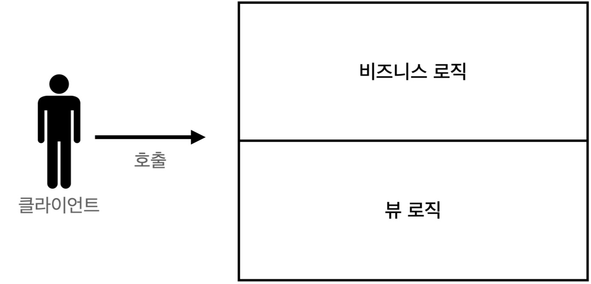
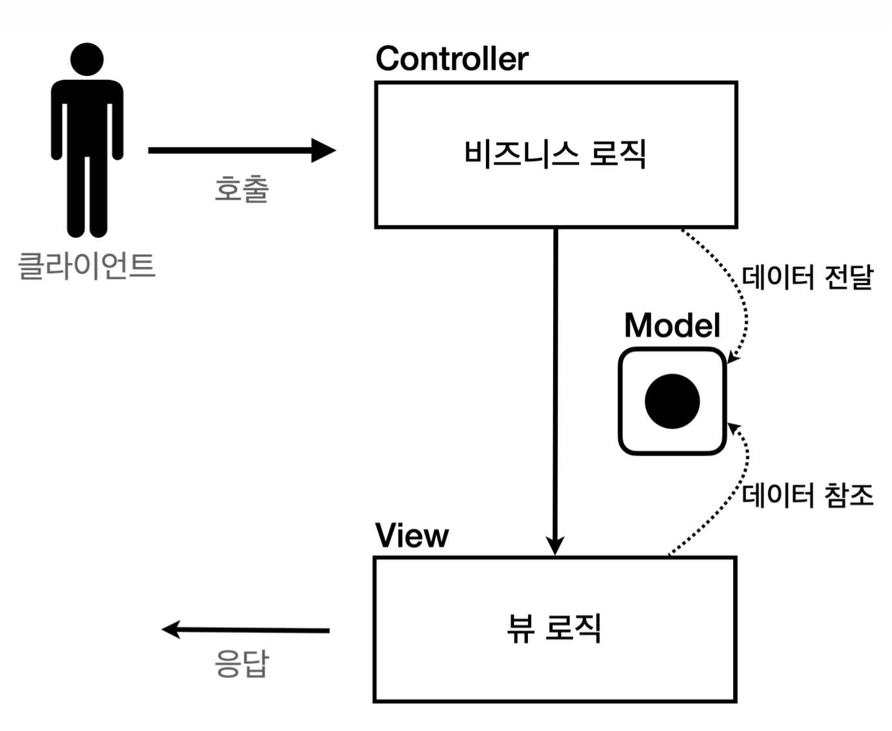
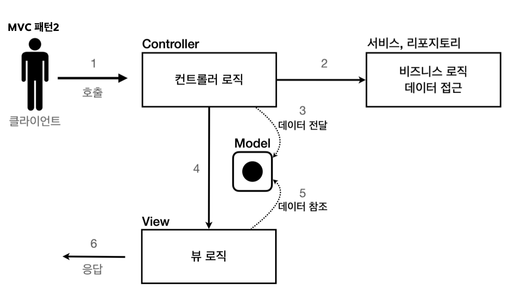

# 서블릿, JSP, MVC 패턴
## 회원 관리 웹 애플리케이션 요구사항
- 회원 정보
	- 이름: username
	- 나이: age
- 기능 요구사항
	- 회원 저장
	- 회원 목록 조회
### 회원 도메인 모델
```java
package hello.servlet.domain.member;  
  
import lombok.Getter;  
import lombok.Setter;  
  
@Getter @Setter  
public class Member {  
  
    private Long id;  
    private String username;  
    private int age;  
  
    public Member() {  
    }  
  
    public Member(String username, int age) {  
        this.username = username;  
        this.age = age;  
    }  
}
```
- `id`는 `Member`를 회원 저장소에 저장하면 회원 저장소가 할당한다.
### 회원 저장소
```java
package hello.servlet.domain.member;  
  
import java.util.ArrayList;  
import java.util.HashMap;  
import java.util.List;  
import java.util.Map;  
  
/**  
 * 동시성 문제가 고려되어 있지 않음, 실무에서는 ConcurrentHashMap, AtomicLong 사용 고려  
 */  
public class MemberRepository {  
  
    private static Map<Long, Member> store = new HashMap<>();  
    private static long sequence = 0L;  
  
    private static final MemberRepository instance = new MemberRepository();  
  
    public static MemberRepository getInstance() {  
        return instance;  
    }  
  
    private MemberRepository() {  
    }  
  
    public Member save(Member member) {  
        member.setId(++sequence);  
        store.put(member.getId(), member);  
        return member;  
    }  
  
    public Member findById(Long id) {  
        return store.get(id);  
    }  
  
    public List<Member> findAll() {  
        return new ArrayList<>(store.values());  
    }  
  
    public void clearStore() {  
        store.clear();  
    }  
}
```
- 회원 저장소는 싱글톤 패턴을 적용했다.
- 스프링을 사용하면 스프링 빈으로 등록하면 되지만, 지금은 최대한 스프링 없이 순수 서블릿 만으로 구현하는 것이 목적
- 싱글톤 패턴은 객체를 단 하나만 생성해서 공유해야 하므로 생성자를 private 접근자로 막아둔다
### 회원 저장소 테스트 코드
```java
package hello.servlet.domain.member;  
  
import org.junit.jupiter.api.AfterEach;  
import org.junit.jupiter.api.Assertions;  
import org.junit.jupiter.api.Test;  
  
import java.util.List;  
  
import static org.junit.jupiter.api.Assertions.*;  
  
class MemberRepositoryTest {  
    MemberRepository memberRepository = MemberRepository.getInstance();  
  
    @AfterEach  
    void afterEach() {  
        memberRepository.clearStore();  
    }  
  
    @Test  
    void save() {  
        // given  
        Member member = new Member("hello", 20);  
  
        // when  
        Member savedMember = memberRepository.save(member);  
  
        // then  
        Member findMember = memberRepository.findById(savedMember.getId());  
        Assertions.assertEquals(savedMember, findMember);  
    }  
  
    @Test  
    void findAll() {  
        // given  
        Member member1 = new Member("member1", 20);  
        Member member2 = new Member("member2", 30);  
  
        memberRepository.save(member1);  
        memberRepository.save(member2);  
  
        // when  
        List<Member> result = memberRepository.findAll();  
  
        // then  
        Assertions.assertEquals(2, result.size());  
        org.assertj.core.api.Assertions.assertThat(result).contains(member1, member2);  
    }  
}
```
- 회원을 저장하고 목록을 조회하는 테스트
- 각 테스트가 끝날 때, 다음 테스트에 영향을 주지 않도록 각 테스트의 저장소를 `clearStore()`를 호출하여 초기화
## 서블릿으로 회원 관리 웹 애플리케이션 만들기
### 회원 등록 HTML 폼
```java
package hello.servlet.web.servlet;  
  
import hello.servlet.domain.member.MemberRepository;  
import jakarta.servlet.ServletException;  
import jakarta.servlet.annotation.WebServlet;  
import jakarta.servlet.http.HttpServlet;  
import jakarta.servlet.http.HttpServletRequest;  
import jakarta.servlet.http.HttpServletResponse;  
  
import java.io.IOException;  
import java.io.PrintWriter;  
  
@WebServlet(name = "memberFormServlet", urlPatterns = "/servlet/members/new-form")  
public class MemberFormServlet extends HttpServlet {  
  
    private MemberRepository memberRepository = MemberRepository.getInstance();  
  
    @Override  
    protected void service(HttpServletRequest request, HttpServletResponse response) throws ServletException, IOException {  
        response.setContentType("text/html");  
        response.setCharacterEncoding("utf-8");  
  
        PrintWriter w = response.getWriter();  
        w.write("""  
                <!DOCTYPE html>                <html>                <head>                 <meta charset="UTF-8">                 <title>Title</title>                </head>                <body>                <form action="/servlet/members/save" method="post">                 username: <input type="text" name="username" />                 age: <input type="text" name="age" />                 <button type="submit">전송</button>  
                </form>                </body>                </html>                """);  
    }  
}
```
### 회원 저장
```java
package hello.servlet.web.servlet;  
  
import hello.servlet.domain.member.Member;  
import hello.servlet.domain.member.MemberRepository;  
import jakarta.servlet.ServletException;  
import jakarta.servlet.annotation.WebServlet;  
import jakarta.servlet.http.HttpServlet;  
import jakarta.servlet.http.HttpServletRequest;  
import jakarta.servlet.http.HttpServletResponse;  
  
import java.io.IOException;  
import java.io.PrintWriter;  
  
@WebServlet(name = "memberSaveServlet", urlPatterns = "/servlet/members/save")  
public class MemberSaveServlet extends HttpServlet {  
  
    private MemberRepository memberRepository = MemberRepository.getInstance();  
  
    @Override  
    protected void service(HttpServletRequest request, HttpServletResponse response) throws ServletException, IOException {  
        System.out.println("MemberSaveServlet.service");  
        String username = request.getParameter("username");  
        int age = Integer.parseInt(request.getParameter("age"));  
  
        Member member = new Member(username, age);  
        memberRepository.save(member);  
  
        response.setContentType("text/html");  
        response.setCharacterEncoding("utf-8");  
  
        PrintWriter w = response.getWriter();  
        w.write("<html>\n" +  
                "<head>\n" +  
                " <meta charset=\"UTF-8\">\n" +  
                "</head>\n" +  
                "<body>\n" +  
                "성공\n" +  
                "<ul>\n" +  
                " <li>id="+member.getId()+"</li>\n" +  
                " <li>username="+member.getUsername()+"</li>\n" +  
                " <li>age="+member.getAge()+"</li>\n" +  
                "</ul>\n" +  
                "<a href=\"/index.html\">메인</a>\n" +  
                "</body>\n" +  
                "</html>");  
    }  
}
```
1. 파라미터 조회해서 Member 객체 만듦
2. Member 객체를 MemberRepository를 통해 저장
3. Member 객체를 사용해서 결과 화면용 HTML을 동적으로 만들어서 응답
### 회원 목록 조회
```java
package hello.servlet.web.servlet;  
  
import hello.servlet.domain.member.Member;  
import hello.servlet.domain.member.MemberRepository;  
import jakarta.servlet.ServletException;  
import jakarta.servlet.annotation.WebServlet;  
import jakarta.servlet.http.HttpServlet;  
import jakarta.servlet.http.HttpServletRequest;  
import jakarta.servlet.http.HttpServletResponse;  
  
import java.io.IOException;  
import java.io.PrintWriter;  
import java.util.List;  
  
@WebServlet(name = "memberListServlet", urlPatterns = "/servlet/members")  
public class MemberListServlet extends HttpServlet {  
  
    private MemberRepository memberRepository = MemberRepository.getInstance();  
  
    @Override  
    protected void service(HttpServletRequest request, HttpServletResponse response) throws ServletException, IOException {  
  
        List<Member> members = memberRepository.findAll();  
  
        response.setContentType("text/html");  
        response.setCharacterEncoding("utf-8");  
  
        PrintWriter w = response.getWriter();  
        w.write("<html>");  
        w.write("<head>");  
        w.write(" <meta charset=\"UTF-8\">");  
        w.write(" <title>Title</title>");  
        w.write("</head>");  
        w.write("<body>");  
        w.write("<a href=\"/index.html\">메인</a>");  
        w.write("<table>");  
        w.write(" <thead>");  
        w.write(" <th>id</th>");  
        w.write(" <th>username</th>");  
        w.write(" <th>age</th>");  
        w.write(" </thead>");  
        w.write(" <tbody>");  
        /*  
        w.write(" <tr>");        w.write(" <td>1</td>");        w.write(" <td>userA</td>");        w.write(" <td>10</td>");        w.write(" </tr>");        */        for (Member member : members) {  
            w.write(" <tr>");  
            w.write("       <td>" + member.getId() + "</td>");  
            w.write("       <td>" + member.getUsername() + "</td>");  
            w.write("       <td>" + member.getAge() + "</td>");  
            w.write(" </tr>");  
        }  
  
        w.write(" </tbody>");  
        w.write("</table>");  
        w.write("</body>");  
        w.write("</html>");  
    }  
}
```
1. `memberRepository.findAll()`을 통해 모든 회원 조회
2. 회원 목록 HTML을 for 루프를 통해 회원 수 만큼 동적으로 생성하고 응답
### 템플릿 엔진으로
- 지금까지 서블릿과 자바 코드만으로 HTML을 만들어보았다. 서블릿 덕분에 동적으로 원하는 HTML을 마음껏 만들 수 있다. 정적인 HTML 문서라면 화면이 계속 달라지는 회원의 저장 결과라던가, 회원 목록 같은 동적인 HTML을 만드는 일은 불가능 할 것이다.
- 그런데, 코드에서 보듯이 이것은 매우 복잡하고 비효율적이다. 자바 코드로 HTML을 만들어 내는 것보다 차라리 HTML 문서에 동적으로 변경해야 하는 부분만 자바 코드를 넣을 수 있다면 더 편리할 것이다.
- 이것이 바로 템플릿 엔진이 나온 이유이다. 템플릿 엔진을 사용하면 HTML 문서에서 필요한 곳만 코드를 적용해서 동적으로 변경 가능
- 템플릿 엔진에는 JSP, Thymeleaf, Freemarker, Velocity 등이 있다.
> 참고
> JSP는 성능과 기능면에서 다른 템플릿 엔진과의 경쟁에서 밀리면서 점점 사장되어 가는 추세이다. 템플릿 엔진들은 각각 장단점이 있는데 강의에서는 JSP는 앞부분에서 잠깐 다루고, 스프링과 잘 통합되는 Thymeleaf를 사용한다.
## JSP로 회원 관리 웹 애플리케이션 만들기
### JSP 라이브러리 추가
- 스프링 부트 3.0 이상
```groovy
implementation 'org.apache.tomcat.embed:tomcat-embed-jasper'
implementation 'jakarta.servlet:jakarta.servlet-api'
implementation 'jakarta.servlet.jsp.jstl:jakarta.servlet.jsp.jstl-api'
implementation 'org.glassfish.web:jakarta.servlet.jsp.jstl'
```
### 회원 등록 폼 JSP
```jsp
<%@ page contentType="text/html; charset=UTF-8" language="java" %>  
<html>  
<head>  
    <title>Title</title>  
</head>  
<body>  
<form action="/jsp/members/save.jsp" method="post">  
    username: <input type="text" name="username" />  
    age: <input type="text" name="age" />  
    <button type="submit">전송</button>  
</form>  
</body>  
</html>
```
- `<%@ page contentType="text/html; charset=UTF-8" language="java" %>` 
	- 첫 줄은 JSP 문서라는 뜻. JSP 문서는 이렇게 시작해야 함
### 회원 저장 JSP
```jsp
<%@ page import="hello.servlet.domain.member.Member" %>  
<%@ page import="hello.servlet.domain.member.MemberRepository" %>  
<%@ page contentType="text/html;charset=UTF-8" language="java" %>  
<%  
  // request, response 사용 가능  
  MemberRepository memberRepository = MemberRepository.getInstance();  
  System.out.println("MemberSaveServlet.service");  
  String username = request.getParameter("username");  
  int age = Integer.parseInt(request.getParameter("age"));  
  
  Member member = new Member(username, age);  
  memberRepository.save(member);
%>  
<html>  
<head>  
    <title>Title</title>  
</head>  
<body>  
성공  
<ul>  
  <li>id=<%=member.getId()%></li>  
  <li>username=<%=member.getUsername()%></li>  
  <li>age=<%=member.getAge()%></li>  
</ul>  
<a href="../../index.html">메인</a>  
</body>  
</html>
```
- 자바 코드 그대로 사용 가능
- `<%@ page import="hello.servlet.domain.member.Member" %> `
	- 자바의 import문과 같다
- `<% ~~ %>`
	- 이 부분에는 자바 코드 입력 가능
- `<%= ~~ %>`
	- 이 부분에는 자바 코드 출력 가능
### 회원 목록 JSP
```jsp
<%@ page import="hello.servlet.domain.member.Member" %>  
<%@ page import="java.util.List" %>  
<%@ page import="hello.servlet.domain.member.MemberRepository" %>  
<%@ page contentType="text/html;charset=UTF-8" language="java" %>  
<%  
  MemberRepository memberRepository = MemberRepository.getInstance();  
  List<Member> members = memberRepository.findAll();%>  
<html>  
<head>  
    <title>Title</title>  
</head>  
<body>  
<a href="/index.html">메인</a>  
<table>  
  <thead>  <th>id</th>  
  <th>username</th>  
  <th>age</th>  
  </thead>  <tbody>  <%  
    for (Member member : members) {  
      out.write(" <tr>");  
      out.write("       <td>" + member.getId() + "</td>");  
      out.write("       <td>" + member.getUsername() + "</td>");  
      out.write("       <td>" + member.getAge() + "</td>");  
      out.write(" </tr>");  
    }  %>  
  </tbody>  
</table>  
</body>  
</html>
```
### 서블릿과 JSP의 한계
- 서블릿
	- 뷰 화면을 위한 HTML을 만드는 작업이 자바 코드에 섞여서 지저분하고 복잡함
	- JSP를 사용한 덕분에 뷰 생성을 위한 HTML 작업을 깔끔하게 가져가고, 중간중간 동적으로 변경이 필요한 부분에만 자바 코드 적용
- JSP
	- 코드의 상위 절반은 회원을 저장하기 위한 비즈니스 로직, 나머지 하위 절반만 결과를 HTML로 보여주기 위한 뷰 영역
	- 회원 목록의 경우에도 마찬가지
	- 자바 코드, 데이터 조회하는 리포지토리 등등 다양한 코드가 모두 JSP에 노출되어있음. JSP가 너무 많은 역할을 함.
	- 수백 수천줄의 대형 프로젝트의 JSP의 유지보수는 지옥과 같을 것
#### MVC 패턴의 등장
- 비즈니스 로직과 뷰의 분리
## MVC 패턴 - 개요
### 기존의 문제점
#### 너무 많은 역할
- 하나의 서블릿이나 JSP로 비즈니스 로직, 뷰 렌더링까지 모두 처리하게 되면 너무 많은 역할을 하게 되고 유지보수가 어려워짐
#### 변경의 라이프 사이클
- 둘 사이에 변경 라이프 사이클이 다르다는 점
	- UI 수정과 비즈니스 로직 수정은 각각 다르게 발생할 가능성이 매우 높고 대부분 서로에게 영향 X
	- 변경 라이프 사이클이 다른 부분을 하나의 코드로 관리하는 것은 유지보수에 좋지 않음
### Model View Controller
- *컨트롤러*: HTTP 요청을 받아서 파라미터를 검증하고, 비즈니스 로직 실행. 뷰에 전달할 결과 데이터를 조회해서 모델에 담는다.
- *모델*: 뷰에 출력할 데이터를 담아둔다. 뷰가 필요한 데이터를 모두 모델에 담아서 전달해주는 덕분에 뷰는 비즈니스 로직이나 데이터 접근을 몰라도 되고 화면을 렌더링 하는 일에 집중 가능
- *뷰*: 모델에 담겨있는 데이터를 사용해서 화면을 그리는 일에 집중한다. 
>  참고
>  컨트롤러에  비즈니스 로직을 둘 수도 있지만, 이렇게 되면 컨트롤러가 너무 많은 역할을 담당함. 그래서 일반적으로 비즈니스 로직은 서비스(Service)라는 계층을 별도로 만들어서 처리한다. 그리고 컨트롤러는 비즈니스 로직이 있는 서비스를 호출하는 역할을 담당한다. 참고로 비즈니스 로직을 호출한다는 표현보다는, 비즈니스 로직이라 설명했다.
- MVC 패턴 이전

- MVC 패턴1

- MVC 패턴2

