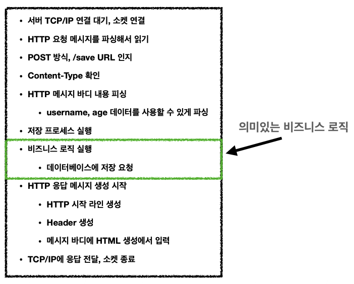
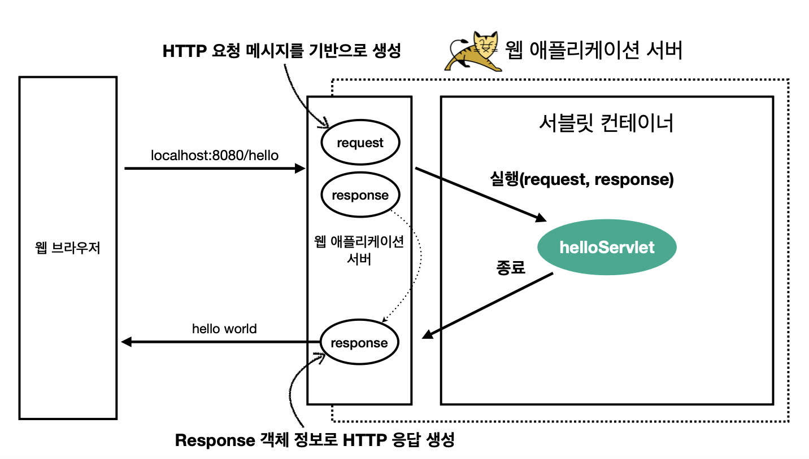
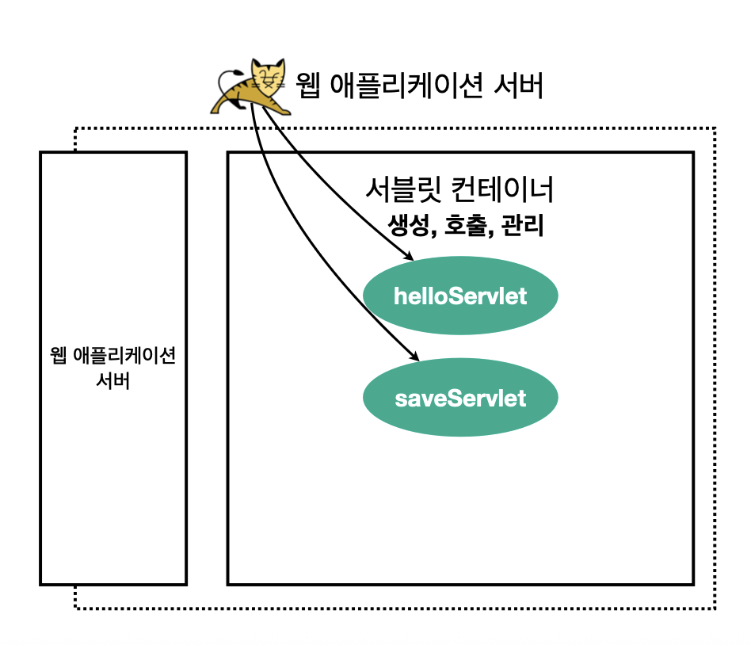

# 서블릿
## 서블릿이란?
- 만약 회원 저장을 위해 모든 로직을 직접 구현한다고 생각해보자
- 초록색 박스 부분만 비즈니스 로직이고 나머지는 이를 실행하기 위한 작업이다.
	- 너무 번거로움!
- 따라서 이런 번거로운 작업을 해주는 것

### 특징
- urlPatterns(/hello)의 URL이 호출되면 서블릿 코드가 실행
- HTTP 요청 정보를 편리하게 사용할 수 있는 `HttpServletRequest`
- HTTP 응답 정보를 편리하게 제공할 수 있는 `HttpServletResponse`
- 개발자는 HTTP 스펙을 매우 편리하게 사용

### HTTP 요청, 응답 흐름
- HTTP 요청시
	- WAS는 Request, Response 객체를 새로 만들어서 서블릿 객체 호출
	- 개발자는 Request 객체에서 HTTP 요청 정보를 편리하게 꺼내서 사용
	- 개발자는 Response 객체에 HTTP 응답 정보를 편리하게 입력
	- WAS는 Response 객체에 담겨있는 내용으로 HTTP 응답 정보를 생성
## 서블릿 컨테이너

- 톰캣처럼 서블릿을 지원하는 WAS
- 서블릿 객체를 생성, 초기화, 호출, 종료하는 생명주기 관리
- 서블릿 객체는 **싱글톤으로 관리**
	- 고객의 요청이 올 때 마다 계속 객체를 생성하는 것은 비효율
	- 최초 로딩 시점에 서블릿 객체를 미리 만들어두고 재활용
	- 모든 고객 요청은 동일한 서블릿 객체 인스턴스에 접근
	- *공유 변수 사용 주의*
	- 서블릿 컨테이너 종료 시 함께 종료
- JSP도 서블릿으로 변환되어서 사용
- 동시 요청을 위한 멀티 쓰레드 처리 지원
