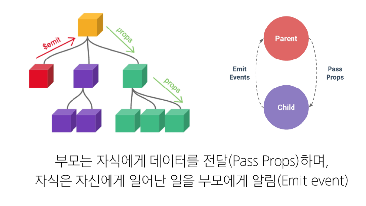
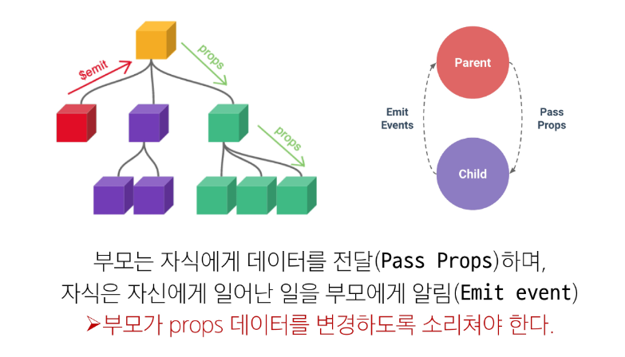
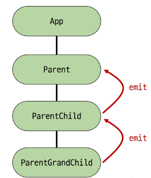

# Component State Flow
# Passing Props
## Props
### 같은 데이터 하지만 다른 컴포넌트
- 동일한 사진 데이터가 한 화면에 다양한 위치에서 여러 번 출력되고 있음
- 하지만 해당 페이지를 구성하는 컴포넌트가 여러 개라면 각 컴포넌트가 개별적으로 동일한 데이터를 관리해야 할까?
- 그렇다면 사진을 변경 해야 할 때 모든 컴포넌트에 대해 변경 요청을 해야 함
	- 공통된 부모 컴포넌트에서 관리하자

### Props
: 부모 컴포넌트로부터 자식 컴포넌트로 데이터를 전달하는데 사용되는 속성
### Props 특징
- 부모 속성이 업데이트되면 자식으로 전달 되지만 그 반대는 안됨
- 즉, 자식 컴포넌트 내부에서 `props`를 변경하려고 시도해서는 안되며 불가능
- 또한 부모 컴포넌트가 업데이트될 떄마다 이를 사용하는 자식 컴포넌트의 모든 `props`가 최신 값으로 업데이트 됨
→ 부모 컴포넌트에서만 변경하고 이를 내려 받는 자식 컴포넌트는 자연스럽게 갱신
### One-Way Data Flow
- 모든 props는 자식 속성과 부모 속성 사이에 *하향식 단방향 바인딩*을 형성 (one-way-down-binding)
#### 단방향인 이유
- 하위 컴포넌트가 실수로 상위 컴포넌트의 상태를 변경하여 앱에서의 데이터 흐름을 이해하기 어렵게 만드는 것을 방지하기 위함
→ 데이터 흐름의 "일관성" 및 "단순화"
## Props 선언
### Props 작성
- 부모 컴포넌트 `Parent`에서 자식 컴포넌트 `ParentChild`에 보낼 `props` 작성

```vue
<script setup>
import ParentChild from '@/components/Parent.vue';
</script>

<template>
<div>
  <ParentChild my-msg="message" /> <!-- props 작성 -->
</div>
</template>

<style scoped>
</style>
```
### Props 선언
- `defineProps()`를 사용하여 `props`를 선언
- `defineProps()`에 작성하는 인자의 데이터 타입에 따라 선언 방식이 나뉨
```vue
<script setup>
defineProps()
</script>
```
#### 1. "문자열 배열"을 사용한 선언
- 배열의 문자열 요소로 `props` 선언
- 문자열 요소의 이름은 전달된 `props`의 이름
```vue
<script setup>
defineProps(['myMsg'])
</script>
```
#### 2. "객체"를 사용한 선언
- 각 객체 속성의 키가 전달받은 `props` 이름이 되며, 객체 속성의 값은 값이 될 데이터의 타입에 해당하는 생성자 함수 (Number, String ...) 여야 함
- *객체 선언 문법 사용 권장*
```vue
<script setup>
defineProps({
  myMsg: String
})
</script>
```
### props 데이터 사용
- props 선언 후 템플릿에서 반응형 변수와 같은 방식으로 활용
```vue
<template>
<div>
  {{ myMsg }}
</div>
</template>
```
- props를 객체로 반환하므로 필요한 경우 JavaScript에서 접근 가능
```vue
<script setup>
const props = defineProps({
  myMsg: String
})
console.log(props) // {myMsg: 'message'}
console.log(props.myMsg) // message
</script>
```
### 한 단계 더 props 내려 보내기
- `ParentChild` 컴포넌트를 부모로 갖는 `ParentGrandChild` 컴포넌트 생성 및 등록
```vue
<script setup>
import ParentGrandChild from '@/components/ParentGrandChild.vue'
const props = defineProps({
  myMsg: String
})
</script>

<template>
<div>
  <p>{{ myMsg }}</p>
  <ParentGrandChild />
</div>
</template>
```
- `ParentChild` 컴포넌트에서 Parent로 부터 받은 `props`인 `myMsg`를 `ParentGrandChild`에게 전달
```vue
<!-- ParentChild.vue -->
<template>
<div>
  <p>{{ myMsg }}</p>
  <ParentGrandChild :my-msg="myMsg"/>
</div>
</template>
```
```vue
<!-- ParnetGrandChild.vue -->

<script setup>
defineProps({
  myMsg: String
})
</script>

<template>
<div>
  <p>{{ myMsg }}</p>
</div>
</template>
```
- 출력 결과 확인
- `ParentGrandChild`가 받아서 출력하는 `props`은 `Parent`에 정의 되어 있는 `props`이며 `Parent`가 `props`을 변경할 경우 이를 전달받고 있는 `ParentChild`, `ParentGrandChild`에서도 모두 업데이트 됨
## Props 세부사항
### 1. Props Name Casing (Props 이름 컨벤션)
- 자식 컴포넌트로 전달 시 (→ `kebab-case`)
	- *기술적으로 camelCase도 가능하나 HTML 속성 표기법과 동일하게 kebab-case로 표기할 것을 권장*
```vue
<ParentChild my-msg="message" />
```
- 선언 및 템플릿 참조 시 (→ `camelCase`)
```vue
defindProps({
	myMsg: String
})

<p>{{ myMsg }}</p>
```
### 2. Static Props와 Dynamic Props
- 지금까지 작성한 것은 Static(정적) `props`
- `v-bind`를 사용하여 *동적으로 할당된 props*를 사용할 수 있음
#### 1. Dynamic props 정의
```vue
<!-- Parent.vue -->
<script setup>
import ParentChild from '@/components/Parent.vue';
defineProps()
import {ref} from 'vue'
const name = ref('Alice')
</script>

<template>
<div>
  <ParentChild my-msg="message" :dynamic-props="name" />
</div>
</template>
```
#### 2. Dynamic props 선언 및 출력
```vue
<script setup>
const props = defineProps({
  myMsg: String,
  dynamicProps: String,
})
</script>

<template>
<div>
  <p>{{ dynamicProps }}</p>
</div>
</template>
```
#### 3. Dynamic Props 출력 확인

## Props 활용
### 다른 디렉티브와 함께 사용
- `v-for`와 함께 사용하여 반복되는 요소를 `props`로 전달하기
- `ParentItem` 컴포넌트 생성 및 `Parent`의 하위 컴포넌트로 등록
- 데이터 정의 및 `v-for` 디렉티브의 반복 요소로 활용
- 각 반복 요소를 `props`로 내려 보내기
```vue
<script setup>
const items = ref([
  {id: 1, name: '사과'},
  {id: 2, name: '바나나'},
  {id: 3, name: '딸기'},
])
</script>

<template>
<div>
  <ParentItem v-for="item in items" :key="item.id" :my-prop="item" />
</div>
</template>
```
- `props` 선언 및 출력 결과 확인
```vue
<!-- ParentItem.vue -->
<script setup>
defineProps({
  myProp: Object
})
</script>

<template>
<div>
  <p>{{ myProp.id }}</p>
  <p>{{ myProp.name }}</p>
</div>
</template>
```
# Component Events
## Emit

### `$emit()`
: 자식 컴포넌트가 이벤트를 발생시켜 부모 컴포넌트로 데이터를 전달하는 역할의 메서드
- *$* 표기는 Vue 인스턴스의 내부 변수들을 가리킴
- Life Cycle hooks, 인스턴스 메서드 등 내부 특정 속성에 접근할 때 사용
### emit 메서드 구조

- `event`
	- 커스텀 이벤트 이름
- `args`
	- 추가 인자
## 이벤트 발신 및 수신 (Emitting and Listening to Events)
- `$emit`을 사용하여 템플릿 표현식에서 직접 사용자 정의 이벤트를 발신
```vue
<button @click="$emit('someEvent')">클릭</button>
```
- 그런 다음 부모는 `v-on`을 사용하여 수신할 수 있음
```vue
<ParentComp @some-event="someCallback" />
```
### 예시
- `ParentChild`에서 `someEvent` 라는 이름의 사용자 정의 이벤트를 발신
```vue
<!-- ParentChild.vue -->

<button @click="$emit('someEvent')">클릭</button>
```
- `ParentChild`의 부모 `Parnet`는 `v-on`을 사용하여 발신된 이벤트를 수신
- 수신 후 처리할 로직 및 콜백함수 호출
```vue
<!-- Parent.vue -->
<script setup>
const someCallback = function () {
  console.log('ParentChild가 발신한 이벤트를 수신함')
}
</script>

<template>
<div>
  <ParentItem v-for="item in items" :key="item.id" :my-prop="item" />
</div>
</template>
```
## emit 이벤트 선언
- `defineEmits()`를 사용하여 발신할 이벤트를 선언
- `props`와 마찬가지로 `defineEmits()`에 작성하는 인자의 데이터 타입에 따라 선언 방식이 나뉨 (배열, 객체)
- `defineEmits()`는 `$emit` 대신 사용할 수 있는 동등한 함수를 반환 (script에서는 `$emit` 메서드를 접근할 수 없기 때문)
```vue
<script setup>
const emit = defineEmits(['someEvent', 'myFocus'])
const buttonClick = function () {
  emit('someEvent')
}
</script>
```
- 이벤트 선언 방식으로 추가 버튼 작성 및 결과 확인
```vue
<!-- ParentChild.vue -->
<script setup>
const emit = defineEmits(['someEvent'])
const buttonClick = function () {
  emit('someEvent')
}
</script>

<template>
<div>
  <button @click="buttonClick">클릭</button>
</div>
</template>
```
## 이벤트 전달
### 이벤트 인자 (Event Argument)
- 이벤트 발신 시 추가 인자를 전달하여 값을 제공할 수 있음
### 이벤트 인자 전달 활용
- `ParentChild`에서 이벤트를 발신하여 `Parent`로 추가 인자 전달하기
```vue
<!-- ParentChild.vue -->
<script setup>
const emit = defineEmits(['someEvent', 'emitArgs'])
const emitArgs = function () {
  emit('emitArgs', 1, 2, 3)
}
</script>

<template>
<div>
  <button @click="emitArgs">추가 인자 전달</button>
</div>
</template>
```
- `ParentChild`에서 발신한 이벤트를 `Parent`에서 수신
```vue
<!-- Parent.vue -->

<script setup>
const getNumbers = function (...args) {
  console.log(args)
  console.log(`ParentChild가 전달한 추가인자 ${args}를 수신했어요`)
}
</script>

<template>
<div>
  <ParentChild @some-event="someCallback" @emit-args="getNumbers" my-msg="message" :dynamic-props="name" />
</div>
</template>
```
## 이벤트 세부사항
### Event Name Casing
- 선언 및 발신 시 (→ `camelCase`)
- 부모 컴포넌트에서 수신 시 (→ `kebab-case`)
## emit 이벤트 활용
### emit 이벤트 실습
- 최하단 컴포넌트 `ParentGrandChild`에서 `Parent`컴포넌트의 `name` 변수 변경 요청하기

### 실습 구현
- `ParentGrandChild`에서 이름 변경을 요청하는 이벤트 발신
```vue
<!-- ParentGrandChild.vue -->

<script setup>
const emit = defineEmits(['updateName'])
const updateName = function () {
  emit('updateName')
}
</script>

<template>
<div>
  <button @click="updateName">이름 변경</button>
</div>
</template>
```
- 이벤트 수신 후 이름 변경을 요청하는 이벤트 발신
```vue
<!-- ParentChild.vue -->

<script setup>
const emit = defineEmits(['someEvent', 'emitArgs', 'updateName'])
const updateName = function () {
  emit('updateName')
}
</script>

<template>
<div>
  <ParentGrandChild :my-msg="myMsg" @update-name="updateName"/>
</div>
</template>
```
- 이벤트 수신 후 이름 변수 변경 메서드 호출
- 해당 변수를 `props`으로 받는 모든 곳에서 자동 업데이트
```vue
<!-- Parent.vue -->

<script setup>
const updateName = function () {
  name.value = 'Bella'
}
</script>

<template>
<div>
  <ParentChild @update-name="updateName" @some-event="someCallback" @emit-args="getNumbers" my-msg="message" :dynamic-props="name" />
</div>
</template>
```
# 참고
## *주의*  정적 & 동적 props
- 첫 번째는 정적 `props`로 문자열 "1" 전달
- 두 번째는 동적 `props`로 숫자 1 전달
```vue
<!-- 1 -->
<SomeComponent num-props="1" />

<!-- 2 -->
<SomeComponent :num-props="1" />
```
## Props 선언 시 "객체 선언 문법"을 권장하는 이유
- 컴포넌트를 가독성이 좋게 문서화하는 데 도움이 되며, 다른 개발자가 잘못된 유형을 전달할 때에 브라우저 콘솔에 경고를 출력하도록 함
- 추가로 `props`에 대한 *유효성 검사*로서 활용 가능
```vue
<script>
defineProps({
  // 여러 타입 허용
  propB: [String, Number],
  // 문자열 필수
  propC: {
    type: String,
    required: true
  },
  // 기본 값을 가지는 숫자형
  propD: {
    type: Number,
    default: 10
  },
  ...
})
</script>
```
## emit 이벤트도 "객체 선언 문법"으로 작성 가능
- `emit` 이벤트 또한 객체 구문으로 선언 된 경우 유효성을 검사할 수 있음
```vue
<script setup>
const emit = defineEmits({
  // 유효성 검사 없음
  click: null,
  // submit 이벤트 유효성 검사
  submit: ({ email, password }) => {
    if (email && password) {
      return true
    } else {
      console.warn('submit 이벤트가 옳지 않음')
      return false
    }
  }
})
const submitForm = function (email, password) {
  emit('submit', {email, password})
}
</script>
```