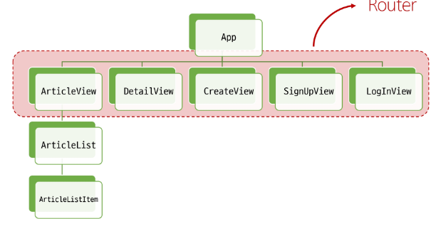
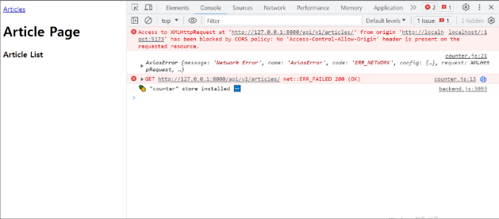
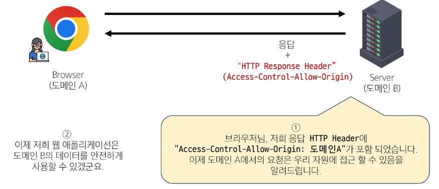
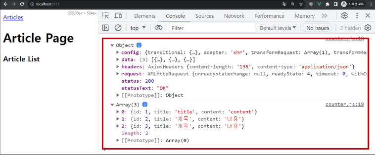
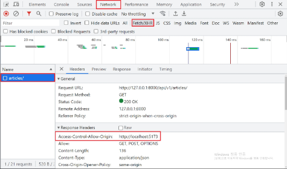
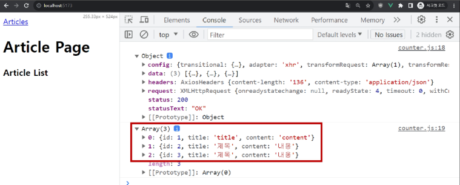
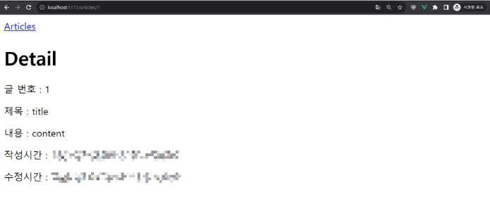
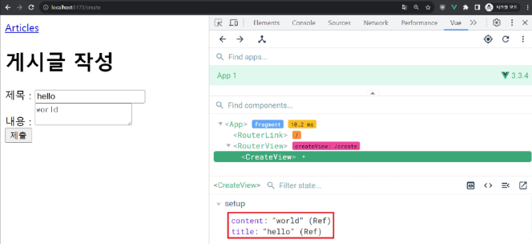
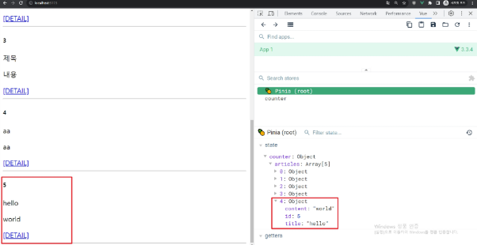
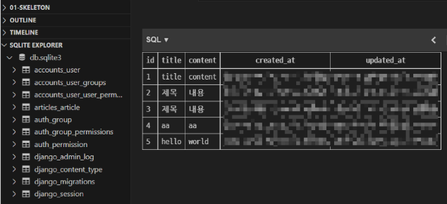

# Vue with DRF 1
# 메인 페이지 구현
## 게시글 목록 출력

### 개요
- `ArticleView` 컴포넌트에 `ArticleList` 컴포넌트와 `ArticleListItem` 컴포넌트 등록 및 출력하기
- `ArticleList`와 `ArticleListItem`은 각각 게시글 출력을 담당
### 게시글 목록 출력
- `ArticleView`의 `route` 관련 코드 주석 해제
- `App` 컴포넌트에 `ArticleView` 컴포넌트로 이동하는 `RouterLink` 작성
- `ArticleView` 컴포넌트에 `ArticleList` 컴포넌트 등록
- `store`에 임시 데이터 `articles` 배열 작성하기
- `ArticleList` 컴포넌트에서 게시글 목록 출력
- `store`의 `articles` 데이터 참조
- `v-for`를 활용하여 하위 컴포넌트에서 사용할 `article`  단일 객체 정보를 `props`로 전달
- `ArticleListItem` 컴포넌트는 내려 받은 `props`를 정의 후 출력
## DRF와의 요청과 응답
### DRF로부터 응답 데이터 받기
- 이제는 임시 데이터가 아닌 DRF 서버에 요청하여 데이터를 응답 받아 `store`에 저장 후 출력하기
### DRF와의 요청과 응답
- DRF 서버로의 AJAX 요청을 위한 `axios` 설치 및 관련 코드 작성
```
npm install axios
```
```js
// store/counter.js

// store/counter.js

import { ref, computed } from "vue";
import { defineStore } from "pinia";
import axios from "axios";

export const useCounterStore = defineStore(
  "counter",
  () => {
    const articles = ref([]);
    const API_URL = "http://127.0.0.1:8000";
    return { articles, API_URL };
  },
  { persist: true }
);
```
- DRF 서버로 요청을 보내고 응답 데이터를 처리하는 `getArticles` 함수
```js
// store/counter.js

export const useCounterStore = defineStore(
  "counter",
  () => {
	  ...,
    const getArticles = function () {
      axios({
        method: "get",
        url: `${API_URL}/api/v1/articles/`,
      })
        .then((res) => {
          console.log(res);
          console.log(res.data);
        })
        .catch((err) => console.log(err));
    };
    return { articles, API_URL, getArticles };
  },
  { persist: true }
);
```
- `ArticleView` 컴포넌트가 마운트 될 때 `getArticles` 함수가 실행되도록 함
  → 해당 컴포넌트가 렌더링 될 때 항상 최신 게시글 목록을 불러오기 위함
```vue
<!-- views/ArticleView.vue -->

<script setup>
import ArticleList from "@/components/ArticleList.vue";
import { onMounted } from "vue";
import { useCounterStore } from "@/stores/counter";

const store = useCounterStore();

onMounted(() => {
  store.getArticles();
});
</script>
```
- Vue와 DRF 서버를 모두 실행한 후 응답 데이터 확인
  → 에러 발생

- 그런데 DRF 서버 측에서는 문제 없이 응답했음(200 OK)
  → 서버는 응답했으나 브라우저 측에서 거절한 것

- 브라우저가 거절한 이유
  → `'localhost:5173'`에서 `'127.0.0.1:8000/api/v1/articles/'`의 `XMLHttpRequest`에 대한 접근이 *CORS policy*에 의해 차단되었다.
# CORS Policy
## CORS Policy
### SOP (Same-origin policy)
: 동일 출처 정책
- 어떤 출처(Origin)에서 불러온 문서나 스크립트가 다른 출처에서 가져온 리소스와 상호 작용하는 것을 제한하는 보안 방식
  → '다른 곳에서 가져온 자료는 일단 막는다'
  → 웹 애플리케이션의 도메인이 다른 도메인의 리소스에 접근하는 것을 제어하여 사용자의 개인 정보와 데이터의 보안을 보호하고, 잠재적인 보안 위협을 방지
  → 잠재적으로 해로울 수 있는 문서를 분리함으로써 공격받을 수 있는 경로를 줄임
- [https://developer.mozilla.org/en-US/docs/Web/Security/Same-origin_policy](https://developer.mozilla.org/en-US/docs/Web/Security/Same-origin_policy)
### Origin (출처)
- URL의 Protocol, Host, Port를 모두 포함하여 "출처"라고 부름
- Same Origin 예시
	- 아래 *세 영역이 일치하는 경우에만 동일 출처*로 인정

#### Same Origin 예시
`http://localhost:3000/articles/3/`을 기준으로 동일 출처 여부를 비교

| URL                                | 결과  | 이유          |
| ---------------------------------- | --- | ----------- |
| http://localhost:3000/articles/    | 성공  | Path만 다름    |
| http://localhost:3000/comments/3/  | 성공  | Path만 다름    |
| https://localhost:3000/articles/3/ | 실패  | Protocol 다름 |
| http://localhost:80/articles/3/    | 실패  | Port 다름     |
| http://yahuua:3000/articles/3/     | 실패  | Host 다름     |
### CORS policy의 등장
- 기본적으로 웹 브라우저는 같은 출처에서만 요청하는 것을 허용하며, 다른 출처로의 요청은 보안상의 이유로 차단됨
	- SOP에 의해 다른 출처의 리소스와 상호작용 하는 것이 기본적으로 제한되기 때문
- 하지만 현대 웹 애플리케이션은 다양한 출처로부터 리소스를 요청하는 경우가 많기 때문에 CORS 정책이 필요하게 되었음
  → *CORS*는 웹 서버가 리소스에 대한 서로 다른 출처 간 접근을 허용하도록 선택할 수 있는 기능을 제공
### CORS (Cross-Origin Resource Sharing)
: 교차 출처 리소스 공유
- 특정 출처에서 실행 중인 웹 애플리케이션이 *다른 출처의 자원에 접근할 수 있는 권한을 부여*하도록 브라우저에 알려주는 체제
  → 만약 다른 출처의 리소스를 가져오기 위해서는 이를 제공하는 서버가 브라우저에게 다른 출처지만 접근해도 된다는 사실을 알려야 함
  → "CORS policy (교차 출처 리소스 공유 정책)"
### CORS Policy (Cross-Origin Resource Sharing Policy)
: 교차 출처 리소스 공유 정책
- 다른 출처에서 온 리소스를 공유하는 것에 대한 정책
- 서버에서 설정되며, 브라우저가 해당 정책을 확인하여 요청이 허용되는지 여부를 결정
  → 다른 출처의 리소스를 불러오려면 그 다른 출처에서 올바른 *CORS header를 포함한 응답을 반환해야 함*
- [https://developer.mozilla.org/ko/docs/Web/HTTP/Cors](https://developer.mozilla.org/ko/docs/Web/HTTP/Cors)
### CORS 적용 방법

### CORS policy 정리
- 웹 애플리케이션이 다른 도메인에 있는 리소스에 안전하게 접근할 수 있도록 허용 또는 차단하는 보안 메커니즘
- 서버가 약속된 `CORS Header`를 포함하여 응답한다면 브라우저는 해당 요청을 허용
  → 서버에서 `CORS Header`를 만들어야 한다.
## CORS Headers 설정
### CORS Headers 설정하기
- Django에서는 `django-cors-headers` 라이브러리 활용
  → 손쉽게 응답 객체에 `CORS header`를 추가해주는 라이브러리
- [https://github.com/adamchainz/django-cors-headers](https://github.com/adamchainz/django-cors-headers)
### django-cors-headers 사용하기
- 설치
```
pip install django-cors-headers
```
- settings.py
```python
INSTALLED_APPS = [
	...
    'corsheaders',
    ...
]
MIDDLEWARE = [
	...
    'corsheaders.middleware.CorsMiddleware',
    'django.middleware.common.CommonMiddleware',
    ...
]
```
- CORS를 허용할 Vue 프로젝트의 Domain 등록
```python
# settings.py

CORS_ALLOWED_ORIGINS = [
    'http://127.0.0.1:5173',
    'http://localhost:5173',
]
```
### CORS 처리 결과
- 메인페이지에서 DRF 응답 데이터 재확인

- 응답 객체에서 `Access-Control-Allow-Origin` Header 확인
	- 개발자도구-Network-Fetch/XHR

# Article CR 구현
## 전체 게시글 조회
- 응답 받은 데이터에서 각 게시글의 데이터 구성 확인 (`id, title, content`)

- `store`에 게시글 목록 데이터 저장
```js
// store/counter.js
export const useCounterStore = defineStore(
  "counter",
  () => {
    const articles = ref([]);
    const API_URL = "http://127.0.0.1:8000";
    const getArticles = function () {
      axios({
        method: "get",
        url: `${API_URL}/api/v1/articles/`,
      })
        .then((res) => {
          articles.value = res.data;
        })
        .catch((err) => console.log(err));
    };
    return { articles, API_URL, getArticles };
  },
  { persist: true }
);
```
- `store`에 저장된 게시글 목록 출력 확인
	- `pinia-plugin-persistedstate`에 의해 브라우저 Local Storage에 저장됨
## 단일 게시글 조회
### 단일 게시글 데이터 출력
- `DetailVue` 관련 `route` 주석 해제
```js
// router/index.js

import DetailView from '@/views/DetailView.vue'
const router = createRouter({
  history: createWebHistory(import.meta.env.BASE_URL),
  routes: [
    {
      path: "/",
      name: "ArticleView",
      component: ArticleView,
    },
    {
      path: '/articles/:id',
      name: 'DetailView',
      component: DetailView
    },
  ],
});
```
- `ArticleListItem`에 `DetailView` 컴포넌트로 가기 위한 `RouterLink`
```vue
<!-- components/ArticleListItem.vue -->

<template>
  <div>
    <h5>{{ article.id }}</h5>
    <p>{{ article.title }}</p>
    <p>{{ article.content }}</p>
    <RouterLink :to="{ name: 'DetailView', params: { id: article.id } }"
      >[Detail]</RouterLink
    >
  </div>
</template>

<script setup>
import { RouterLink } from "vue-router";
...
</script>
```
- `DetailView`가 마운트 될 때 특정 게시글을 조회하는 AJAX 요청 진행
```vue
<!-- views/DetailView.vue -->

<script setup>
import axios from "axios";
import { onMounted } from "vue";
import { useRoute } from "vue-router";
import { useCounterStore } from "@/stores/counter";

const store = useCounterStore();
const route = useRoute();

onMounted(() => {
  axios({
    method: "get",
    url: `${store.API_URL}/api/v1/articles/${route.params.id}/`,
  })
    .then((res) => {
      console.log(res.data);
    })
    .catch((err) => console.log(err));
});
</script>
```
- 응답 데이터 확인
	- http://localhost:5173/articles/1/

- 응답 데이터 저장 후 출력
```vue
<!-- views/DetailView.vue -->
<template>
  <div>
    <h1>Detail</h1>
    <div v-if="article">
      <p>글 번호: {{ article.id }}</p>
      <p>제목: {{ article.title }}</p>
      <p>내용: {{ article.content }}</p>
      <p>작성시간: {{ article.created_at }}</p>
      <p>수정시간: {{ article.updated_at }}</p>
    </div>
  </div>
</template>

<script setup>
import axios from "axios";
import { onMounted, ref } from "vue";
import { useRoute } from "vue-router";
import { useCounterStore } from "@/stores/counter";

const store = useCounterStore();
const route = useRoute();
const article = ref(null);

onMounted(() => {
  axios({
    method: "get",
    url: `${store.API_URL}/api/v1/articles/${route.params.id}/`,
  })
    .then((res) => {
      article.value = res.data;
    })
    .catch((err) => console.log(err));
});
</script>
```
- 결과 확인

## 게시글 작성
- `CreateView` 관련 `route` 주석 해제
```js
// router/index.js

import CreateView from '@/views/CreateView.vue'
const router = createRouter({
  history: createWebHistory(import.meta.env.BASE_URL),
  routes: [
	...
    {
      path: '/create',
      name: 'CreateView',
      component: CreateView
    },
    ...
  ],
});
```
- `ArticleView`에 `CreateView` 컴포넌트로 가기 위한 `RouterLink` 작성
```vue
<!-- views/ArticleView.vue -->
<template>
  <div>
    <h1>Article Page</h1>
    <RouterLink :to="{ name: 'CreateView' }">[CREATE]</RouterLink>
    <ArticleList />
  </div>
</template>

<script setup>
import { RouterLink } from "vue-router";

</script>
```
- `v-model`을 사용해 사용자 입력 데이터를 양방향 바인딩
- `v-model`의 `trim` 수식어를 사용해 사용자 입력 데이터의 공백을 제거
```vue
<!-- views/CreateView.vue -->
<template>
  <div>
    <h1>게시글 작성</h1>
    <form>
      <label for="title">제목 : </label>
      <input type="text" id="title" v-model.trim="title" /><br />
      <label for="content">내용 : </label>
      <textarea id="content" v-model.trim="content"></textarea><br />
      <input type="submit" />
    </form>
  </div>
</template>

<script setup>
import { ref } from "vue";

const title = ref(null);
const content = ref(null);
</script>
```
- 양방향 바인딩 데이터 입력 확인

```vue
<!-- views/CreateView.vue -->

<script setup>
import { ref } from "vue";
import axios from "axios";
import { useCounterStore } from "@/stores/counter";
import { useRouter } from "vue-router";

const store = useCounterStore();
const router = useRouter();

const title = ref(null);
const content = ref(null);

const createArticle = function () {
  axios({
    method: "post",
    url: `${store.API_URL}/api/v1/articles/`,
    data: {
      title: title.value,
      content: content.value,
    },
  })
    .then(() => {
      router.push({ name: "ArticleView" });
    })
    .catch((err) => console.log(err));
};
</script>
```
- submit 이벤트가 발생하면 `createArticle` 함수를 호출
- `v-on`의 `prevent` 수식어를 사용해 `submit` 이벤트의 기본 동작 취소
```vue
<!-- views/CreateView.vue -->
<template>
  <div>
    <h1>게시글 작성</h1>
    <form @submit.prevent="createArticle">
      <label for="title">제목 : </label>
      <input type="text" id="title" v-model.trim="title" /><br />
      <label for="content">내용 : </label>
      <textarea id="content" v-model.trim="content"></textarea><br />
      <input type="submit" />
    </form>
  </div>
</template>
```
- 게시글 생성 결과 확인

- 서버 측 DB 확인

