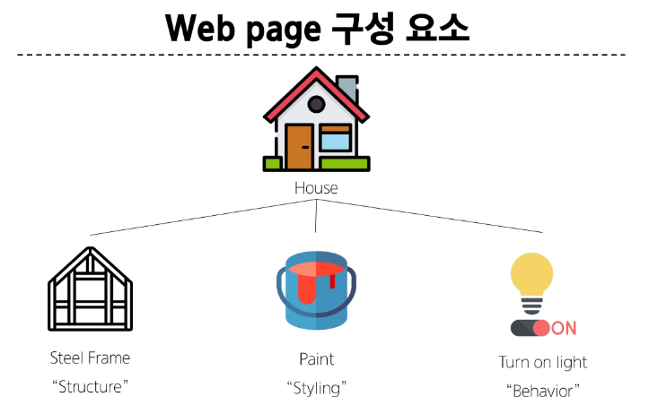
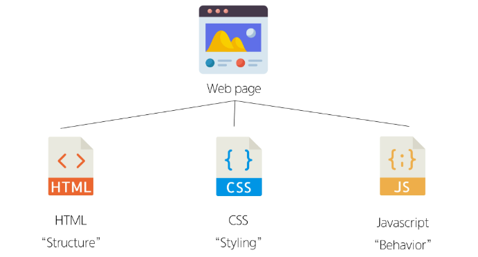
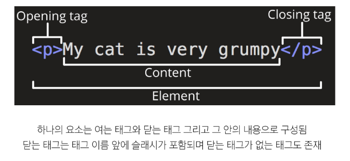
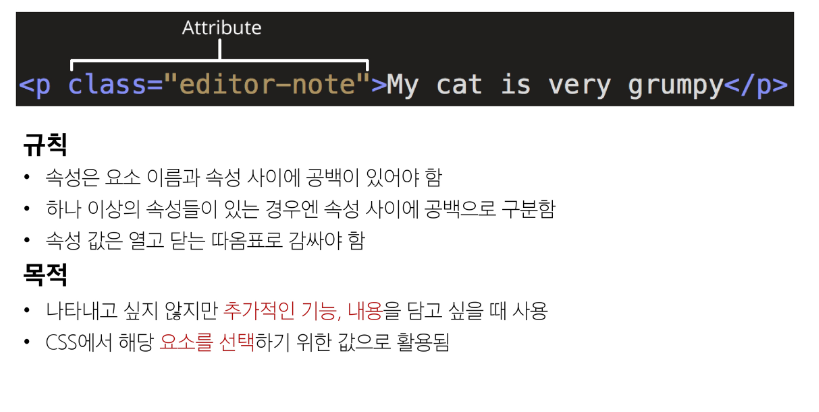

# 웹
## Web
: Web site, Web application 등을 통해 사용자들이 정보를 검색하고 상호 작용하는 기술
## Web site
: 인터넷에서 여러 개의 *Web page*가 모인 것으로, 사용자들에게 정보나 서비스를 제공하는 공간
## Web page
: HTML, CSS 등의 웹 기술을 이용하여 만들어진, *Web site를 구성하는 요소*


# 웹 구조화
## HTML
: HyperText Markup Language
웹 페이지의 의미와 *구조*를 정의하는 언어
### Hypertext
: 웹 페이지를 다른 페이지로 연결하는 링크
참조를 통해 사용자가 한 문서에서 다른 문서로 즉시 접근할 수 있는 텍스트
### Markup Language
: 태그 등을 이용하여 데이터의 구조를 명시하는 언어(HTML, Markdown)
## Structure of HTML
```HTML
<!DOCTYPE html>
<html lang='en'>
<head>
	<meta charset="UTF-8">
	<title>My page</title>
</head>
<body>
	<p>This is my page</p>
</body>
</html>
```
- `<!DOCTYPE html>` : 해당 문서가 html로 작성된 문서라는 것을 나타냄
- `<html></html>` : 전체 페이지의 콘텐츠를 포함
- `<title></title>` : 브라우저 탭 및 즐겨찾기 시 표시되는 제목으로 사용
- `<head></head>` : HTML 문서에 관련된 설명, 설정 등(사용자에게 보이지 않음)
- `<body></body>`: 페이지에 표시되는 모든 콘텐츠
### HTML Element(요소)

### HTML Attributes(속성)

# CSS
: Cascading Style Sheet
웹 페이지의 디자인과 레이아웃을 구성하는 언어
## CSS 구문
```CSS
h1 {
	color: blue;
	font-size: 30px;
}
```
## CSS 적용 방법
1. 인라인(inline) 스타일
2. 내부(Internal) 스타일 시트
3. 외부(External) 스타일 시트
### 인라인 스타일
- HTML 요소 안에 style 속성 값으로 작성
### 내부 스타일 시트
- head 태그 안에 style 태그에 작성
### 외부 스타일 시트
- 별도의 CSS 파일 생성 후 HTML link 태그를 사용해 불러오기