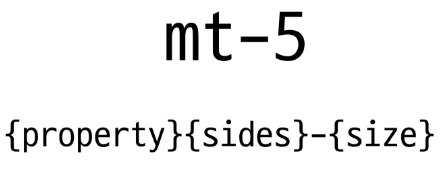
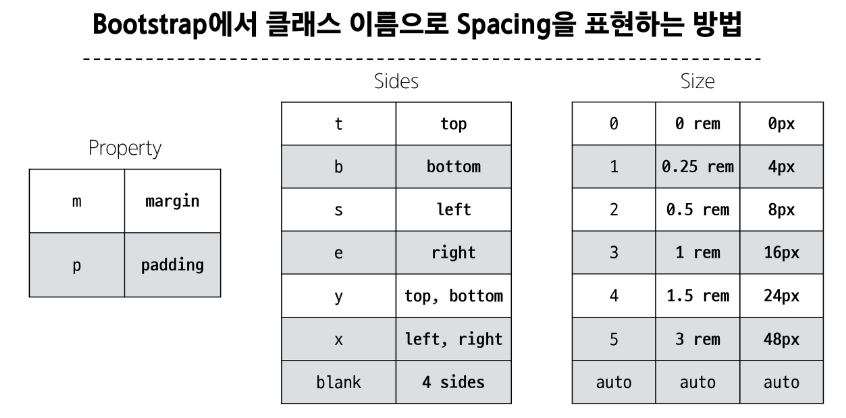
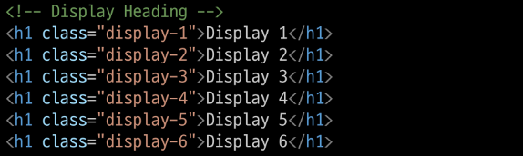
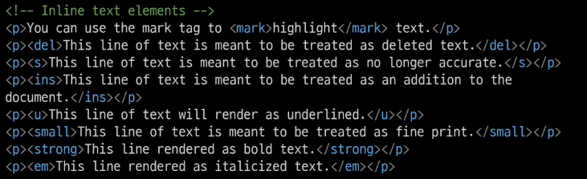
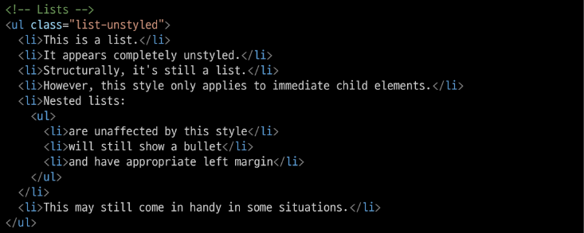

# Bootstrap
: CSS 프론트엔드 프레임워크 (Toolkit)
- 미리 만들어진 다양한 디자인 요소들을 제공하여 웹 사이트를 빠르고 쉽게 개발할 수 있도록 함
[Bootstrap Doc](https://getbootstrap.com/docs/5.3/getting-started/introduction/)
## CDN (Content Delivery Network)
: 지리적 제약 없이 빠르고 안전하게 콘텐츠를 전송할 수 있는 전송 기술
## Bootstrap 기본 사용법
```html
<p class="mt-5">Hello, world!</p>
```

- m : property
- t : sides
- 5 : size

## Reset CSS
: 모든 HTML 요소 스타일을 일관된 기준으로 재설정하는 간결하고 압축된 규칙 세트
- HTML Element, Table, List 등의 요소들에 일관성 있게 스타일을 적용시키는 기본 단계
### Normalize CSS
- Reset CSS 방법 중 대표적인 방법
- 웹 표준 기준으로 브라우저 중 하나가 불일치 한다면 차이가 있는 브라우저를 수정하는 방법
### Bootstrap에서의 Reset CSS
- bootstrap은 `bootstrap-reboot.css`라는 파일명으로 `normalize.css`를 자체적으로 커스텀해서 사용하고 있음
# Bootstrap 활용
## Typography
: 제목, 본문 텍스트, 목록 등
### [Display headings](https://getbootstrap.com/docs/5.3/content/typography/#headings)
: 기존 Heading보다 더 눈에 띄는 제목이 필요할 경우 (더 크고 약간 다른 스타일)

### [Inline text elements]()
: HTML inline 요소에 대한 스타일

### [Lists]()
: HTML list 요소에 대한 스타일

## [Colors](https://getbootstrap.com/docs/5.3/customize/color/)

## Components
### [Alerts](https://getbootstrap.com/docs/5.3/components/alerts/)
### [Badges](https://getbootstrap.com/docs/5.3/components/badge/)
### [Buttons](https://getbootstrap.com/docs/5.3/components/buttons/)
### [Cards](https://getbootstrap.com/docs/5.3/components/card/)
### [Navbar](https://getbootstrap.com/docs/5.3/components/navbar/)
# Semantic Web
: 웹 데이터를 의미론적으로 구조화된 형태로 표현하는 방식