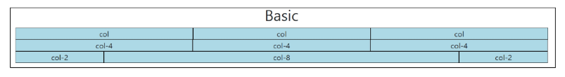
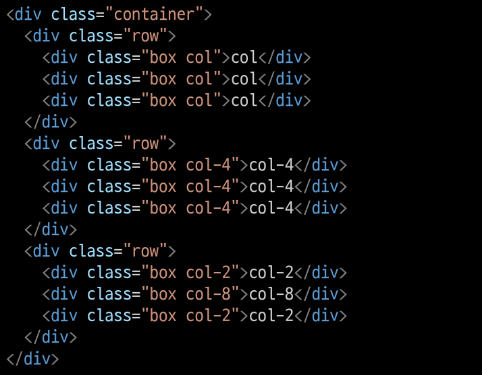
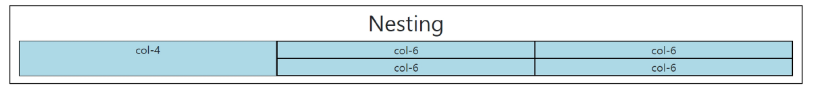
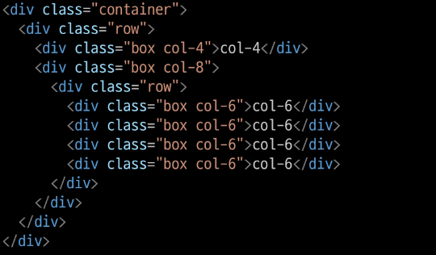
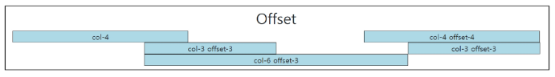
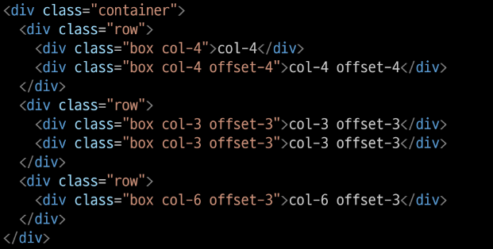
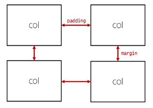
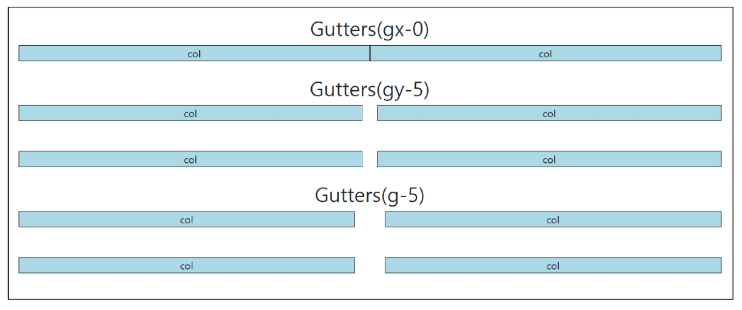
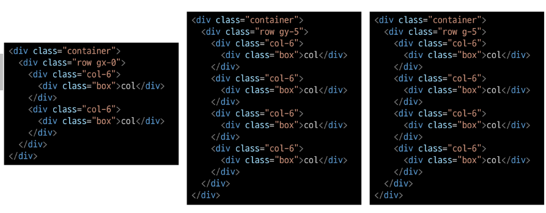
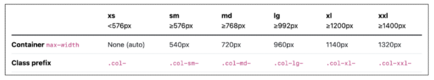

# [emmet](https://docs.emmet.io/abbreviations/syntax/)
## child: >
`div>ul>li`
## Sibling: +
`div+p+bq`
## Climb-up: ^
`div+div>p>span+em^bq`
## Multiplication: *
`ul>li*5`
## Grouping: ()
`div>(header>ul>li*2>a)+footer>p`
## ID and CLASS
`div#header+div.page+div#footer.class1.class2.class3`
# Bootstrap Grid system
: 웹 페이지의 레이아웃을 조정하는 데 사용되는 *12개의 컬럼*으로 구성된 시스템
- 목적 : 반응형 디자인을 지원해 웹 페이지를 모바일, 태블릿, 데스크탑 등 다양한 기기에서 적절하게 표시할 수 있도록 도움
- 반응형 웹 디자인: 디바이스 종류나 화면 크기에 상관없이, 어디서든 일관된 레이아웃 및 사용자 경험을 제공하는 디자인 기술
## Grid system 기본 요소
### Container
: Column들을 담고 있는 공간
### Column
: 실제 컨텐츠를 포함하는 부분
### Gutter
: 컬럼과 컬럼 사이의 여백 영역
### 1개의 row안에 12개의 Column 영역이 구성됨
: 각 요소는 12개 중 몇 개를 차지할 것인지 지정됨
## Grid System 실습
### 기본

### 중첩(Nesting)

### 상쇄(Offset)

### gutters
: Grid system에서 column 사이에 여백 영역
x축은 *padding*, y축은 *margin*으로 여백 생성

# Grid system for responsive web
: 디바이스 종류나 화면 크기에 상관없이, 어디서든 일관된 레이아웃 및 사용자 경험을 제공하는 디자인 기술
- Bootstrap grid system에서는 12개 column과 6개 breakpoints를 사용하여 반응형 웹 디자인을 구현
## Grid system Breakpoints
: 웹 페이지를 다양한 화면 크기에서 적절하게 배치하기 위한 분기점
→ 화면 너비에 따라 6개의 분기점 제공(xs, sm, md, lg, xl, xxl)
- 각 breakpoints 마다 설정된 최대 너비 값 *이상으로* 화면이 커지면 grid system 동작이 변경됨
