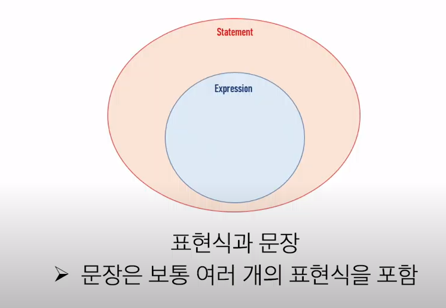
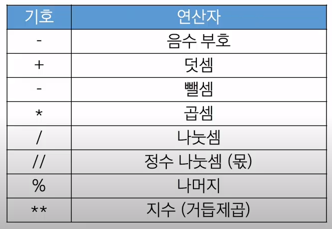
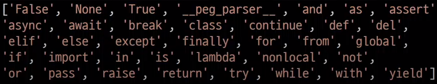
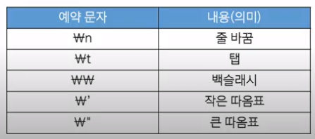

## 프로그램
: 명령어들의 집합
1. 프로그램 작성
2. 프로그램 실행
- 프로그램은 이처럼 몇 가지 기초 연산으로 구성됨
- 컴퓨터는 더 다양한 연산 집합을 가짐
	- 기존 연산을 사용해 더 많은 연산을 만들 수도 있음
#### 프로그램의 핵심
새 연산을 정의하고 조합해 유용한 작업을 수행하는 것 -> 문제를 해결하는 매우 강력한 방법
#### 프로그래밍 언어
컴퓨터에게 작업을 지시하고 문제를 해결하는 도구

## 파이썬
#### 파이썬을 사용하는 이유
- 간결하고 읽기 쉬운 문법
- 다양한 응용 분야
	- 데이터 분석, 인공지능, 웹 개발, 자동화 등
- 파이썬 커뮤니티의 지원
	- 세계적인 규모의 풍부한 온라인 포럼 및 커뮤니티 생태계
#### 파이썬 프로그램이 실행되는 법
- 인터프리터가 사용자의 명령어를 운영체제가 이해하는 언어로 바꿈
1. 파이썬 프로그램
2. 파이썬 인터프리터 (훨씬 더 사용하기 쉽고 운영체제간 이식도 가능 - 확장성)
3. 운영 체제
#### 파이썬 인터프리터를 사용하는 2가지 방법
1. shell이라는 프로그램으로 한 번에 한 명령어 씩 입력해서 실행
	- git에서 `python -i` 입력
2. 확장자가 .py인 파일에 작성된 파이썬 프로그램을 실행

## 표현식과 값
ex. 1+2 : 하나의 표현식
#### 표현식(Expression)
: 값, 변수, 연산자 등을 조합하여 계산되고 결과를 내는 코드 구조
- 표현식이 **평가**되어 값이 반환됨
#### 평가(Evaluate)
: 표현식이나 문장을 실행하여 그 결과를 계산하고 값을 결정하는 과정
- 표현식이나 문장을 순차적으로 평가하여 프로그램의 동작을 결정
#### 문장(Statement)
: 실행 가능한 동작을 기술하는 코드
- 조건문, 반복문, 함수 정의 등
- 
## 타입(Type)
: 값이 어떤 종류의 데이터인지, 어떻게 해석되고 처리되어야 하는지를 정의
     1               +          2
깂(피연산자) 연산자
- 타입은 2가지 요소로 이루어짐
	- 값
	- 값에 적용할 수 있는 연산
### Data Type
#### Numeric Type
- int(정수)
- float(실수)
- complex(복소수)
#### Sequence Types
- list
- tuple
- range
#### Text Sequence Type
- str (문자열)
#### Set Types
- set
#### Mapping Types
- dict
#### 기타
- None
- Boolean
- Function
### 산술 연산자
#### 연산자 종류

#### 연산자 우선순위
1. ** (지수)
2. - (음수 부호)
3.  * , /, //, % (곱셈, 나눗셈, 정수 나눗셈, 나머지)
4. +, - (덧셈, 뺄셈)

## 변수와 메모리
### 변수(Variable)
: 값을 참조하는 이름
- `degrees = 36.5` : 할당문 (변수 degrees에 값 36.5를 할당했다)
#### 변수명 규칙
- 영문 알파벳, 언더스코어( _ ), 숫자로 구성
- 숫자로 시작할 수 없음
- 대소문자를 구분
- 아래 키워드는 파이썬의 내부 예약어로 사용할 수 없음

#### 변수, 값 그리고 메모리
- 거리에 집 주소가 있듯이 메모리의 모든 위치를 고유하게 식별하는 메모리 주소가 존재
- 변수는 그 변수가 참조하는 객체의 메모리 주소를 가짐
- 객체(Object)
	- 타입을 갖는 메모리 주소 내 값
	- 값이 들어있는 상자
#### 할당문
1. 할당 연산자(=) 오른쪽에 있는 표현식을 평가해서 값(메모리 주소)을 생성
2. 값의 메모리 주소를 '=' 왼쪽에 있는 변수에 저장
	- 존재하지 않는 변수라면 - 새 변수 생성
	- 기존에 존재했던 변수라면 - 기존 변수를 재사용해서 변수에 들어 있는 메모리 주소를 변경
#### 변수에 재할당

## 읽기 좋은 코드
#### Style Guide
: 코드의 일관성과 가독성을 향상시키기 위한 규칙과 권장 사항들의 모음
- 프로그래밍 언어의 맞춤법
#### 파이썬 Style Guide
- 변수명은 무엇을 위한 변수인지 직관적인 이름을 가져야 함
- 공백(Spaces) 4칸을 사용하여 코드 블록을 들여쓰기
- 한 줄의 길이는 79자로 제한하며, 길어질 경우 줄 바꿈을 사용
- 문자와 밑줄( _ )을 사용하여 함수, 변수, 속성의 이름을 작성
- 함수 정의나 클래스 정의 등의 블록 사이에는 빈 줄을 추가
- [파이썬 스타일 가이드](https://peps.python.org/pep-0008/)
#### 파이썬 Tutor
: 파이썬 프로그램이 어떻게 실행되는지 도와주는 시각화 도우미
 - [Python Tutor](https://pythontutor.com) : 메모리 시각화
	- 하단 중앙 옵션 변경 -> render all ~ (좀 더 디테일하게 보고 싶을 때)
#### 주석(Comment)
- 프로그램 코드 내에 작성되는 설명이나 메모
- 인터프리터에 의해 실행되지 않음
- 사람을 위한 
- 여러 줄 주석 : 쌍따옴표 앞뒤로 3개 (but 일반적으로 Ctrl + / 사용)
## Data Types
: 값의 종류와 그 값에 적용 가능한 연산과 동작을 결정하는 속성
### 데이터 타입이 필요한 이유
- 값들을 구분하고, 어떻게 다뤄야 하는지를 알 수 있음
- 요리 재료마다 특정한 도구가 필요하듯이 각 데이터 타입 값들도 각자에게 적합한 도구를 가짐
- 타입을 명시적으로 지정하면 코드를 읽는 사람이 변수의 의도를 더 쉽게 이해할 수 있고, 잘못된 데이터 타입으로 인한 오류를 미리 예방
### int (정수 자료형)
: 정수를 표현하는 자료형
#### 진수 표현
- 2진수(binary): 0b *0b10*
- 8진수(octal): 0o *0o30*
- 16진수(hexadecimal): 0x *0x10*
### float (실수 자료형)
: 실수를 표현하는 자료형
- 프로그래밍 언어에서 float는 실수에 대한 *근삿값*
#### 유한 정밀도
- 컴퓨터 메모리 용량이 한정돼 있고 한 숫자에 대해 저장하는 용량이 제한 됨
- 0.666666666666666과 1.6666666666667은 제한된 양의 메모리에 저장할 수 있는 2/3과 5/3에 가장 가까운 값
#### 실수 연산 시 주의사항
- 컴퓨터는 2진수 사용, 사람은 10진법 사용
- 이때 10진수 0.1은 2진수로 표현하면 0.000110011001100 ... 같이 무한대로 반복
- 무한대 숫자를 그대로 저장할 수 없어서 사람이 사용하는 10진법의 근삿값만 표시
- 0.1의 경우 3602879701896397 / 2 ** 55 이며 0.1에 가깝지만 정확히 동일하지는 않음
- 이런 과정에서 예상치 못한 결과가 나타남
- 이런 증상을 *Floating point rounding error*라고 함
#### 실수 연산 시 해결책
1. 임의의 작은 수 활용(두 수의 차이가 매우 작은 수보다 작은지를 확인)
2. math 모듈 활용
#### 지수 표현 방식
: e 또는 E를 사용한 지수 표현
- 314 * 0.01 -> 314e-2
### Sequence Types
: 여러 개의 값들을 *순서대로 나열*하여 저장하는 자료형
#### Sequence Types 특징
1. 순서 (Sequence)
	- 값들이 순서대로 저장(정렬 x)
2. 인덱싱(Indexing)
	- 각 값에 고유한 인덱스(번호)를 가지고 있으며, 인덱스를 사용하여 특정 위치의 값을 선택하거나 수정할 수 있음
3. 슬라이싱(Slicing)
	- 인덱스 범위를 조절해 부분적인 값을 추출할 수 있음
4. 길이(Length)
	- `len()` 함수를 사용하여 저장된 값의 개수(길이)를 구할 수 있음
5. 반복(Iteration)
	- 반복문을 사용하여 저장된 값들을 반복적으로 처리할 수 있음
## str(문자열)
: 문자들의 *순서가 있는* *변경 불가능한* 시퀀스 자료형
#### 문자열 표현
- 문자열은 단일 문자나 여러 문자의 조합으로 이루어짐
- 작은따옴표(') 또는 큰따옴표(")로 감싸서 표현
	- 둘 중에 하나로 통일
#### 중첩 따옴표
- 따옴표 안에 따옴표를 표현할 경우
	- 작은따옴표가 들어 있는 경우는 큰따옴표로 문자열 생성
	- 큰따옴표가 들어 있는 경우는 작은따옴표로 문자열 생성
#### Escape sequence
- 역슬래시(backslash)뒤에 특정 문자가 와서 특수한 기능을 하는 문자 조합
- 파이썬의 일반적인 문법 규칙을 잠시 탈출한다는 의미
 

## String Interpolation
: 문자열 내에 변수나 표현식을 삽입하는 방법
#### f-string
: 문자열에 f 또는 F 접두어를 붙이고 표현식을 {expression}로 작성하여 문자열에 파이썬 표현식의 값을 삽입할 수 있음
`print(f'Debugging {var1} {var2} {var3} {3+5}')` 
#### 문자열의 시퀀스 특징
`my_str = 'hello'`
- 인덱싱 `print(my_str[1])` e
- 슬라이싱 `print(my_str[2:4])` ll
- 길이 `print(len(my_str))` 5
#### 인덱스(Index)
: 시퀀스 내의 값들에 대한 고유한 번호로, 각 값의 위치를 식별하는 데 사용하는 숫자
- index 예시

| h | e | l | l | o |
| ---- | ---- | ---- | ---- | ---- |
| 0 | 1 | 2 | 3 | 4 |
| -5 | -4 | -3 | -2 | -1 |
#### Slicing 예시
- `my_str[2:4]` : 2,3 ll
- `my_str[:3]` : 0,1,2 hel
- `my_str[0:5:2]` : 0,2,4 hlo
- `my_str[::-1]` : -1 -2 -3 -4 -5  olleh
#### 문자열은 불변(변경 불가)
`my_str[1] = z` : TypeError: 'str' object does not support item assignment
