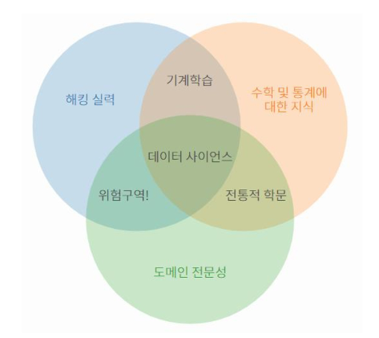
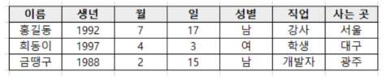
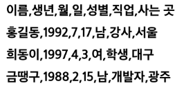

# 목표
- 데이터 사이언스 분야에 대해 이해하기
- 데이터 사이언스에서 자주 사용되는 패키지 사용해보기
### 학습할 내용 정리
1. 구글 주식 데이터 다운로드
2. 데이터 사이언스에서 자주 사용되는 패키지 사용
3. 원하는 데이터만 뽑아서 차트로 출력
## 준비사항
### Jupyter notebook 이란?
- 데이터사이언스 작업에 많이 활용되는 파이썬 개발환경
- 웹 브라우저에서 실행
- 코드 실행, 텍스트 문서 작성, 시각화 등을 하나의 문서에 통합하여 작업 가능
- 데이터 사이언스 작업에 많이 쓰이는 이유
	- 셀 단위 코드 실행으로 결과 바로 확인 가능
	- 문서를 작성할 수 있는 마크다운 기능 제공
	- 개별적인 코드 블록을 실행할 수 있음
# 관통 Ver1. 데이터 사이언스 기초
## 데이터 사이언스
- *다양한 데이터로부터 새로운 지식과 정보를 추출*하기 위해 과학적 방법론, 프로세스, 알고리즘, 시스템을 동원하는 융합 분야
- 컴퓨터 과학, 통계학, 수학 등 다양한 학문의 원리와 기술을 활용

### 데이터 사이언스 프로세스
: 필요한 정보를 추출하는 5가지 단계
1. 문제 정의: 해결하고자 하는 문제 정의
2. 데이터 수집: 문제 해결에 필요한 데이터 수집
3. 데이터 전처리(정제): 실질적인 분석을 수행하기 위해 데이터를 가공하는 단계
	- 수집한 데이터의 오류 제거(결측치, 이상치), 데이터 형식 변환 등
4. 데이터 분석: 전처리가 완료된 데이터에서 필요한 정보를 추츨하는 단계
5. 결과 해석 및 공유: 의사 결정에 활용하기 위해 결과를 해석하고 시각화 후 공유하는 단계
## 데이터 사이언스 프로세스 실습
### 프로세스 1. 문제 정의
- 구글의 주식 가격은 앞으로 어떻게 될까?
### 프로세스 2. 데이터 수집
- 주식 가격을 분석하기 위해서는 기간 별 주식 가격에 대한 데이터가 필요
- 데이터 수집은 다양한 기술과 방법을 활용할 수 있음
	- 웹 스크래핑(Web Scraping): 웹 페이지에서 데이터를 추출하는 기술
	- 웹 크롤링(Web Crawling): 웹 페이지를 자동으로 탐색하고 데이터를 수집하는 기술
	- Open API 활용: 공개된 API를 통해 데이터를 수집
	- 데이터 공유 플랫폼 활용: 다양한 사용자가 데이터를 공유하고 활용할 수 있는 온라인 플랫폼
		- 종류: 캐글(Kaggle), Data.world, 데이콘(Dacon), 공공데이터포털 등
#### 캐글(Kaggle)
- 데이터 분석 경진대회 플랫폼
- 기업 및 단체에서 데이터와 해결 과제를 등록하면, 데이터 과학자들이 이를 해결하는 방법을 개발하고 경쟁할 수 있는 플랫폼
- 경진 대회, 데이터셋 공유, 토론 등의 기능이 가능하며 많은 데이터 과학자와 분석가들이 활용함
1. 회원가입 [https://www.kaggle.com/](https://www.kaggle.com/)
2. Google Stock Price 검색
	- 실습에 활용할 테이터는 "Google Stock Price: Daily, Weekly & Monthly(2023)"
	- 데이터셋 요약: 2013-05-01 부터 최근까지 일/주/월 별 데이터
#### \[참고] cvs란?
- 몇 가지 필드를 쉼표(,)로 구분한 텍스트 데이터 및 텍스트 파일
- 일반적으로 표 형식의 데이터를 CSV 형태로 많이 사용
- 저장, 전송 및 처리 속도가 빠르며 처리 가능한 프로그램이 다양합니다.
- 예시
	- 엑셀
	
	- csv
	
### 프로세스 3. 데이터 전처리(정제)
- 데이터 전처리 단계는 분석을 진행하기 전 데이터를 정제하는 단계입니다.
- 다음과 같은 과정을 포함
	- 불완전하거나 오류가 있는 데이터를 제거하여 데이터의 품질을 개선
	- 중복 데이터 제거
	- 분석하기 적절한 형식으로 데이터를 반환
- 데이터 전처리 및 분석에 사용되는 파이썬 패키지
	- Numpy, Pandas, Matplotlib
#### 자주 활용되는 파이썬 패키지
- 데이터 사이언스에서 가장 많이 사용되는 3종 패키지
	- 데이터 처리 및 데이터 분석
		- Numpy : 수학 계산용 패키지. Pandas와 Matplotlib를 사용하기 위해 활용하는 패키지
		- Pandas: 원하는 데이터만 추출하거나 데이터를 분석할 때 활용되는 패키지
	- 데이터 시각화
		- Matplotlib: 그래프를 그려주는 패키지
#### Numpy
- 다차원 배열을 쉽게 처리하고 효율적으로 사용할 수 있도록 지원하는 파이썬 패키지
- 장점
	- Numpy 행렬 연산은 데이터가 많을수록 Python 반복문에 비해 훨씬 빠르다.
	- 다차원 행렬 자료 구조를 제공하여 개발하기 편하다.
- 특징
	- CPython(공식 사이트의 Python)에서만 사용 가능
	- 행렬 인덱싱(Array Indexing) 기능 제공
#### Pandas
- Numpy의 한계
	- 유연성(데이터에 레이블을 붙이거나, 누락된 데이터로 작업)이 부족함
	- 그룹화, 피벗 등 구조화가 부족함
- Pandas는 마치 프로그래밍 버전의 엑셀을 다루듯 고성능의 데이터 구조를 만들 수 있음
- Numpy 기반으로 만들어진 패키지로, Series(1차원 배열)과 DataFrame(2차원 배열)이라는 효율적인 자료구조 제공
#### Matplotlib
- 파이썬에서 데이터 시각화를 위해 가장 널리 사용되는 라이브러리
- 다양한 종류의 그래프와 도표를 생성하고 데이터를 시각적으로 표현할 수 있습니다.
# 파이썬을 활용한 데이터 수집 2
API를 활용한 데이터 수집(실습)
1. Dog API 사용 : requests Library를 이용하여 파이썬에서 API를 사용해봅니다. 이를 이용하여 강아지 사진의 URL을 받아옵니다.
2. 알라딘 문고 API를 사용하여 파이썬에서 도서 정보를 받아와 요구사항에 맞도록 가공
3. Spotify 서비스의 API를 사용하여, 파이썬으로 음악 정보를 가져오 ㅏ요구사항에 맞도록 가공
# 금융 상품 비교 앱 - PJT02
- 프로젝트명: 파이썬과 Pandas를 사용한 데이터 처리
- 목표: 넷플릭스 주가 데이터 분석
- 특징 : 
	- 데이터 사이언스  프로세스 활용
	- 캐글을 통해 데이터 다운로드
# 영화 추천 서비스 - PJT02
- 프로젝트명: 파이썬을 활용한 데이터 수집2
- 목표: 파이썬으로 도서 및 아티스트 데이터 수집 및 가공을 통한 미션 수행
- 특징:
	- 외부 API를 활용한 데이터 수집 및 가공 복습
	- 요구사항에 맞게 JSON 형태 데이터 가공